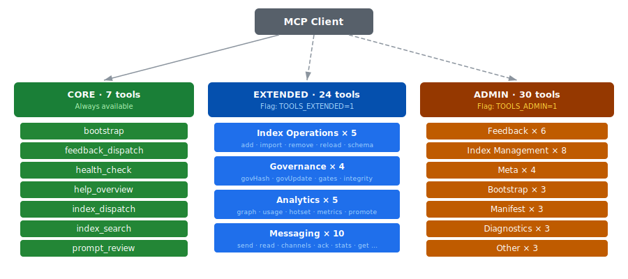
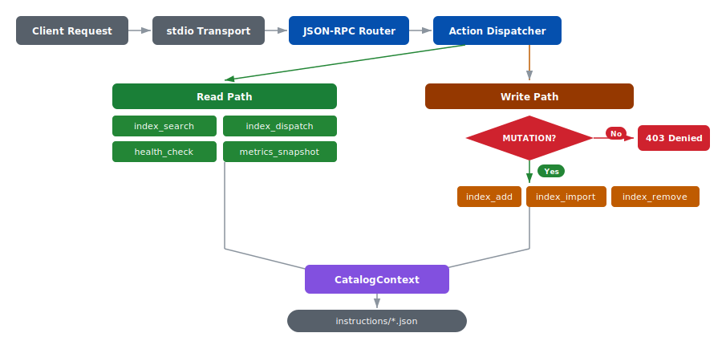
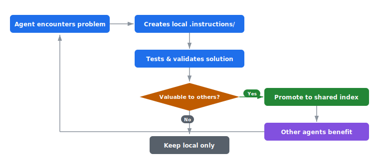

# Index Server

**Model Context Protocol server providing governed, classified, and auditable instruction catalogs with analytics and optional admin dashboard.**

[](LICENSE)
[](https://github.com/jagilber-org/index-server/packages)
[](package.json)
[](https://codecov.io/gh/jagilber-org/index-server)
[](https://marketplace.visualstudio.com/items?itemName=jagilber-org.index-server)
[](https://open-vsx.org/extension/jagilber-org/index-server)

---

> **🚀 [Quick Start Guide](docs/quickstart.md)** — Get running in 5 minutes with HTTPS and semantic search
>
> **📖 [Use Case Scenarios](docs/use-cases.md)** — Real-world examples for support engineers, dev teams, and knowledge management

## Overview

Index Server is an implementation of the [Model Context Protocol (MCP)](https://modelcontextprotocol.io) that enables AI agents to access governed instruction catalogs. It provides governance, usage analytics, security controls, and an optional admin dashboard for monitoring and maintenance.

**Key Capabilities:**
- **MCP Protocol Compliance** - Full JSON-RPC 2.0 over stdio transport with schema validation
- **Instruction Governance** - Lifecycle management with ownership, versioning, and approval workflows
- **Usage Analytics** - Track instruction usage with persistent storage and hotset analysis
- **Security Controls** - Bootstrap confirmation, mutation gating, audit logging, and pre-commit hooks
- **Admin Dashboard** - Optional HTTP(S) interface with visual drift detection and monitoring
- **Performance** - Optimized for sub-50ms response times with comprehensive caching

---

## Quick Start

### Prerequisites

- Node.js >= 22 LTS
- npm (included with Node.js)
- An MCP-compatible client (VS Code, Claude Desktop, or similar)

### Installation

**From npm:**

```bash
npm install @jagilber-org/index-server
```

**From source:**

```bash
git clone https://github.com/jagilber-org/index-server.git
cd index-server
npm install
npm run build
```

### Configuration

Add to your MCP client configuration (e.g., VS Code `mcp.json` or Claude Desktop config):

```jsonc
// VS Code: .vscode/mcp.json
{
  "servers": {
    "index-server": {
      "type": "stdio",
      "command": "node",
      "args": [
        "C:/path/to/index-server/dist/server/index-server.js",
        "--dashboard",
        "--dashboard-port=3210"
      ],
      "env": {
        "INDEX_SERVER_LOG_LEVEL": "info",
        "INDEX_SERVER_MUTATION": "1",
        "INDEX_SERVER_DIR": "C:/path/to/index-server/instructions"
      }
    }
  }
}
```

- Use absolute paths or set `cwd` to enable relative paths
- Dashboard arguments (`--dashboard`, `--dashboard-port`) are optional
- Restart your MCP client after configuration changes
- See [Configuration Guide](docs/mcp_configuration.md) for advanced patterns

### Verification

1. Server should appear in your MCP client's server list
2. Dashboard (if enabled) accessible at `http://localhost:8787`
3. Test with: `tools/list` to see available tools

---

## Dashboard

The optional admin dashboard provides a Grafana-dark themed interface for server monitoring and catalog management:


| Panel | Description |
|-------|-------------|
| **Overview** | Server health, uptime, and system status |
| **Configuration** | Environment flags and runtime settings |
| **Sessions** | Connected clients and activity |
| **Maintenance** | Backup, repair, and catalog operations |
| **Monitoring** | Performance metrics and error rates |
| **Instructions** | Catalog browser with usage counts, signal badges, and governance status |
| **Graph** | Mermaid dependency graph of instructions |

See [dashboard.md](docs/dashboard.md) for full details.

### REST Client Scripts (No MCP Required)

For subagents or CI pipelines that cannot load MCP tools, two REST client scripts provide full CRUD access via the dashboard HTTP bridge:

```powershell
# PowerShell (irm)
.\scripts\index-server-client.ps1 -Action search -Keywords deploy -Mode semantic
.\scripts\index-server-client.ps1 -Action get -Id my-instruction
.\scripts\index-server-client.ps1 -Action track -Id my-instruction -Signal helpful
```

```bash
# Bash (curl)
./scripts/index-server-client.sh search "deploy" semantic 10
./scripts/index-server-client.sh get my-instruction
./scripts/index-server-client.sh track my-instruction helpful
```

Both scripts support HTTP/HTTPS, self-signed cert bypass, and return structured JSON. See [tools.md - REST Client Scripts](docs/tools.md#rest-client-scripts-agent-access-without-mcp) for full reference.

---

## Tools

### Tool Tier Architecture



### Request Flow



### Tool Reference

**Instruction Management:**
- `index_dispatch` - Unified dispatcher for catalog operations (list, get, search, add, export, diff)
- `index_search` - Keyword search with relevance scoring
- `index_add` - Create new instructions with validation
- `index_import` - Batch import from external sources
- `index_remove` - Delete instructions with confirmation

**Governance & Quality:**
- `index_governanceUpdate` - Patch ownership, status, review dates
- `index_governanceHash` - Generate deterministic governance fingerprints
- `integrity_verify` - Validate catalog integrity
- `gates_evaluate` - Check gating criteria compliance
- `prompt_review` - Static analysis of prompts

**Analytics & Monitoring:**
- `usage_track` - Record instruction usage events
- `usage_hotset` - Retrieve frequently-used instructions
- `health_check` - Server health and configuration status
- `metrics_snapshot` - Performance and operational metrics

**Feedback System:**
- `feedback_dispatch` - Submit issues, feature requests, security reports; query, update, and monitor feedback

See [API Reference (tools.md)](docs/tools.md) for complete tool documentation.

---

## Agent Bootstrapping

On first run, the server creates `instructions/000-bootstrapper.json` -- a P0 instruction that teaches AI agents how to use the index, create local instructions, and contribute validated patterns back to the shared catalog.

Agents query it automatically:
```json
{"method": "index_dispatch", "params": {"action": "get", "id": "000-bootstrapper"}}
```

### Knowledge Flywheel



Instructions start local in `.instructions/`, get validated over multiple sessions, then proven patterns are promoted to the shared index via `promote_from_repo`.

### Bootstrap Security

Fresh installations block mutations until human confirmation:

1. **Reference Mode** (`INDEX_SERVER_REFERENCE_MODE=1`) - Read-only catalog access
2. **Fresh Installation** - Mutations blocked until confirmed via `bootstrap` tool
3. **Confirmed** - Full mutation access (subject to `INDEX_SERVER_MUTATION` setting)

See [Configuration Guide](docs/configuration.md) for bootstrap workflow details.

---

## Configuration

### Environment Variables

**Core:**

| Variable | Default | Description |
|----------|---------|-------------|
| `INDEX_SERVER_LOG_LEVEL` | `info` | Logging level: `silent`, `error`, `warn`, `info`, `debug`, `trace` |
| `INDEX_SERVER_MUTATION` | `disabled` | Enable mutations: `enabled` or `disabled` |
| `INDEX_SERVER_DIR` | `./instructions` | Absolute path to instruction catalog directory |
| `INDEX_SERVER_REFERENCE_MODE` | `0` | Read-only mode: `1` or `0` |
| `INDEX_SERVER_AUTO_SEED` | `1` | Auto-create bootstrap seeds: `1` or `0` |

**Advanced:**

| Variable | Default | Description |
|----------|---------|-------------|
| `INDEX_SERVER_TIMING_JSON` | `{}` | JSON timing overrides (e.g., `{"manifest.waitDisabled":15000}`) |
| `INDEX_SERVER_TEST_MODE` | - | Test mode: `coverage-fast` for accelerated coverage runs |
| `INDEX_SERVER_TRACE` | - | Trace tokens: comma-separated (e.g., `manifest,bootstrap`) |
| `INDEX_SERVER_MANIFEST_WRITE` | `1` | Enable manifest writes: `1` or `0` |
| `INDEX_SERVER_BODY_MAX_LENGTH` | `20000` | Max body length for instructions (1000–1000000) |

**Semantic Search:**

| Variable | Default | Description |
|----------|---------|-------------|
| `INDEX_SERVER_SEMANTIC_ENABLED` | `0` | Enable semantic search: `1` or `0` |
| `INDEX_SERVER_SEMANTIC_MODEL` | `Xenova/all-MiniLM-L6-v2` | HuggingFace model for embeddings |
| `INDEX_SERVER_SEMANTIC_CACHE_DIR` | `./data/models` | Local model cache directory |
| `INDEX_SERVER_EMBEDDING_PATH` | `./data/embeddings.json` | Cached embedding vectors path |
| `INDEX_SERVER_SEMANTIC_DEVICE` | `cpu` | Compute device: `cpu`, `cuda`, or `dml` |
| `INDEX_SERVER_SEMANTIC_LOCAL_ONLY` | `1` | Block remote model downloads: `1` or `0` |

> **Note:** Semantic search requires a one-time model download (~90MB). Set `INDEX_SERVER_SEMANTIC_LOCAL_ONLY=0` and `INDEX_SERVER_SEMANTIC_ENABLED=1` to download, then revert to `INDEX_SERVER_SEMANTIC_LOCAL_ONLY=1`.

**Dashboard:**

| Variable / CLI Argument | Default | Description |
|-------------------------|---------|-------------|
| `INDEX_SERVER_DASHBOARD` / `--dashboard` | `0` | Enable HTTP(S) dashboard |
| `INDEX_SERVER_DASHBOARD_PORT` / `--dashboard-port=<port>` | `8787` | Dashboard port |
| `INDEX_SERVER_DASHBOARD_GRAPH` | `0` | Enable Graph tab (loads ~4.5MB mermaid + elkjs) |

**TLS / HTTPS:**

| Variable / CLI Argument | Default | Description |
|-------------------------|---------|-------------|
| `INDEX_SERVER_DASHBOARD_TLS` / `--dashboard-tls` | `0` | Enable HTTPS for the dashboard |
| `INDEX_SERVER_DASHBOARD_TLS_CERT` / `--dashboard-tls-cert=<path>` | - | Path to TLS certificate file (PEM) |
| `INDEX_SERVER_DASHBOARD_TLS_KEY` / `--dashboard-tls-key=<path>` | - | Path to TLS private key file (PEM) |
| `INDEX_SERVER_DASHBOARD_TLS_CA` / `--dashboard-tls-ca=<path>` | - | Path to CA certificate for client verification (PEM) |

When TLS is enabled, the dashboard serves over HTTPS. All three files (cert, key, and optionally CA) must be PEM-encoded. Example:

```jsonc
{
  "env": {
    "INDEX_SERVER_DASHBOARD": "1",
    "INDEX_SERVER_DASHBOARD_TLS": "1",
    "INDEX_SERVER_DASHBOARD_TLS_CERT": "/etc/certs/server.crt",
    "INDEX_SERVER_DASHBOARD_TLS_KEY": "/etc/certs/server.key"
  }
}
```

Or via CLI arguments:

```bash
node dist/server/index-server.js --dashboard --dashboard-tls \
  --dashboard-tls-cert=/etc/certs/server.crt \
  --dashboard-tls-key=/etc/certs/server.key
```

For complete configuration details, see [Configuration Guide](docs/configuration.md).

---

## Usage Patterns

### Search-First Workflow

```json
{
  "method": "tools/call",
  "params": {
    "name": "index_search",
    "arguments": { "keywords": ["javascript", "arrays"], "limit": 10 }
  }
}
```

Then retrieve full content:
```json
{
  "method": "tools/call",
  "params": {
    "name": "index_dispatch",
    "arguments": { "action": "get", "id": "instruction-id-from-search" }
  }
}
```

### Simplified Authoring

Minimal required fields -- governance fields are auto-derived:

```jsonc
{
  "id": "example-instruction-123",
  "title": "Example Instruction",
  "body": "Instruction content here...",
  "priority": 50,
  "audience": "all",
  "requirement": "optional",
  "categories": ["example"]
}
```

---

## Documentation

| Document | Purpose |
|----------|---------|
| [Product Requirements](docs/project_prd.md) | Authoritative requirements and governance |
| [API Reference](docs/tools.md) | Complete MCP tool documentation |
| [MCP Configuration](docs/mcp_configuration.md) | Setup patterns for all environments |
| [Server Configuration](docs/configuration.md) | Environment variables and CLI options |
| [Architecture](docs/architecture.md) | System design and component overview |
| [Admin Dashboard](docs/dashboard.md) | UI features, drift monitoring, maintenance |
| [Content Guidance](docs/content_guidance.md) | Local vs. central instruction guidance |
| [Network Privacy](docs/network-privacy.md) | Network transparency and offline deployment |
| [Documentation Index](docs/docs_index.md) | Full documentation map |

---

## Development

```bash
npm install          # Install dependencies
npm run build        # Build TypeScript
npm test             # Run test suite (350+ tests)
npm run test:contracts  # Contract tests only
npm run typecheck    # Type checking
npm run lint         # Linting
```

### Pre-commit Hooks

Automated checks run before every commit: typecheck, lint, test suite, and security scan. Configuration in [.husky](.husky).

### Testing Standards

- All tests must pass before merge
- Coverage levels maintained
- Contract tests validate protocol compliance
- Property-based tests validate idempotence and determinism

---

## Security

- **Pre-commit Hooks** - Prevents accidental commit of credentials and PII
- **Input Validation** - Comprehensive validation and sanitization
- **Audit Logging** - Security-relevant events logged with timestamps
- **Mutation Gating** - Write operations require explicit enablement

### Network Transparency

Index Server makes **zero telemetry calls** and sends **no data to external services** during normal operation.

| Connection | Destination | When | How to Disable |
|------------|-------------|------|----------------|
| Semantic search model | `huggingface.co` | First semantic search only (one-time ~90 MB) | `INDEX_SERVER_SEMANTIC_ENABLED=0` (default) |
| Leader/follower RPC | `127.0.0.1` | Multi-instance mode only | `INDEX_SERVER_MODE=standalone` (default) |
| Instance health ping | `127.0.0.1` | Dashboard clustering only | `INDEX_SERVER_DASHBOARD=0` (default) |

Default configuration makes zero outbound network connections. See [Network Privacy Guide](docs/network-privacy.md) for verification and offline deployment.

### Dashboard Security Model

The optional admin dashboard binds to **`127.0.0.1`** (localhost) by default, restricting access to the local machine.

| Route prefix | Auth required | Notes |
|---|---|---|
| `/api/admin/*` | ✅ `INDEX_SERVER_ADMIN_API_KEY` | Timing-safe key comparison + loopback IP check |
| `/api/*` (non-admin) | ❌ | Instructions CRUD, search, messaging, embeddings |
| `/` (dashboard UI) | ❌ | Static HTML/JS dashboard |

**Non-admin API routes rely on network-level access control** — only the localhost bind address prevents unauthorized access. This is secure for local development and single-machine deployments.

> **⚠️ Warning:** If you change the bind address to `0.0.0.0` or expose the dashboard port externally (e.g., via Docker port mapping to `0.0.0.0`), all non-admin API routes become accessible without authentication. In that scenario:
> - Use a reverse proxy (nginx, Caddy, Traefik) with TLS and authentication
> - Restrict access via firewall rules or container networking
> - Set `INDEX_SERVER_ADMIN_API_KEY` to protect admin operations

### Reporting Security Issues

See [SECURITY.md](SECURITY.md) for vulnerability reporting and security policy.

---

## Contributing

All contributions go through the development repository. See [CONTRIBUTING.md](CONTRIBUTING.md) for the full workflow, environment variable conventions, and code standards.

**Requirements:**
- Open an issue before making changes
- Add tests for new features and bug fixes
- Maintain strict TypeScript compliance
- Follow MCP specifications
- Review [SECURITY.md](SECURITY.md)

---

## Repository Structure

```
index-server/
+-- .github/              # GitHub workflows and templates
+-- docs/                 # Project documentation
+-- schemas/              # JSON schemas for validation
+-- scripts/              # Build and maintenance scripts
+-- src/                  # TypeScript source code
|   +-- server/           # MCP server implementation
|   +-- services/         # Core business logic
|   +-- types/            # Type definitions
+-- tests/                # Test suites
+-- dist/                 # Build output (gitignored)
+-- coverage/             # Coverage reports (gitignored)
+-- data/                 # Performance baselines and analytics
+-- feedback/             # User feedback storage
+-- governance/           # Governance policies
+-- snapshots/            # Index snapshots for drift detection
```

---

## License

MIT License - see [LICENSE](LICENSE) file for details.

---

Built with [Model Context Protocol (MCP)](https://modelcontextprotocol.io), TypeScript, Node.js, Vitest, and AJV.
