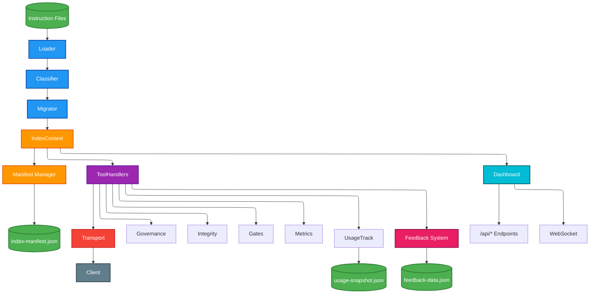
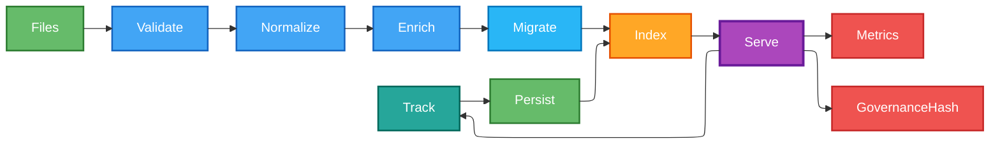
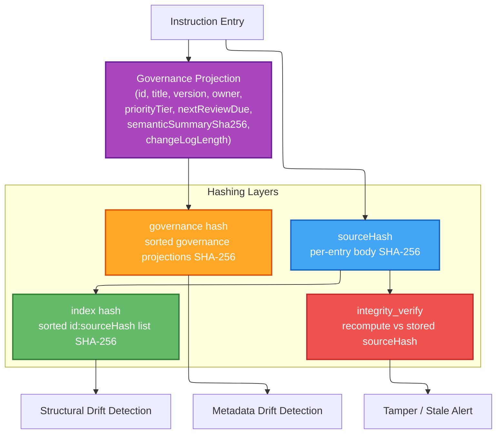
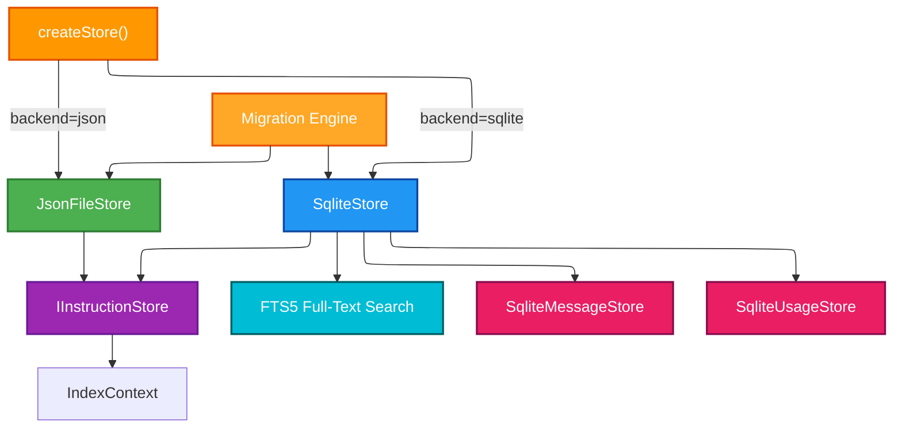
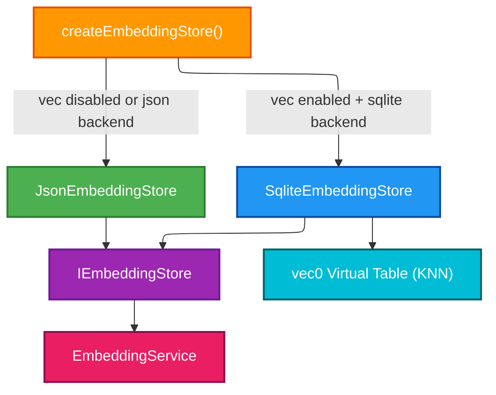
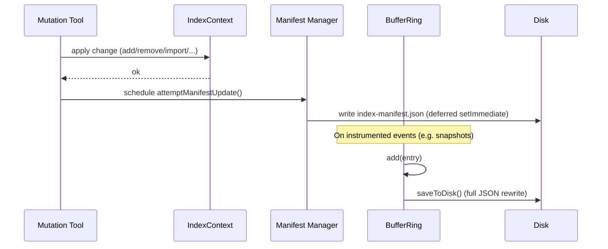
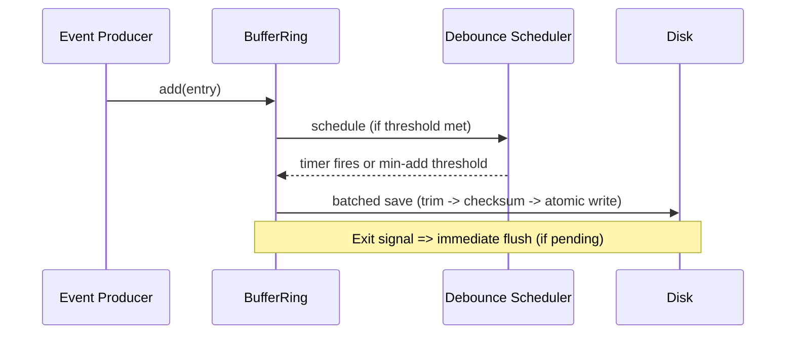
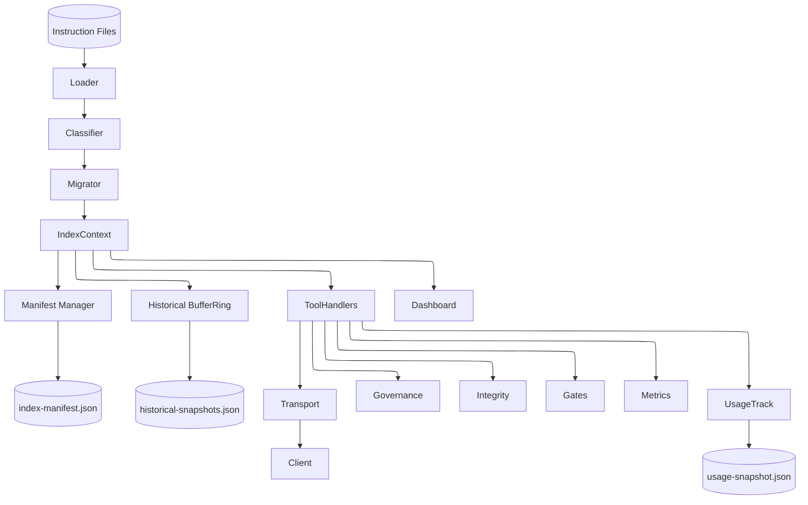

# ARCHITECTURE

Updated for 1.24.0 (adds: `IEmbeddingStore` abstraction with sqlite-vec KNN backend, device probe fallback chain, model readiness checks, structured logging enforcement across 27 server-side files). Previous: 1.12.0 (pluggable storage abstraction layer with SQLite backend [experimental], FTS5 full-text search, bidirectional JSON↔SQLite migration engine, SQLite message & usage stores).

## High-Level Components

Professional styled architecture with color-coded components:



## Data Lifecycle



## Component Descriptions

| Component | Responsibility | Notes |
|-----------|----------------|-------|
| Instruction Files | Author-managed JSON entries | Enriched placeholders persisted lazily (owner, review dates, schemaVersion) |
| IndexLoader | Read + schema validate + minimal defaults | Computes index hash (id:sourceHash) |
| Classification | Normalize (trim, dedupe, scope derivation), risk, priority tier | Derives semantic summary + review cadence |
| Migration | Ensure `schemaVersion` matches current constant | Rewrites file if version upgraded |
| IndexContext | Caching, mtime + signature invalidation, enrichment persistence, opportunistic materialization | Uses `.index-version` for cross‑process invalidation; in‑memory write path avoids reload race |
| Governance Projection | Deterministic subset for governance hash | Fields: id,title,version,owner,priorityTier,nextReviewDue,semanticSummarySha256,changeLogLength |
| Tool Registry | Central schemas + stable flags + dynamic listing (`meta_tools`) | Exposes machine-consumable tool metadata |
| Tool Handlers | JSON-RPC implementation (instructions/*, feedback/*, governanceHash, usage, integrity, gates, metrics) | Write tools are enabled by default and can be forced read-only with INDEX_SERVER_MUTATION=0 |
| MCP SDK Transport | Standard MCP over stdio | Emits `server/ready`, handles capabilities |
| Usage Tracking | usage_track increments with firstSeenTs + debounced persistence | Optional gating via INDEX_SERVER_FEATURES='usage' |
| Feedback / Emit System | `feedback_submit` MCP tool + dashboard feedback CRUD | Persistent JSON store + feedback audit & security logging |
| Metrics Snapshot | Aggregate per-method counts + feature counters | Lightweight in-memory aggregation |
| Integrity Verify | Recompute vs stored sourceHash | Detects tampering or stale placeholders |
| Gates Evaluate | Evaluate gating rules from `instructions/gates.json` | Summarizes pass/fail severities |
| Dashboard | Optional read-only visualization & /tools.json | Enabled via CLI flags |
| Leader Election | [EXPERIMENTAL] Port-based leader election for multi-instance deployments | See `docs/multi-instance-design.md` |
| ThinClient | [EXPERIMENTAL] Stdio-to-HTTP bridge forwarding JSON-RPC to leader | Follower mode entry point |
| (Future) Optimizer | Hotset selection / ranking | Not yet implemented |

## Data Flow Summary

1. Loader enumerates `instructions/*.json`, applies Ajv validation (draft-07) and minimal bootstrap defaults.
2. Classification normalizes + derives governance fields (version/status/owner/priorityTier/review dates/semantic summary) & risk score.
3. Migration hook updates schemaVersion if older (current schemaVersion: 6 per instruction.schema.json).
4. index hash (id:sourceHash) and governance hash (projection set) computed.
5. Entries cached (map + sorted list); enrichment persistence pass rewrites placeholders once.
6. Tools served: diff / list / governanceHash / integrity / gates / prompt review / usage / metrics.
7. usage_track increments counts; first increment forces immediate flush; subsequent increments debounced.
8. metrics_snapshot reflects cumulative method invocation stats + feature counters.
9. gates_evaluate and integrity_verify provide governance & integrity control loops.

## Hashing & Integrity Layers

| Layer | Purpose | Input | Output |
|-------|---------|-------|--------|
| sourceHash | Per-entry body immutability check | Trimmed body | sha256 hex (64) |
| index hash | Fast structural change detection | Sorted `id:sourceHash` list | sha256 hex |
| governance hash | Governance metadata drift detection | Sorted governance projections | sha256 hex |
| integrity_verify | Detect body tamper vs stored sourceHash | Recompute each entry | Issues list |



`governanceHash` ignores body churn; use with index hash for layered drift diagnostics.

## Diff Evolution

Current: structured incremental diff (added / updated / removed) when client supplies hash + known set.

Future: extend to include governance-only delta classification and optional streaming for very large Indexs.

## Prompt Governance

`prompt_review` consumes versioned `docs/prompt_criteria.json` patterns:

- Pattern rules (regex) produce issues on match (policy violations).
- MustContain rules produce issues on absence (missing required guidance).

Results summarize counts, highest severity enabling fast gating flows.

## Error Handling Philosophy

- Loader isolates schema & logical validation errors per file; faulty files skipped with error list preserved.
- Handlers return `{ notFound:true }` patterns over errors for absence cases.
- JSON-RPC errors standardized (-32601 unknown method, -32602 validation, -32603 internal).
- `index_add` shape failures embed authoritative input schema (schema‑aided remediation) when id / body / entry wrapper gaps detected (1.1.0+).

## Security & Governance

- Mutations are enabled by default; use `INDEX_SERVER_MUTATION=0` when you need an explicit read-only runtime.
- Feature gating via `INDEX_SERVER_FEATURES` (e.g. usage) guarded by `feature_status` introspection.
- Governance projection enables reproducible policy diffing; hash reproducibility flag `GOV_HASH_TRAILING_NEWLINE` optional.
- Prompt review and search regexes are screened to avoid catastrophic patterns; search also caps explicit regex patterns at 200 characters.
- Integrity verification & diff support tamper detection.

### Path Traversal Defense

Dashboard HTTP endpoints sanitize instruction identifiers via the `safeName()` utility in `instructions.routes.ts`:

1. Regex strips non-alphanumeric characters (except hyphens and underscores)
2. `path.normalize()` collapses any `../` sequences
3. `path.resolve()` comparison verifies the resolved path stays within the instructions directory

This defense-in-depth approach prevents directory traversal even if the regex is bypassed.

### ensureLoaded Middleware

The `ensureLoadedMiddleware` (mounted in `ApiRoutes.ts`) calls `ensureLoaded()` once per HTTP request and stores the result in `res.locals.indexState`. This eliminates redundant per-handler filesystem checks (N × `fs.existsSync`/`statSync`/`readFileSync` reduced to 1 per request).

## Observability

- `metrics_snapshot` returns per-method counts, feature counters, env feature list.
- Optional verbose/mutation logging to stderr (INDEX_SERVER_VERBOSE_LOGGING / INDEX_SERVER_LOG_MUTATION).
- Structured tracing (1.1.2+): each line `[trace:category[:sub]] { json }` persisted to rotating JSONL (env controlled categories via `INDEX_SERVER_TRACE_CATEGORIES`).
- Future: latency buckets & richer trace event taxonomy.

## Scaling Notes

- Single process in-memory suitable through O(10k) entries (<50ms list/search target P95).
- Potential future: shard by id prefix, or memory-map large Indexs.
- Governance hash projection size is linear, but cheap (small JSON per entry).

## Caching & Invalidation

- Directory meta signature (file name + mtime + size) + latest mtime used to detect changes.
- `.index-version` file touched on each mutation for robust cross-process invalidation.
- `INDEX_SERVER_ALWAYS_RELOAD=1` disables caching (test/debug determinism).
- Enrichment persistence rewrites placeholder fields once; subsequent loads stable.

## Feature & Mutation Gating

| Env Var | Purpose |
|---------|---------|
| INDEX_SERVER_MUTATION | Optional read-only override for mutation tools (`0` disables direct writes) |
| INDEX_SERVER_FEATURES=usage | Activate usage tracking feature counters & persistence |
| INDEX_SERVER_VERBOSE_LOGGING / INDEX_SERVER_LOG_MUTATION | Diagnostic logging scopes |
| GOV_HASH_TRAILING_NEWLINE=1 | Optional governance hash newline sentinel |

## Usage Persistence Flow

1. usage_track increments: sets firstSeenTs if absent, updates lastUsedAt, increments count.
2. First usage forces immediate flush to `data/usage-snapshot.json`.
3. Subsequent usages debounced (500ms) unless process exits (beforeExit/SIGINT/SIGTERM flush).
4. On startup, snapshot merged into in-memory entries.

## Governance & Migration

- Governance projection & `index_governanceHash` enable metadata-only drift detection.
- Schema version constant centralizes on-disk version; migration hook rewrites outdated files.
- MIGRATION guide details reproducibility & verification steps.

## Storage Abstraction Layer

The storage layer is decoupled behind the `IInstructionStore` interface, allowing pluggable backends selected at startup via the factory pattern.



### IInstructionStore Interface

All storage backends implement `IInstructionStore` (`src/services/storage/types.ts`):

| Method | Purpose |
|--------|---------|
| `load(): LoadResult` | Read all entries, compute hash, collect errors/diagnostics |
| `close(): void` | Release resources (DB connections, file handles) |
| `get(id): InstructionEntry \| null` | Retrieve single entry by ID |
| `write(entry): void` | Atomic insert or update |
| `remove(id): void` | Idempotent deletion |
| `list(opts?): InstructionEntry[]` | List entries with optional category/content-type filter |
| `query(opts): InstructionEntry[]` | Multi-filter query with pagination |
| `listScoped(opts): InstructionEntry[]` | Scoped listing (workspace/audience) |
| `search(opts): SearchResult[]` | Keyword search with relevance scoring |
| `categories(): Map<string, number>` | Category names → entry counts |
| `computeHash(): string` | Deterministic SHA-256 over governance projections |
| `count(): number` | Total entry count |

### JsonFileStore (Default)

File-per-instruction backend (`src/services/storage/jsonFileStore.ts`). Each instruction is stored as `{id}.json` in the configured directory (default `./instructions`).

- **Atomic writes**: Temp-file + rename pattern prevents partial writes
- **In-memory cache**: `Map<string, InstructionEntry>` populated on first `load()`
- **No external dependencies**: Uses Node.js built-in `fs` and `crypto`
- **Deduplication**: Last-write-wins on duplicate IDs across files
- **UTF-8 BOM handling**: Gracefully strips BOM when parsing

### SqliteStore (Experimental)

Single-file SQLite backend (`src/services/storage/sqliteStore.ts`). Requires Node.js ≥ 22.5.0 (uses built-in `node:sqlite` `DatabaseSync` API).

- **WAL mode**: Write-Ahead Logging for concurrent read performance (`PRAGMA journal_mode=WAL`)
- **Pragmas**: `busy_timeout=5000`, `synchronous=NORMAL`, `foreign_keys=ON`
- **Schema**: DDL and pragmas defined in `src/services/storage/sqliteSchema.ts`
- **Indexes**: Columns indexed on `content_type`, `status`, `priority`, `priority_tier`, `audience`
- **Atomic upserts**: Uses `INSERT OR REPLACE` for write operations

### FTS5 Full-Text Search (SQLite-only)

When using the SQLite backend, full-text search is powered by FTS5 virtual tables:

- **Indexed columns**: `id`, `title`, `body`, `categories`
- **Content sync**: Database triggers keep FTS5 table in sync with the `instructions` table on INSERT/UPDATE/DELETE
- **BM25 ranking**: Custom column weights — title (10.0), body (5.0), categories (1.0)
- **Fallback**: If FTS5 is unavailable, reverts to in-memory keyword scan (same as JsonFileStore)
- **Access**: Via `SqliteStore.searchFts(opts)` method

### SqliteMessageStore

Persistent message storage (`src/services/storage/sqliteMessageStore.ts`) using the shared SQLite database.

- **Threading**: Hierarchical conversations via `parentId`
- **Lifecycle**: TTL, persistent flag, ACK tracking with deadlines
- **Read receipts**: Per-reader tracking via `readBy` column
- **Indexes**: On `channel`, `sender`, `parent_id`, `created_at`

### SqliteUsageStore

Usage tracking persistence (`src/services/storage/sqliteUsageStore.ts`) using the shared SQLite database.

- **Atomic increment**: SQL `usage_count + 1` with metadata capture
- **Signals**: Tracks `lastAction`, `lastSignal`, `lastComment` per instruction
- **Timestamps**: `firstSeenTs` and `lastUsedAt` for lifecycle tracking
- **Snapshot export**: Bulk `snapshot()` for analytics and dashboard display

### Migration Engine

Bidirectional migration between backends (`src/services/storage/migrationEngine.ts`):

| Function | Direction | Purpose |
|----------|-----------|---------|
| `migrateJsonToSqlite(jsonDir, dbPath, opts?)` | JSON → SQLite | Import file-per-instruction into SQLite database |
| `migrateSqliteToJson(dbPath, jsonDir, opts?)` | SQLite → JSON | Export SQLite entries back to individual JSON files |

- **Idempotent**: Uses `INSERT OR REPLACE`; safe to re-run
- **Progress callback**: Optional `onProgress(current, total)` for UI feedback
- **Error collection**: Returns per-entry error details without aborting the batch
- **Auto-migrate**: When `INDEX_SERVER_SQLITE_MIGRATE_ON_START=1` (default), JSON instructions are automatically imported into the SQLite database on startup if the backend is set to `sqlite`

### Factory Pattern

Backend selection (`src/services/storage/factory.ts`):

```
createStore(backend?, dir?, sqlitePath?) → IInstructionStore
createEmbeddingStore(backend?, embeddingPath?) → IEmbeddingStore
```

Resolution priority:
1. Function parameter (programmatic override)
2. `INDEX_SERVER_STORAGE_BACKEND` environment variable
3. Default: `json`

### Embedding Store Abstraction

Instruction embeddings (for semantic search) are stored behind the `IEmbeddingStore` interface, decoupled from instruction storage:



#### IEmbeddingStore Interface

All embedding backends implement `IEmbeddingStore` (`src/services/storage/types.ts`):

| Method | Purpose |
|--------|---------|
| `load(): EmbeddingData` | Load all embeddings and metadata |
| `save(data): void` | Persist embeddings (transactional for SQLite) |
| `search(query, k): SearchResult[]` | KNN vector similarity search |
| `close(): void` | Release resources |

#### JsonEmbeddingStore (Default)

File-based embedding storage (`src/services/storage/jsonEmbeddingStore.ts`). Stores all embeddings in a single JSON file (default `data/embeddings.json`).

- **Brute-force cosine similarity** search (adequate for small-to-medium indexes)
- **No native dependencies** — pure JavaScript
- **Automatic fallback** — used when sqlite-vec is unavailable or disabled

#### SqliteEmbeddingStore (Experimental)

sqlite-vec backed embedding storage (`src/services/storage/sqliteEmbeddingStore.ts`). Uses a `vec0` virtual table for native KNN search.

- **Native KNN search** via sqlite-vec extension
- **Separate database** — uses `data/embeddings.db` (not shared with instruction store)
- **Configurable dimensions** — default 384 (MiniLM-L6-v2)
- **Transaction-based save** — rollback on error
- **Requires** Node.js ≥ 22.13.0 + `sqlite-vec` npm package
- **Config**: `INDEX_SERVER_SQLITE_VEC_ENABLED=1` (auto-enabled when `INDEX_SERVER_STORAGE_BACKEND=sqlite`; set `=0` to opt out)

#### Embedding Device Probe

`resolveDevice()` (`src/services/embeddingService.ts`) probes ONNX Runtime for available compute backends with an injectable fallback chain:

1. Try requested backend (e.g., `cuda`)
2. Fall back to `dml` (DirectML on Windows)
3. Fall back to `cpu` (always available)
4. Log warnings when falling back from a requested backend

#### Model Readiness Check

`checkModelReadiness()` (`src/services/embeddingService.ts`) validates that the embedding model is available in the local HuggingFace cache before first use. When `INDEX_SERVER_SEMANTIC_LOCAL_ONLY=true` (default), warns users if the model is missing and provides remediation steps.

### Backend Comparison

| Feature | JsonFileStore | SqliteStore |
|---------|---------------|-------------|
| Storage format | Individual `.json` files | Single `.db` file (+ WAL/SHM) |
| Node.js requirement | ≥ 20 | ≥ 22.5.0 (`node:sqlite`) |
| Full-text search | In-memory keyword scan | FTS5 with BM25 ranking |
| Write atomicity | Temp-file rename | SQLite transactions |
| Concurrency | File-level locking | WAL mode (readers don't block writers) |
| Message/usage stores | JSON file-based | Integrated SQLite tables |
| Embedding storage | JSON file (cosine similarity) | sqlite-vec `vec0` KNN (opt-in, ≥ 22.13.0) |
| Best for | Development, small indexes | Production, large indexes |

## Related Documents

- Tools: `docs/tools.md`
- Migration & Verification: `docs/migration.md`
- Versioning Policy: `docs/versioning.md`
- Prompt Criteria: `docs/prompt_criteria.json`
- Multi-Instance Design: `docs/multi_instance_design.md`
- Change Log: `CHANGELOG.md`

## Archive Lifecycle (spec 006-archive-lifecycle)

Instruction records have a first-class **archive lifecycle** that decouples
*"retire from the active surface"* from *"permanent deletion"*. Retirement
paths (`index_groom` deprecated/duplicate cleanup, `index_remove`) move
entries to an archive store that preserves payload, provenance, and audit
context with a reversible `restore` path. Permanent deletion is reserved for
the explicit `purge` semantics and is gated by the existing bulk-delete
safeguards.

See `specs/006-archive-lifecycle/spec.md` for the full requirements set; this
section summarizes the architecture-relevant points.

### Lifecycle State Machine

```text
draft → review → approved → deprecated → archived → purged
                                ↑           ↓
                                └── restore ┘
```

- `archived` is reversible via `index_restore` (dispatcher action `restore`)
  unless the entry has `restoreEligible: false`.
- `purged` is terminal — `index_purgeArchive` (or `index_groom`
  `mode.purgeArchive`) destroys the archived record and its provenance.
- `deprecated` remains discoverable in active queries; `archived` does not.

### Storage Segregation

The archive surface is segregated from the active surface in both backends:

| Backend  | Active                         | Archive                              |
|----------|--------------------------------|--------------------------------------|
| JSON     | `<instructionsDir>/<id>.json`  | `<instructionsDir>/.archive/<id>.json` |
| SQLite   | `instructions` table           | `instructions_archive` table         |

The leading-dot `.archive/` directory is skipped by the JSON loader's
dot-directory convention so archived entries cannot leak into the active
index by mistake. The SQLite `instructions_archive` table has **no FTS5
projection** by contract — semantic and full-text search are active-only.

### `IInstructionStore` Archive Surface

The storage interface gained seven archive methods, implemented by both
`JsonFileStore` and `SqliteStore` with parity verified by the archive
contract suite:

```ts
interface IInstructionStore {
  // ...existing active-surface methods...
  archive(id: string, meta?: ArchiveMeta): InstructionEntry;
  restore(id: string, mode: RestoreMode): InstructionEntry;
  purge(id: string): void;
  getArchived(id: string): InstructionEntry | null;
  listArchived(opts?: ListArchivedOptions): InstructionEntry[];
  computeArchiveHash(): string;
  hasArchived(id: string): boolean;
}
```

Archive-store mutations are atomic with the matching active-store mutation
(SQLite: single transaction; JSON: atomic rename of two files inside a
backup window).

### IndexContext + Embedding Eviction

`IndexContext` exposes `archiveEntry`, `restoreEntry`, `purgeEntry`,
`getArchivedEntry`, `listArchivedEntries`, and
`computeActiveAndArchiveHashes` as the canonical accessors for handlers.
Each mutating accessor fires registered embedding-store hooks so vectors
stay coherent with the active surface:

- `archive(id)` → embedding `evict(id)` (drop the vector; archived id must
  not surface in semantic search).
- `purge(id)`   → embedding `evict(id)` (entry is irrecoverable).
- `restore(id)` → embedding `markStale(id)` (vector retained but flagged
  for refresh on next access — keeps restore cheap).

### Active vs Archive Query Surface

All read dispatcher actions (`list`, `query`, `search`, `categories`, `get`,
`export`, `diff`) operate on the active surface by default. Two flags
broaden the scope:

- `includeArchived: true` → result set is `active ∪ archive`.
- `onlyArchived: true`    → result set is archive only.

Archive-only reads with full archive metadata projection are served by the
dedicated `listArchived` / `getArchived` actions (see `docs/tools.md`).

### Audit Actions

Archive lifecycle operations emit dedicated audit actions (centralized in
`src/services/auditActions.ts`):

| Action                          | When                                                          |
|---------------------------------|---------------------------------------------------------------|
| `archive`                       | Entry archived (any source)                                   |
| `restore`                       | Archived entry restored to active                             |
| `purge`                         | Archived entry permanently deleted                            |
| `purge_blocked`                 | Bootstrap mutation gate or bulk limit denied a purge attempt  |
| `purge_backup`                  | Pre-purge zip backup of `instructionsDir` succeeded           |
| `purge_backup_failed`           | Pre-purge backup failed; purge aborted                        |
| `remove_default_change_warning` | `index_remove` invoked without explicit `mode` (transition)   |

### Schema Version Bump (v6 → v7)

The instruction record schema introduces the new archive metadata fields
(`archivedBy`, `archiveReason`, `archiveSource`, `restoreEligible`;
`archivedAt` was already present). The loader is **lax-accept** on v6/v7 —
older records are accepted as-is — and the writer promotes records to v7 on
the next write (no big-bang migration; promotion is opportunistic).

## Dashboard Asset Refresh & Cache Strategy (1.4.x)

The admin dashboard now separates structural HTML (admin.html) from functional modules (admin.*.js) and styling (admin.css). During the extraction we observed a UX issue: after upgrading the markup for the instruction index (chip‑based meta layout + dual ring card accent) some browsers kept rendering the pre‑extraction stacked layout. Root cause analysis:

1. Legacy inline implementation of `renderInstructionList` was previously embedded in `admin.html`.
2. New implementation lives in `js/admin.instructions.js` (deferred). If a cached older JS file (or the inline legacy function) remained dominant, stale DOM would persist.
3. No cache‑busting headers or query fingerprints were present; long‑lived browser tabs reused cached resources.

Mitigation implemented:

- External script now force‑overrides any legacy `window.renderInstructionList` and triggers a zero‑delay re‑render when `window.allInstructions` already populated.
- Style / structure changes are contained entirely in external assets so future visual upgrades do not require editing `admin.html` unless adding new sections.

Recommended future hardening (optional, low risk):

- Add build version query param: `<script defer src="js/admin.instructions.js?v=${BUILD_VERSION}"></script>` emitted by a tiny build step that injects package.json version (or short git sha).
- Serve dashboard static assets with `Cache-Control: no-cache` or a short `max-age=60` to balance freshness vs network.
- Integrate a lightweight integrity stamp (e.g. `data-build-hash` attribute on `<html>`) so automated tests can assert the expected asset revision loaded.

Rationale for override approach vs immediate query param injection: minimal surface change; avoids altering copy script or requiring HTML rewrite during patch. Query params can be layered later without breaking existing deployments.

Testing Guidance:

- Open DevTools Network tab, disable cache, reload: chips (`.meta-chip > .chip-label/.chip-value`) should appear.
- Confirm `window.renderInstructionList.toString()` contains `meta-chip` to verify override JS loaded.
- Validation automation can scrape `#instructions-list .meta-chip` count after seeding one instruction to assert modern layout active.

This section documents the adopted pattern so future contributors avoid re‑introducing inline render code that could mask upgraded external modules.

### Reusable Index List Styling (1.4.x)

The instruction index card styling has been generalized:

- `.Index-list` wraps any grouped entities (sessions, history, future logs).
- `.Index-item` mirrors `.instruction-item` (shadow, dual ring hover, gradient accent overlay).
- Shared sub-classes: `.Index-item-header`, `.Index-item-name`, `.Index-item-meta`, `.Index-item-summary`.
- Instruction-specific classes remain (`.instruction-item*`) for backward compatibility; both point to unified rules.

When adding a new list, apply `class="Index-list"` to the container and emit `.Index-item` blocks with optional `.meta-chip` children to inherit full theming automatically.

## Manifest Manager & Historical Snapshot Flows (1.5.x)

Recent additions introduced a lightweight manifest write helper plus a historical snapshot persistence path (BufferRing-based). This section documents the flows, performance considerations, and optimization roadmap to resolve observed startup latency caused by synchronous snapshot rewrites.

### Components (New / Clarified)

| Component | Purpose | Interaction Points |
|-----------|---------|--------------------|
| Manifest Manager | Maintains summarized Index manifest (id, version markers, counts) for dashboard / backup routines | Triggered after successful mutation (`add`, `import`, `remove`, `groom`, integrity repair) via deferred `attemptManifestUpdate()` unless forced sync by `INDEX_SERVER_MANIFEST_WRITE=1` |
| Historical Snapshot Writer | Persists rolling window of Index state or activity metrics (BufferRing) | Currently writes full JSON on each `entry-added` when `autoPersist` enabled |
| BufferRing (persistence mode) | Generic circular buffer (logs, metrics, snapshots) | Emits `persisted` events; synchronous atomic file rewrite per add (current) |

### Current (Baseline) Flow



ASCII summary:

```text
Mutation -> IndexContext -> (defer) ManifestUpdate -> manifest.json
Instrumented Event -> BufferRing.add -> synchronous full rewrite (historical-snapshots.json)
```

### Observed Issue

- Repeated log lines: `BufferRing: Persisted N entries ...` (incrementing each single addition) during startup / dashboard usage.
- Each addition triggers full JSON serialization + fs write + rename, amplifying I/O.
- Large historical windows (500+ entries) cause cumulative startup delay when many early events occur in rapid succession.

### Optimization Goals

| Goal | Target | Rationale |
|------|--------|-----------|
| Reduce synchronous I/O frequency | <= 1 write / 250ms burst | Amortize cost under load |
| Bound persisted window size | Configurable cap (e.g. 300) | Avoid unbounded growth & large JSON writes |
| Lazy initial load | Only read snapshot file on first explicit access | Faster cold startup when feature unused |
| Safe shutdown flush | Guarantee latest buffered entries persisted | Durability without constant writes |
| Integrity preserved | Optional checksum retained | Maintain tamper detection |

### Proposed Configuration Flags

| Env Var | Default | Meaning |
|---------|---------|---------|
| BUFFER_RING_PERSIST_DEBOUNCE_MS | 250 | Debounce window before batch write (0 = immediate / legacy) |
| BUFFER_RING_PERSIST_MIN_ADDS | 5 | Minimum new additions to trigger a pending flush earlier than debounce timeout |
| BUFFER_RING_MAX_PERSIST | 300 | Hard cap of entries serialized (oldest trimmed) |
| BUFFER_RING_LAZY_LOAD=1 | off | Skip loadFromDisk until first consumer `get*()` call |
| BUFFER_RING_EXIT_FLUSH=1 | on | Force final flush on process exit signals / beforeExit |

### Revised Flow (After Optimization)



### Complexity & Tradeoffs

- Debounce introduces at most `BUFFER_RING_PERSIST_DEBOUNCE_MS` durability lag; acceptable for non-critical telemetry / snapshot data.
- Batch trimming (cap) sacrifices very old history; governance baseline unaffected if snapshots are informational.
- Lazy load defers integrity check; on-demand read executes once and caches result.

### Implementation Sketch (High-Level)

```text
class BufferRing {
  private pending = false; private timer?: NodeJS.Timeout; private addsSinceFlush = 0;
  add(entry) { coreAdd(); addsSinceFlush++; if(autoPersist) schedule(); }
  schedule(){ if(!pending){ pending=true; timer=setTimeout(flush, DEBOUNCE_MS);} else if(addsSinceFlush >= MIN_ADDS){ flush(); }
  flush(){ clearTimeout(timer); pending=false; addsSinceFlush=0; saveToDisk(); }
  installExitHooks(){ ['beforeExit','SIGINT','SIGTERM'].forEach(sig=>process.on(sig, ()=> pending && flush())); }
  getAll(){ if(lazy && !loaded) loadOnDemand(); return orderedEntries; }
}
```

### Manifest Diagram Augmentation

Updated high-level component diagram (add Manifest & Historical Snapshot nodes):



### Rollout Plan

1. Introduce env flags + non-breaking internal scheduler (feature guarded; legacy path if flags unset).
2. Add tests for: (a) debounced flush timing, (b) min-add early flush, (c) exit flush, (d) lazy load deferral.
3. Update docs & dashboard config listing with new flags (manifest category or new persistence category).
4. Monitor: measure average snapshot file writes per minute pre vs post optimization (target ≥90% reduction during bursts).
5. Optional: extend to usage snapshot if similar pattern emerges.

### Acceptance Criteria

- Startup without requesting historical snapshots performs zero snapshot file reads.
- Burst of 50 additions within 100ms results in ≤1 disk write.
- Manual SIGINT after pending additions flushes within 100ms.
- Historical snapshot file never exceeds `BUFFER_RING_MAX_PERSIST` entries.

---

This section formalizes current state and optimization pathway; implementation should be tracked under a minor version (e.g. 1.5.x) with CHANGELOG entry referencing these acceptance criteria.
