# Centralized Credentials & PII Protection System

> A defense-in-depth system that centralizes many environment variables into a single file outside all Git repositories, auto-loads them into every PowerShell session, and blocks secrets from ever reaching version control through a 3-layer pre-commit scanner deployed across multiple repos in multiple GitHub organizations.

---

## System Architecture

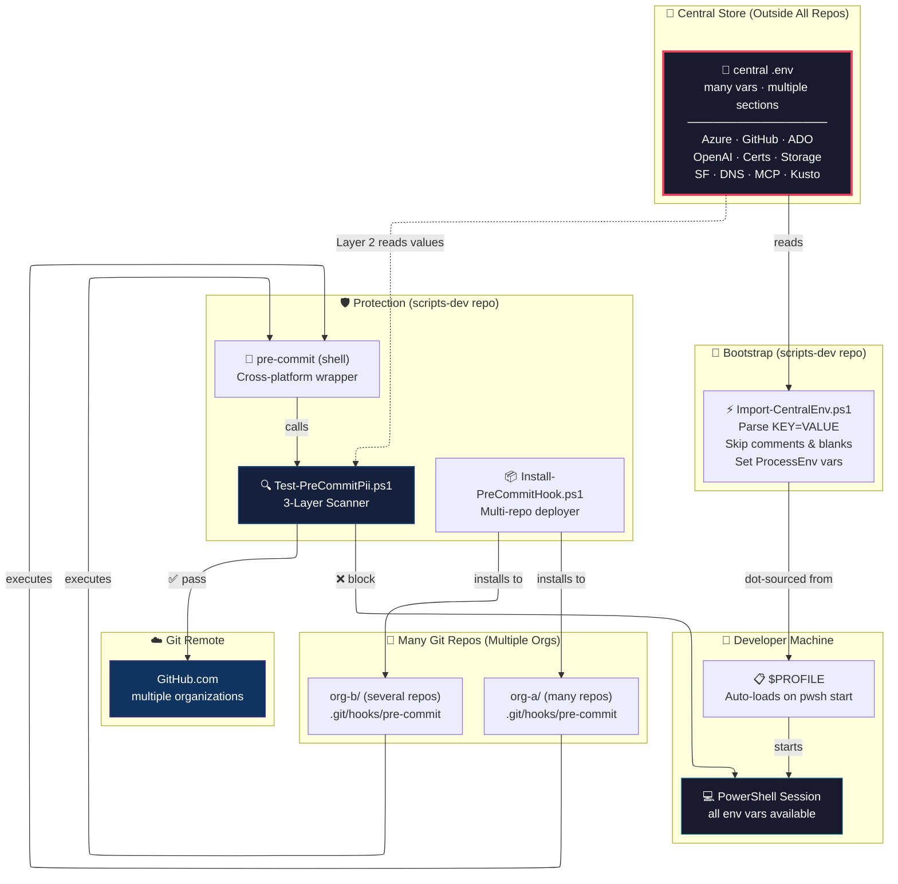

---

## How It Works: End-to-End Flow

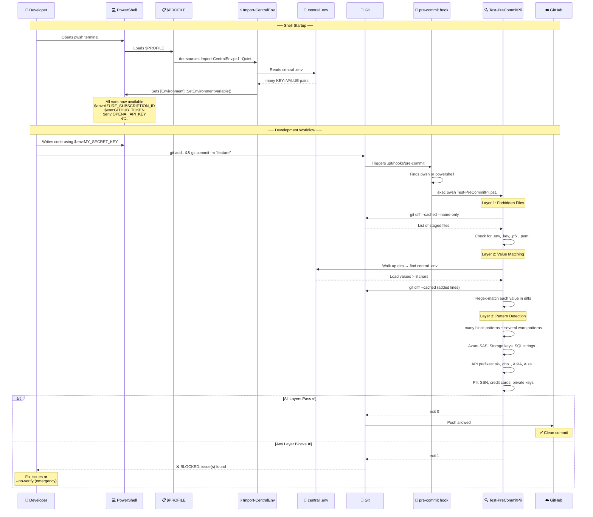

---

## The 3-Layer Scanner Deep Dive

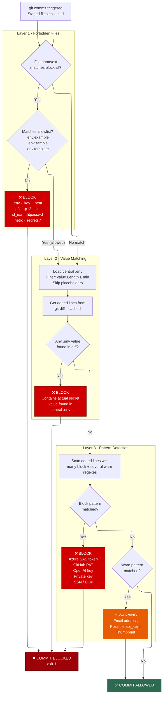

---

## Cross-Org Deployment

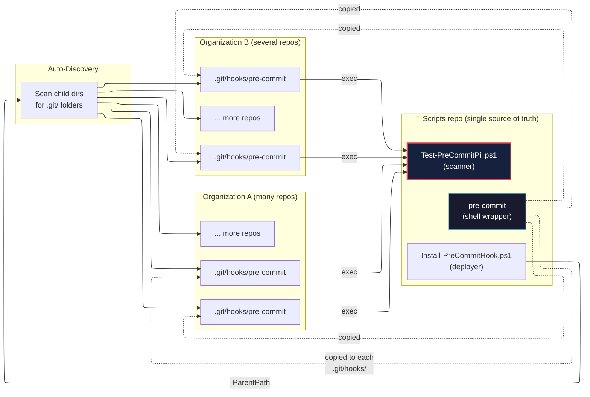

**Key design**: The shell wrapper is copied to each repo, but the actual scanner (`Test-PreCommitPii.ps1`) lives in one place. The wrapper walks up directories to find it — so updating the scanner in the scripts repo instantly updates all repos.

---

## Central .env Structure

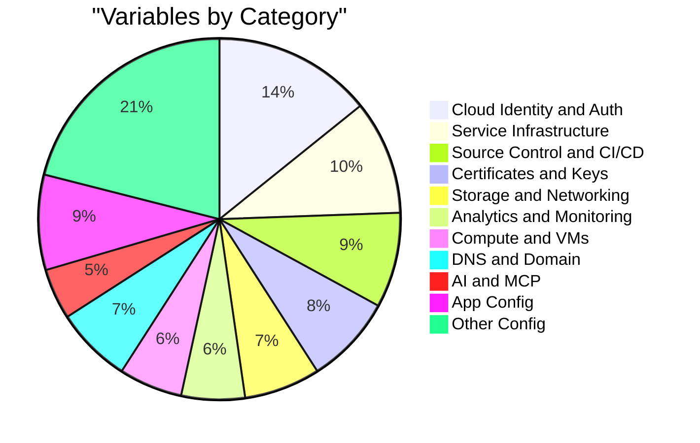

```
<root>\.env                          ← OUTSIDE all repos (no .git/ here)
├── # ── Cloud Identity ──
│   ├── CLOUD_SUBSCRIPTION_ID=...
│   ├── CLOUD_TENANT_ID=...
│   └── CLOUD_RESOURCE_GROUP=...
├── # ── Source Control ──
│   ├── SCM_TOKEN=...
│   └── SCM_ORG=...
├── # ── AI Services ──
│   └── AI_API_KEY=...
├── # ── Certificates ──
│   ├── CERT_THUMBPRINT=...
│   └── PFX_BASE64=...
└── ... (many sections)
```

---

## Import-CentralEnv.ps1 Logic

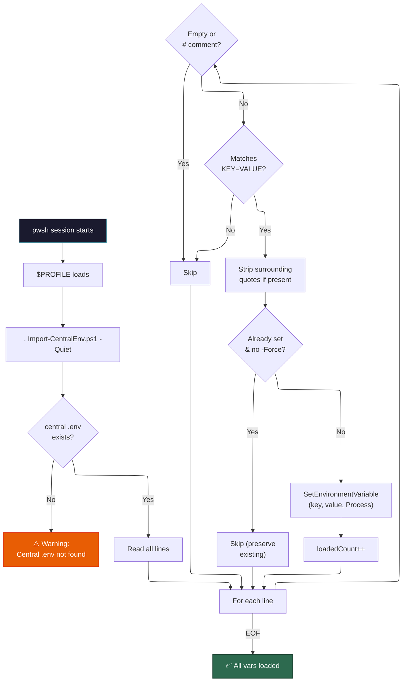

---

## Hook Resolution Chain

When `git commit` fires the `pre-commit` hook, the shell wrapper must locate `Test-PreCommitPii.ps1`:

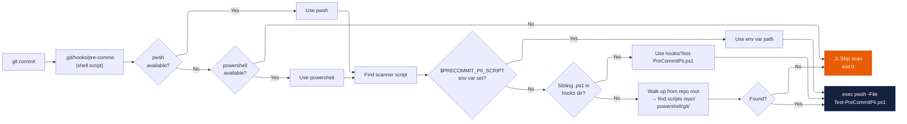

---

## What Gets Blocked vs. Warned

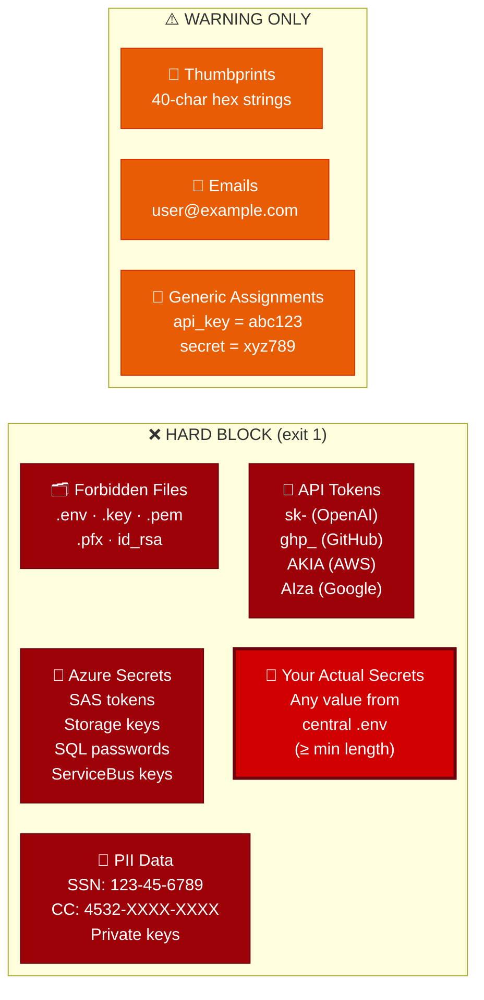

---

## Security Posture Summary

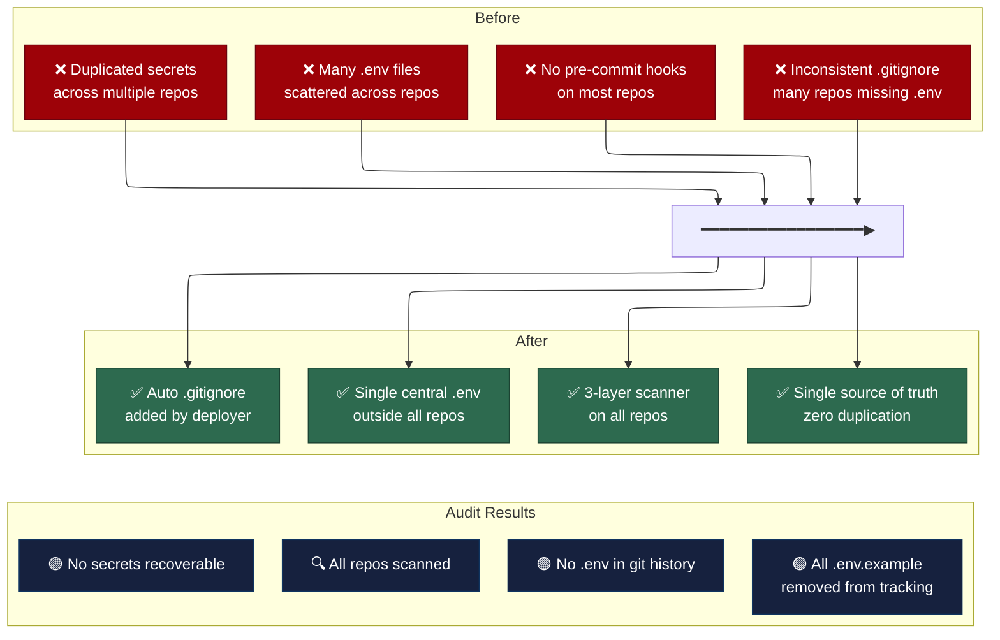

---

## Quick Reference

| Action | Command |
|--------|---------|
| Reload env vars | `Import-CentralEnv -Force` |
| Test hook (dry run) | `Test-PreCommitPii.ps1 -DryRun -Verbose` |
| Deploy to all repos | `Install-PreCommitHook.ps1 -ParentPath @('<root>\org-a','<root>\org-b') -Force` |
| Deploy to one repo | `Install-PreCommitHook.ps1 -RepoPath '<root>\org-a\my-repo'` |
| Preview deployment | `Install-PreCommitHook.ps1 -ParentPath '<root>\org-a' -WhatIf` |
| Emergency bypass | `git commit --no-verify -m 'reason'` |
| Edit central secrets | `code <root>\.env` then `Import-CentralEnv -Force` |

---

## File Map

```
<root>\
├── .env                                          ← 🔐 Central store (many vars)
├── org-a\                                        ← many repos
│   ├── repo-1\.git\hooks\pre-commit              ← 🛡️ Hook (→ scanner)
│   ├── repo-2\.git\hooks\pre-commit              ← 🛡️ Hook (→ scanner)
│   └── ... (more repos)
├── org-b\                                        ← several repos
│   ├── scripts-dev\powershell\
│   │   ├── automation\Import-CentralEnv.ps1      ← ⚡ Loader
│   │   └── git\
│   │       ├── Test-PreCommitPii.ps1             ← 🔍 Scanner (single copy)
│   │       ├── pre-commit                        ← 🐚 Shell wrapper (template)
│   │       ├── Install-PreCommitHook.ps1         ← 📦 Deployer
│   │       ├── pii-secrets-scan.yml              ← 🔄 CI workflow template (Layer 4)
│   │       ├── Invoke-GitleaksScan.ps1           ← 🔗 Gitleaks wrapper (optional)
│   │       └── SECRET-INCIDENT-RESPONSE.md       ← 📋 Incident response runbook
│   └── ... (more repos with hooks)
└── backup\.env                                    ← 💾 Backup
```

---

## Improvement Review & Recommendations

The following recommendations were reviewed against the current implementation. Each is assessed for accuracy, impact, and compatibility with the existing design.

### 1. Layer 4: Server-Side Enforcement (CI Pipeline)

**Recommendation**: Add a CI check ("PII & Secrets Scan") so the repo is protected even when someone bypasses the local hook with `--no-verify`.

**Assessment**: ✅ **Valid and recommended.** Local hooks are client-side only — any developer can bypass them. A server-side CI step closes this gap. Platform-level push protection (e.g., GitHub Advanced Security secret scanning) adds a second server-side net.

**Implementation sketch**:

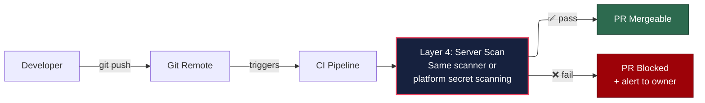

**Status**: 🟢 **Scaffolded** — `pii-secrets-scan.yml` workflow template created in scripts repo.

To deploy: copy `powershell/git/pii-secrets-scan.yml` → `<repo>/.github/workflows/pii-secrets-scan.yml`, set `SCRIPTS_REPO_TOKEN` secret, mark check as required in branch protection.

---

### 2. Use `core.hooksPath` Instead of Copying Hooks

**Recommendation**: Set `git config --global core.hooksPath <centralHooksDir>` to avoid copying the wrapper into every repo's `.git/hooks/`.

**Assessment**: ⚠️ **Partially valid — trade-offs exist.**

| Pros | Cons |
|------|------|
| Zero hook drift — one copy, all repos use it | **Global** — applies to ALL repos including third-party clones |
| No deployer needed for hook distribution | Cannot have repo-specific hooks alongside (hooks.d not natively supported) |
| Simpler maintenance | Breaks repos that ship their own hooks (e.g., husky, lefthook) |
| Recommended by Git documentation | Requires onboarding step if developer uses multiple machines |

**Current design already mitigates drift**: The copied wrapper is thin — it walks up directories to find the single scanner. Updating the scanner in the scripts repo updates behavior for all repos instantly. Only the shell wrapper itself (rarely changed) is copied.

**Recommendation**: Offer `core.hooksPath` as an **alternative mode** in the deployer rather than replacing the copy strategy. Developers using JS/Python repos with framework hooks will need the per-repo approach.

```powershell
# Alternative mode in Install-PreCommitHook.ps1
Install-PreCommitHook.ps1 -UseGlobalHooksPath  # sets core.hooksPath
Install-PreCommitHook.ps1 -ParentPath <dirs>    # current copy mode (default)
```

---

### 3. Treat Found Secrets as Incidents

**Recommendation**: When the scanner blocks a commit containing a real secret, treat it as a potential compromise — rotate the credential immediately.

**Assessment**: ✅ **Valid.** If a secret reached a staged diff, it may have been exposed in shell history, logs, or temporary files. Best practice is to rotate proactively.

**Incident Response Procedure**:

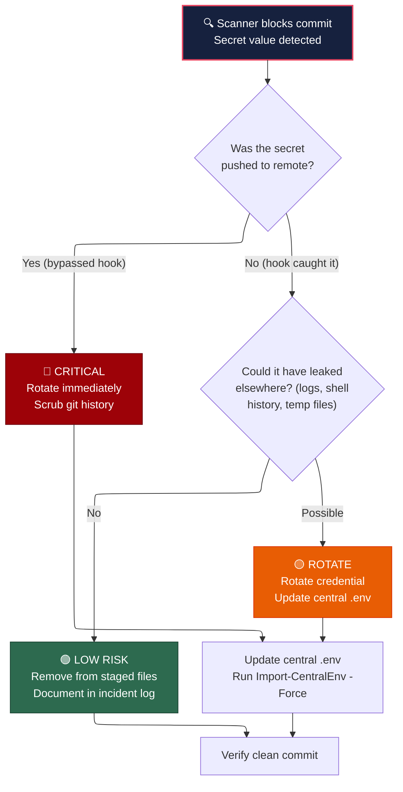

**Key rotation targets**: Cloud service keys, API tokens, connection strings, certificates (if private key exposed).

**Status**: 🟢 **Scaffolded** — `SECRET-INCIDENT-RESPONSE.md` runbook created in scripts repo with severity levels, step-by-step procedures, rotation quick reference, and incident log template.

---

### 4. Harden Central .env Storage

**Recommendation**: Apply OS-level protections to the central `.env` file.

**Assessment**: ✅ **Valid.** The file contains all credentials in plaintext — defense in depth applies here too.

| Protection | Method | Notes |
|------------|--------|-------|
| **Restrict ACLs** | `icacls .env /inheritance:r /grant:r "%USERNAME%:(R,W)"` | Limit to current user only |
| **Encrypt at rest** | BitLocker (full disk) or EFS (per-file) | EFS is transparent to the user |
| **Prevent cloud sync** | Exclude from OneDrive/Dropbox sync folders | Already addressed — file lives outside user profile |
| **Don't log values** | Scanner already shows "match found" not the value | ✅ Already implemented in Layer 2 |

**Action**: Add ACL hardening to the deployer or as a post-setup step. Document BitLocker/EFS recommendation.

```powershell
# Harden .env file permissions (Windows)
$envPath = "<root>\.env"
icacls $envPath /inheritance:r /grant:r "${env:USERNAME}:(R,W)"
```

---

### 5. Delegate to a Known Scanner Engine (e.g., Gitleaks)

**Recommendation**: Use a battle-tested scanner like Gitleaks under the hood to reduce regex maintenance.

**Assessment**: ⚠️ **Partially valid — hybrid approach best.**

| Current Custom Scanner | Gitleaks / trufflehog |
|------------------------|----------------------|
| ✅ Layer 2 (value matching against actual .env) — **unique capability** | ❌ Cannot match against your real secret values without configuration |
| ✅ No external dependencies | ❌ Requires Go binary or container |
| ⚠️ Regex set needs manual updates | ✅ Community-maintained rules (~800+ patterns) |
| ✅ PowerShell-native, cross-platform | ✅ Cross-platform binary |
| ✅ Integrated warning vs. block behavior | ⚠️ Binary block/allow only |

**Key insight**: Layer 2 (matching actual `.env` values against staged diffs) is a capability that off-the-shelf scanners do not provide without custom configuration. This is the system's strongest differentiator.

**Recommendation**: Keep Layers 1 and 2 as-is. Optionally invoke Gitleaks as an additional Layer 3 sub-check for broader pattern coverage, while retaining custom patterns for organization-specific needs.

**Status**: 🟢 **Scaffolded** — `Invoke-GitleaksScan.ps1` wrapper created in scripts repo. Supports `-Install` (auto-download), `-StagedOnly`, JSON reporting. Non-blocking by default — exits 0 if gitleaks not installed.

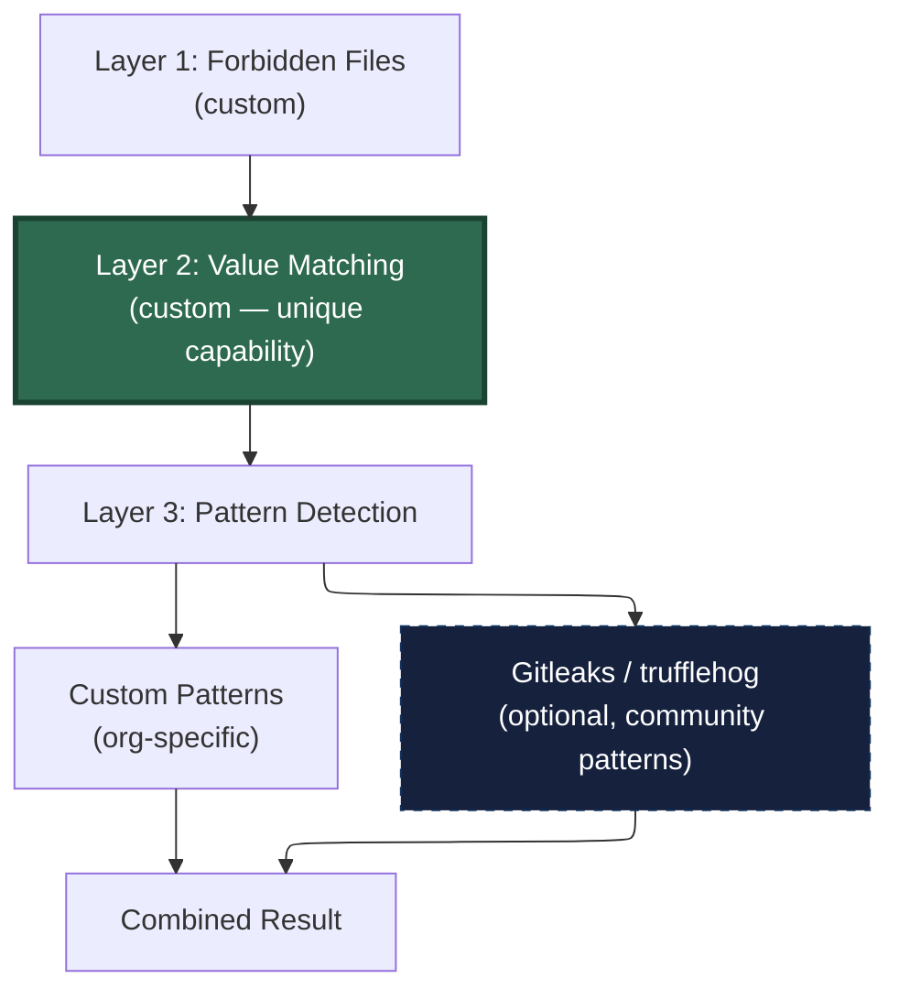

---

### Summary Matrix

| # | Recommendation | Verdict | Priority | Status |
|---|---------------|---------|----------|--------|
| 1 | Layer 4: CI enforcement | ✅ Do it | High | 🟢 Scaffolded — `pii-secrets-scan.yml` |
| 2 | `core.hooksPath` | ⚠️ Offer as option | Medium | ⬜ Deferred |
| 3 | Incident response for found secrets | ✅ Do it | High | 🟢 Scaffolded — `SECRET-INCIDENT-RESPONSE.md` |
| 4 | Harden .env file (ACLs, encryption) | ✅ Do it | Medium | ⬜ Deferred |
| 5 | Gitleaks as optional engine | ⚠️ Consider hybrid | Low | 🟢 Scaffolded — `Invoke-GitleaksScan.ps1` |
