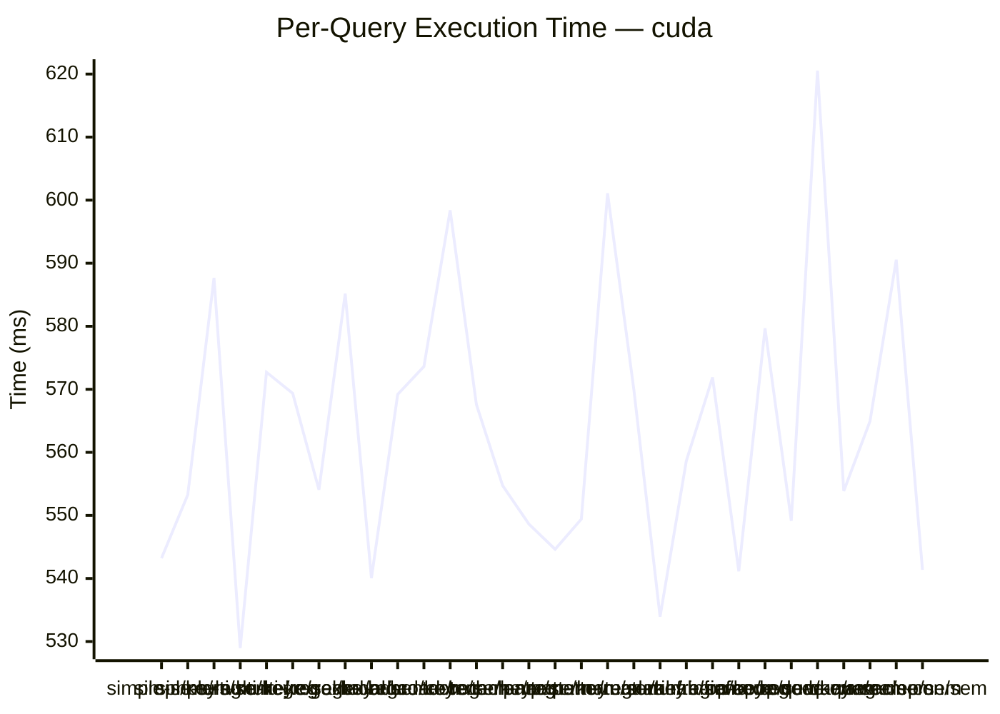
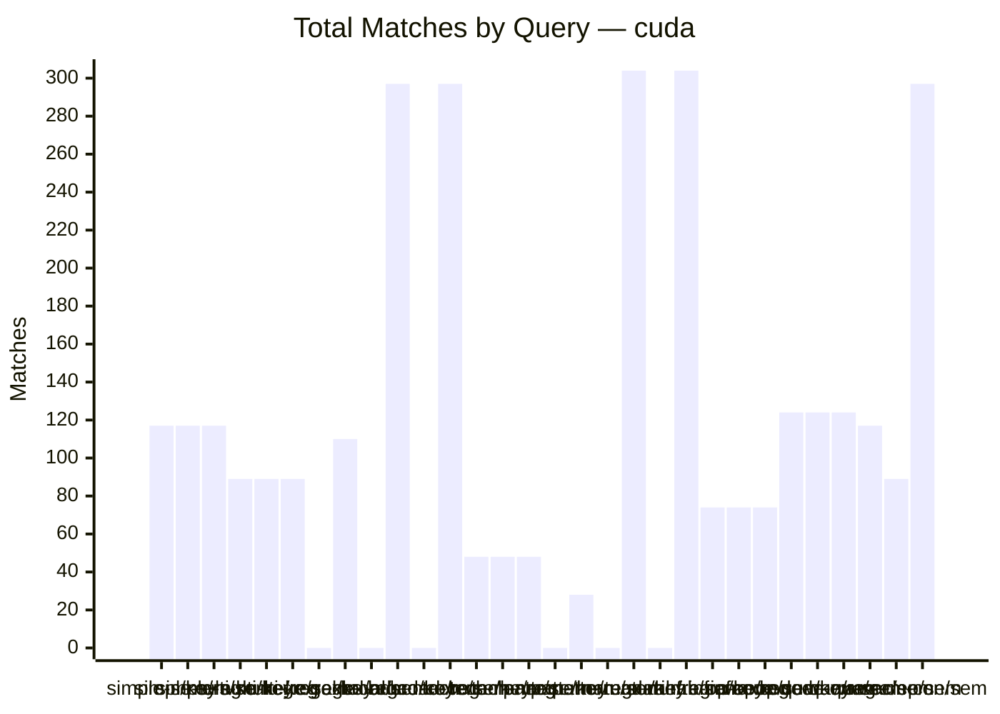

# MCP Search Benchmark Results

**Date**: 2026-03-02 22:31:24  
**Device**: `cuda`  
**Total Duration**: 26.83s  
**Total Queries**: 30  
**GPU**: NVIDIA GeForce RTX 3090  
**OS**: Microsoft Windows 11 Pro N

---

## Summary Statistics

| Mode | Queries | Avg (ms) | Min (ms) | P50 (ms) | P95 (ms) | Max (ms) |
|------|---------|----------|----------|----------|----------|----------|
| keyword | 9 | 555.41 | 528.98 | 554.07 | 571.9 | 571.9 |
| regex | 9 | 564.95 | 533.93 | 554.74 | 620.55 | 620.55 |
| semantic | 12 | 569.52 | 540.06 | 569.36 | 601.09 | 601.09 |

---

## Average Execution Time by Mode

```mermaid
bar chart
    title Average Search Time (ms) — cuda
    x-axis [keyword, regex, semantic]
    y-axis "Time (ms)" 0 --> 745
    bar [555.41, 564.95, 569.52]
```

## Latency Distribution (P50 vs P95 vs Max)

```mermaid
xychart-beta
    title "Latency Percentiles — cuda"
    x-axis ["keyword", "regex", "semantic"]
    y-axis "Time (ms)" 0 --> 745
    bar [554.07, 554.74, 569.36]
    bar [571.9, 620.55, 601.09]
    bar [571.9, 620.55, 601.09]
```



## Per-Query Execution Timeline



## Match Count Comparison



---

## Detailed Results

| # | Query | Mode | Keywords | Exec (ms) | Wall (ms) | Matches | Returned | Status |
|---|-------|------|----------|-----------|-----------|---------|----------|--------|| 1 | simple-single | keyword | security | 543.23 | 562 | 117 | 50 | OK |
| 2 | simple-single | regex | security | 553.27 | 561 | 117 | 50 | OK |
| 3 | simple-single | semantic | security | 587.67 | 1303 | 117 | 50 | OK |
| 4 | multi-keyword | keyword | deploy, kubernetes, container | 528.98 | 555 | 89 | 50 | OK |
| 5 | multi-keyword | regex | deploy, kubernetes, container | 572.71 | 580 | 89 | 50 | OK |
| 6 | multi-keyword | semantic | deploy, kubernetes, container | 569.36 | 1140 | 89 | 50 | OK |
| 7 | regex-alternation | keyword | deploy|release|publish | 554.07 | 575 | 0 | 0 | OK |
| 8 | regex-alternation | regex | deploy|release|publish | 585.17 | 591 | 110 | 50 | OK |
| 9 | regex-alternation | semantic | deploy|release|publish | 540.06 | 1106 | 0 | 0 | OK |
| 10 | broad-concept | keyword | best practices for error handling | 569.18 | 1155 | 297 | 50 | OK |
| 11 | broad-concept | regex | best practices for error handling | 573.62 | 580 | 0 | 0 | OK |
| 12 | broad-concept | semantic | best practices for error handling | 598.38 | 1695 | 297 | 50 | OK |
| 13 | tech-narrow | keyword | RBAC, authorization, role | 567.6 | 597 | 48 | 48 | OK |
| 14 | tech-narrow | regex | RBAC, authorization, role | 554.74 | 561 | 48 | 48 | OK |
| 15 | tech-narrow | semantic | RBAC, authorization, role | 548.63 | 1123 | 48 | 48 | OK |
| 16 | pattern-match | keyword | test.*coverage|unit.test | 544.63 | 567 | 0 | 0 | OK |
| 17 | pattern-match | regex | test.*coverage|unit.test | 549.42 | 555 | 28 | 28 | OK |
| 18 | pattern-match | semantic | test.*coverage|unit.test | 601.09 | 1146 | 0 | 0 | OK |
| 19 | natural-lang | keyword | how to configure CI/CD pipelines with automated testing | 569.98 | 1147 | 304 | 50 | OK |
| 20 | natural-lang | regex | how to configure CI/CD pipelines with automated testing | 533.93 | 542 | 0 | 0 | OK |
| 21 | natural-lang | semantic | how to configure CI/CD pipelines with automated testing | 558.64 | 1650 | 304 | 50 | OK |
| 22 | infra-ops | keyword | monitoring, alerting, observability | 571.9 | 596 | 74 | 50 | OK |
| 23 | infra-ops | regex | monitoring, alerting, observability | 541.14 | 548 | 74 | 50 | OK |
| 24 | infra-ops | semantic | monitoring, alerting, observability | 579.68 | 1118 | 74 | 50 | OK |
| 25 | code-quality | keyword | lint, format, code review | 549.15 | 568 | 124 | 50 | OK |
| 26 | code-quality | regex | lint, format, code review | 620.55 | 627 | 124 | 50 | OK |
| 27 | code-quality | semantic | lint, format, code review | 553.87 | 1101 | 124 | 50 | OK |
| 28 | warm-security | semantic | security | 564.93 | 1115 | 117 | 50 | OK |
| 29 | warm-deploy | semantic | deploy, kubernetes, container | 590.56 | 1142 | 89 | 50 | OK |
| 30 | warm-concept | semantic | best practices for error handling | 541.37 | 1688 | 297 | 50 | OK |

---

## Mode Descriptions

| Mode | Description |
|------|-------------|
| **keyword** | Default substring matching — scans titles, bodies, categories for literal text |
| **regex** | Pattern-based search — keywords treated as regex (supports alternation, wildcards) |
| **semantic** | Embedding-based similarity — uses `Xenova/all-MiniLM-L6-v2` model for conceptual matching |

## Environment

| Setting | Value |
|---------|-------|
| `INDEX_SERVER_SEMANTIC_ENABLED` | 1 |
| `INDEX_SERVER_SEMANTIC_DEVICE` | cuda |
| Model | Xenova/all-MiniLM-L6-v2 |
| Node.js | v22.20.0 |
