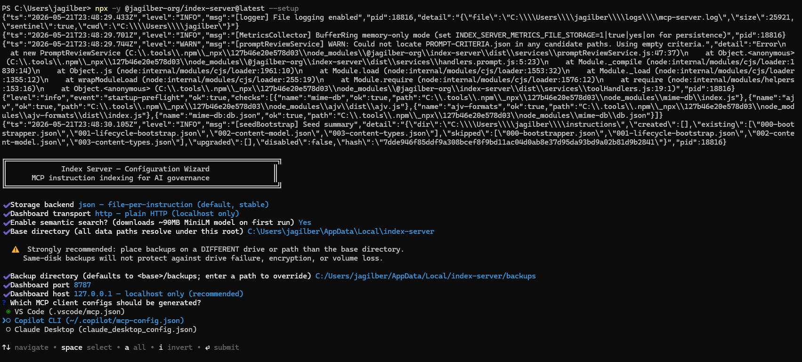
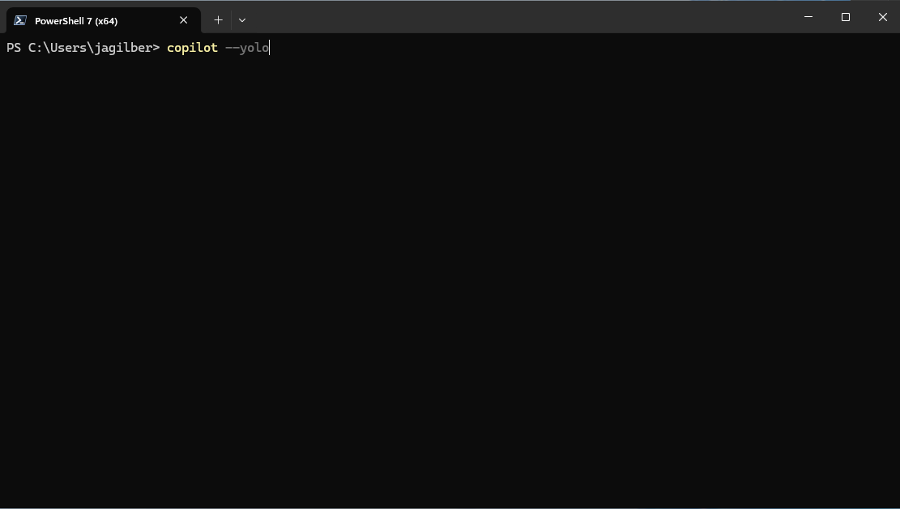
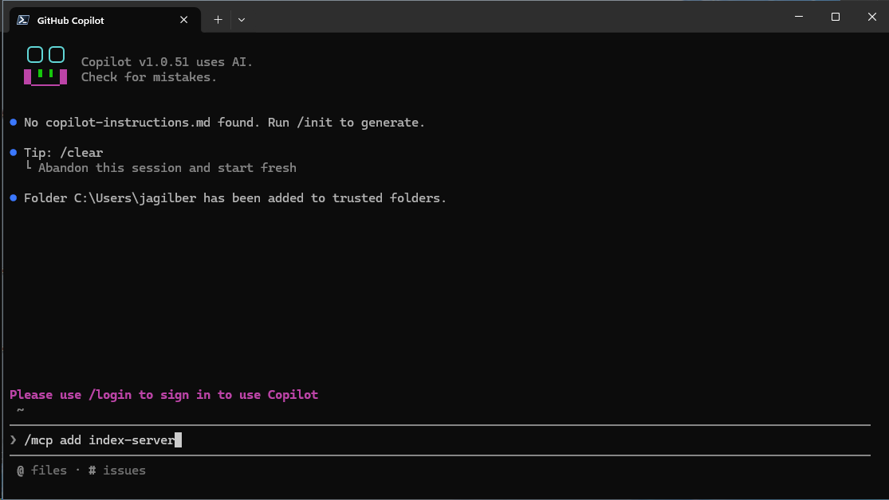
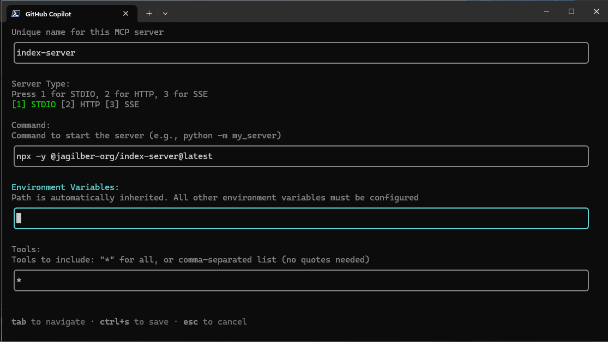
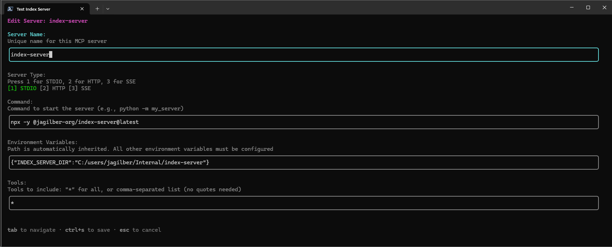
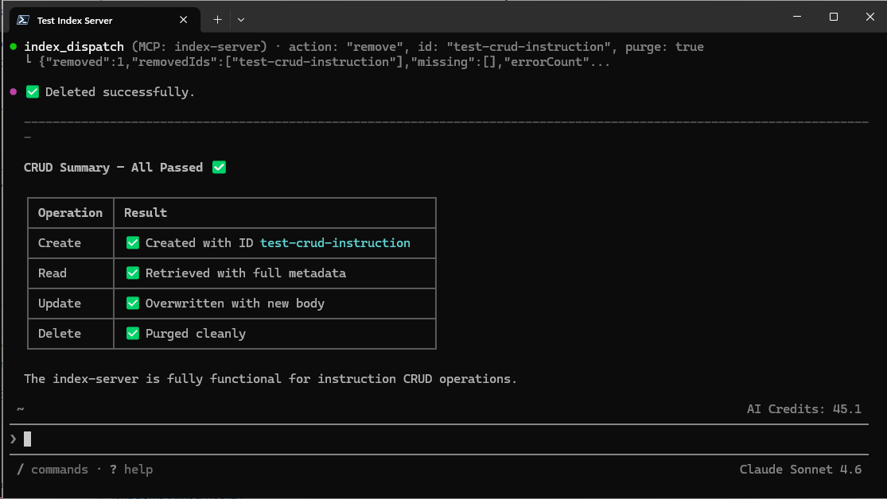

# Copilot CLI quick setup guide

A walkthrough for getting the GitHub Copilot CLI running with the `index-server` MCP wired in. The screenshots are captured on Windows / PowerShell but the same flow works on macOS and Linux.

## Prerequisites

- Node.js 20+ on `PATH` (verify with `node -v`).
- GitHub Copilot subscription tied to the account you'll authenticate with.
- The Copilot CLI installed: `npm install -g @github/copilot`.
- An empty directory you want the `index-server` to use for its persistent state (the value you'll set as `INDEX_SERVER_DIR`).

## Method A: Command-line setup (outside Copilot)

Run the built-in setup wizard directly from a terminal — no need to launch Copilot first. The wizard walks you through storage backend, transport, semantic search, base directory, and generates the MCP config file for the clients you choose (VS Code, Copilot CLI, Claude Desktop):

```pwsh
npx -y @jagilber-org/index-server@latest --setup
```



When the wizard finishes it writes the MCP server entry to the config files you selected. You can then start Copilot CLI normally — the server will be available immediately.

## Method B: Configure inside Copilot CLI

Use this method if you prefer the Copilot CLI's interactive `/mcp add` form.

### 1. Launch Copilot CLI in YOLO mode

Start the CLI with `--yolo` (auto-approve tool calls) so the MCP setup flow doesn't pause on every prompt:

```pwsh
copilot --yolo
```



> YOLO mode is fine for a trusted local setup. Drop the flag and approve calls manually if you'd prefer.

### 2. Add the index-server MCP

Inside the CLI, run `/mcp add index-server`:



Choose **STDIO** transport (press `1`), then accept the default command `npx -y @jagilber-org/index-server@latest`:



### 3. Point it at a working directory

In the **Environment Variables** field, enter `{"INDEX_SERVER_DIR":"<your-path>"}`. This is where the server stores its index, logs, and SQLite state — keep it on a fast local disk and out of any auto-syncing folder (OneDrive, Dropbox, etc.):



### 4. Smoke-test the server

Ask Copilot to run a quick CRUD test (or trigger any `index-server_*` tool) and confirm all operations pass:



If you see all CRUD operations passing, you're done — the CLI will reconnect automatically on subsequent launches.

## Resulting config

The wizard writes the entry below to `~/.copilot/mcp-config.json`. You can edit this file by hand if you need to tweak the path or pin a specific version.

```json
{
  "mcpServers": {
    "index-server": {
      "type": "stdio",
      "command": "npx",
      "tools": [
        "*"
      ],
      "args": [
        "-y",
        "@jagilber-org/index-server@latest"
      ],
      "env": {
        "INDEX_SERVER_DIR": "C:/Users/<you>/index-server"
      }
    }
  }
}
```

### Field reference

| Field | Purpose |
| --- | --- |
| `type` | Transport. `stdio` is what the wizard configures; the server is launched as a child process and piped over stdin/stdout. |
| `command` / `args` | How to launch the server. `npx -y @jagilber-org/index-server@latest` always pulls the latest published version; pin a version (e.g. `@1.4.2`) for reproducibility. |
| `tools` | Tool allow-list. `"*"` exposes every tool the server advertises. Replace with an array of tool names to restrict. |
| `env.INDEX_SERVER_DIR` | Working directory the server uses for its index, logs, and database. Use forward slashes on Windows to avoid JSON escaping. |

## Troubleshooting

- **`npx` hangs on first launch** — the package is downloading. Subsequent launches use the npm cache and are fast.
- **`INDEX_SERVER_DIR` errors** — confirm the path exists and is writable. The server will create subfolders inside it but does not create the root.
- **Stale tool list** — exit the CLI and relaunch; MCP servers are started lazily per session.
- **Pin a version** — replace `@latest` with an explicit version in `args` and restart the CLI.

## Related docs

- [copilot-cli-env-vars.md](copilot-cli-env-vars.md) — environment variables understood by the CLI.
- [QUICKSTART.md](QUICKSTART.md) — broader copilot-ui quickstart.
