# Admin Dashboard Guide

> Operational UI for monitoring and managing the index. Intended for administrators / maintainers – not general MCP clients. Keep it disabled in production unless actively in use.

## Contents

- Overview
- Dashboard Panels
- Enabling the Dashboard
- Core Panels
  - System Health Card
  - instruction index
  - Instruction Editor
  - Live Log Tail
- Semantic Summaries
- UI Drift Snapshots (Playwright)
- Maintenance & Baseline Refresh
- Troubleshooting

---

## Overview

The dashboard exposes real‑time server metrics, instruction index state, and controlled mutation workflows when explicitly enabled. It is intentionally out-of-band from the MCP protocol to avoid polluting the runtime capability surface used by agents.

### Dashboard Architecture

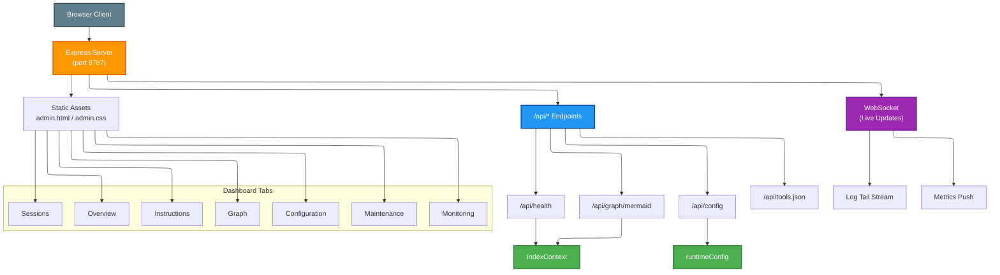

## Dashboard Panels

The admin dashboard features a Grafana-dark enterprise theme with seven navigation tabs:

### Overview

Server health metrics, uptime, and system status at a glance.

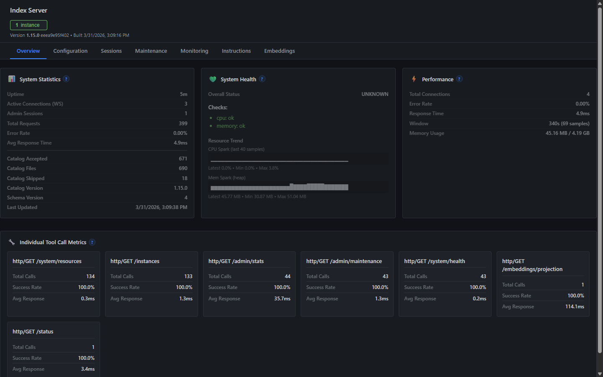

### Configuration

Active environment flags, feature toggles, and runtime configuration.

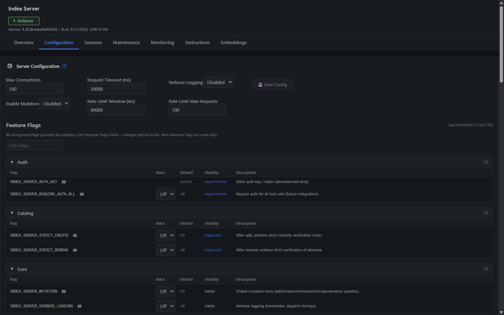

### Sessions

Connected client sessions and activity tracking.

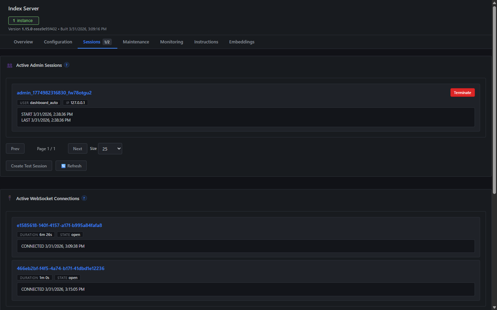

### Maintenance

Index maintenance operations, backup management, and repair tools.

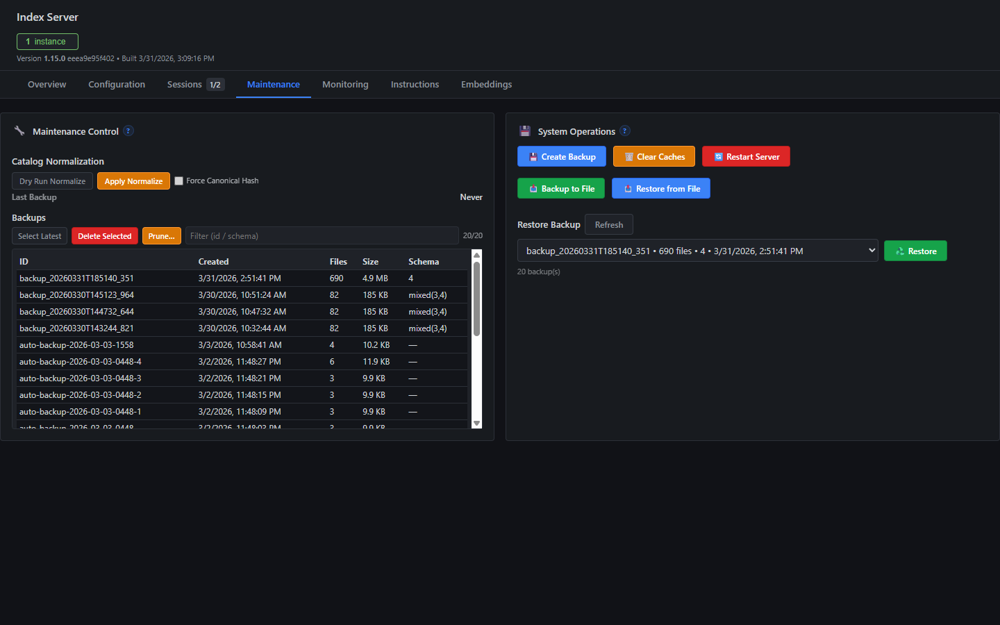

### Monitoring

Real-time performance metrics, request counts, and error rates.

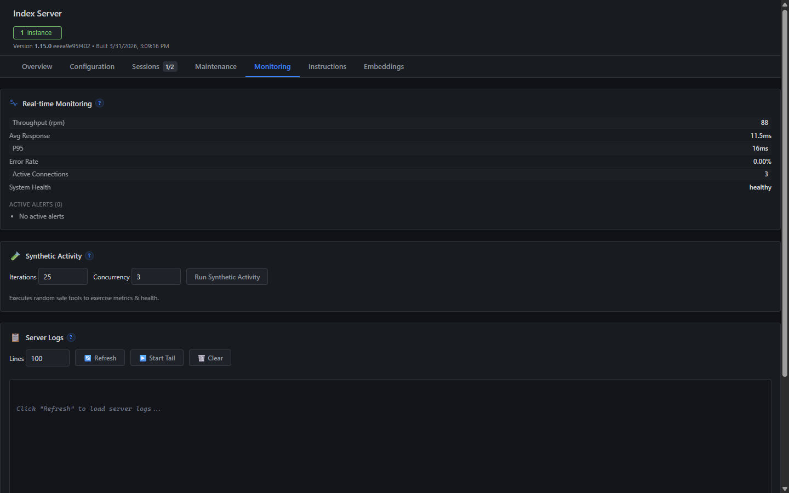

### Instructions

instruction index browser with metadata, governance status, and search.

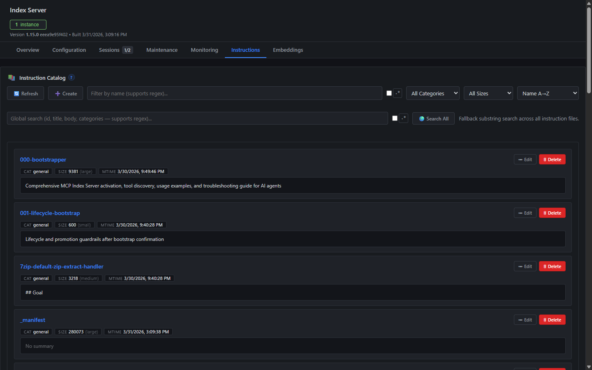

### Graph

Mermaid-rendered dependency graph of instruction relationships.

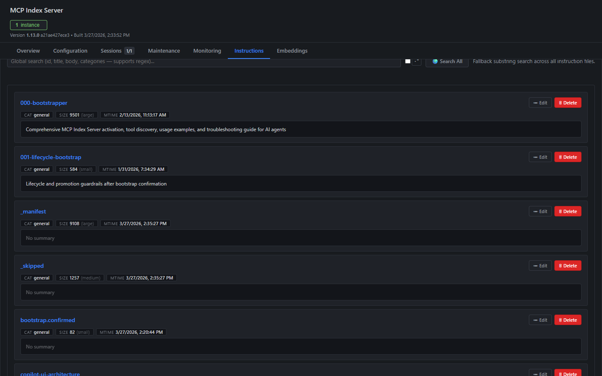

### Dashboard Data Flow

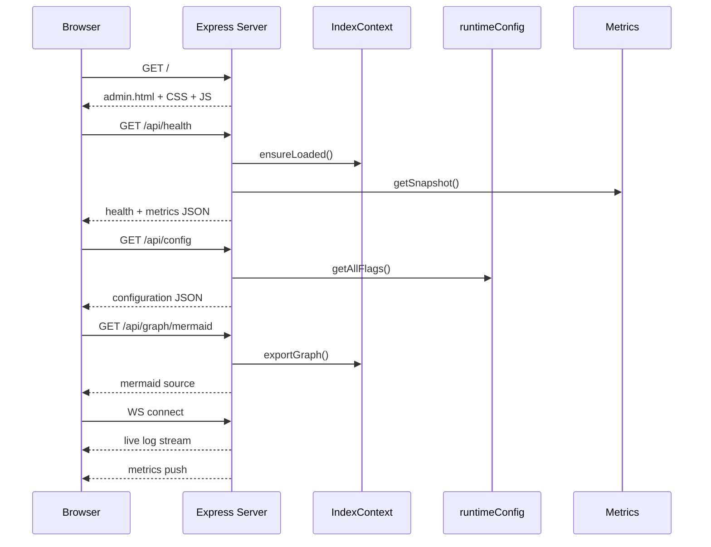

## Enabling the Dashboard

```bash
# Development (auto build via prestart)
INDEX_SERVER_DASHBOARD=1 npm start

# Specific port
INDEX_SERVER_DASHBOARD=1 INDEX_SERVER_DASHBOARD_PORT=8787 npm start

# Direct node invocation (built output)
node dist/server/index-server.js --dashboard --dashboard-port=8787
```

Access at: `http://localhost:<port>` (default 8787).

Environment variables / CLI flags:

- `INDEX_SERVER_DASHBOARD=1` or `--dashboard` – enable UI
- `INDEX_SERVER_DASHBOARD_PORT` or `--dashboard-port` -- override port (default 8787)
- `INDEX_SERVER_HTTP_METRICS=1` – (optional) exposes per-route counters shown in health panel (if implemented)

## Core Panels

### System Health Card

Shows process CPU %, memory RSS, uptime, and lightweight spark lines (CPU, memory). Designed for quick anomaly scanning rather than deep profiling.

Snapshot (example):


### instruction index

Paginated (or streaming) list of instruction metadata including derived `semanticSummary` for quick scanning. Columns typically include id, title, priority, owner, status, riskScore, and truncated semantic summary.

Snapshot (example):

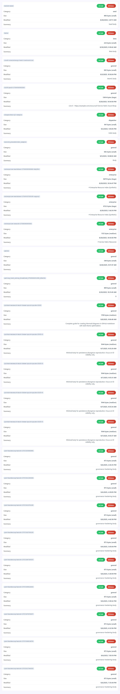

### Instruction Editor

Appears when selecting an instruction for edit or creating a new one (when mutation enabled). Transient validation / load flicker banner intentionally suppressed to reduce noise.

Enable mutation (example):

```bash
INDEX_SERVER_MUTATION=1 INDEX_SERVER_DASHBOARD=1 npm start
```

#### Markdown Preview

The instruction editor includes a built-in **Markdown Preview** panel for previewing the rendered `body` field of an instruction. Powered by [marked](https://github.com/markedjs/marked) with GitHub Flavored Markdown (GFM) enabled.

**Usage:**

1. Open an instruction in the editor (edit or create).
2. Click the **📖 Preview** button in the editor toolbar.
3. A preview panel appears below the textarea showing the rendered markdown from the instruction's `body` field.
4. The preview **auto-updates** as you type in the editor.
5. Click **📖 Hide Preview** to collapse the panel.

**Notes:**

* GFM features are supported: tables, fenced code blocks, task lists, strikethrough.
* Line breaks are not converted to `<br>` tags (standard markdown paragraph rules apply).
* If the instruction JSON is invalid or has no `body` field, the preview displays an informational message.

### Live Log Tail

Provides real-time server log streaming with start/stop controls (buttons styled to match action toolbar). Use for quick correlation during manual tests. Avoid leaving it running indefinitely in production.

### Snapshot Gallery (All Views / Cards)

Below is (or will be) a consolidated gallery of dashboard visual regression targets. Two are already captured by the baseline Playwright spec; the remainder can be added following the instructions further below.

| View / Card | Current Snapshot | Expected File Name (chromium / default OS) | Capture Status |
|-------------|------------------|--------------------------------------------|----------------|
| System Health Card |  | `panel-overview.png` | Captured |
| Instruction List (Index) | 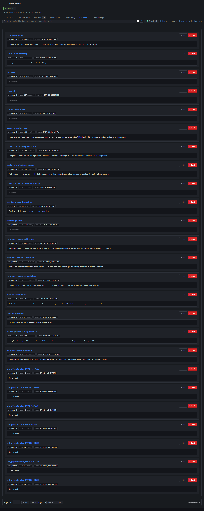 | `instructions-list-<browser>-<platform>.png` | Captured |
| Instruction Editor (panel open) | (skipped – no rows in seed run) | `instruction-editor-<browser>-<platform>.png` | Optional / Skipped |
| Log Tail (active streaming) | (skipped – button hidden in headless layout) | `log-tail-<browser>-<platform>.png` | Optional / Skipped |
| Dashboard Overview (top fold) | (optional) | `dashboard-overview-<browser>-<platform>.png` | Optional |
| Semantic Summary Row Focus (single row zoom) | (optional) | `instruction-row-focus-<browser>-<platform>.png` | Optional |

#### Adding Missing Snapshots

1. Open `tests/playwright/baseline.spec.ts`.
2. Add additional `test("instruction editor", ...)` style blocks using stable selectors.
3. Prefer scoping snapshots to minimal bounding containers to reduce drift noise (e.g. a specific card div rather than full page).

Steps:

- Run baseline generation:

  ```bash
  npm run pw:baseline
  ```

- Commit newly generated `.png` files under `tests/playwright/baseline.spec.ts-snapshots/`.

#### Example Playwright Snippet

```ts
// ...existing code...
test('instruction editor', async ({ page }) => {
  // Precondition: open editor (select first row, or click "New")
  await page.click('[data-test="instruction-row"]');
  await page.waitForSelector('[data-test="instruction-editor"]');
  const editor = await page.locator('[data-test="instruction-editor"]');
  expect(await editor.screenshot()).toMatchSnapshot('instruction-editor-chromium-win32.png');
});

test('log tail', async ({ page }) => {
  await page.click('[data-test="log-tail-toggle"]');
  await page.waitForSelector('[data-test="log-tail-active"]');
  const logPanel = await page.locator('[data-test="log-tail-panel"]');
  expect(await logPanel.screenshot()).toMatchSnapshot('log-tail-chromium-win32.png');
});
// ...existing code...
```

> Use parameterized naming (e.g. derive from `test.info().project.name`) if multi-browser to avoid hard‑coding browser names; the current baseline uses explicit file names for clarity.

#### Naming Guidance

Pattern: `<region-id>-<browser>-<platform>.png`

Where:

- `region-id` = kebab cased logical view (system-health-card, instructions-list, instruction-editor, log-tail, dashboard-overview)
- `browser` = playwright project name (chromium, firefox, webkit, etc.)
- `platform` = `process.platform` (win32, linux, darwin) for cross‑OS baselines when needed.

Keep region scope tight (card divs) unless an integrated layout regression must be tracked (use `dashboard-overview-*`).

#### Instruction for Reviewers

When a PR adds or updates snapshots:

- Ensure each new image corresponds to a documented row in the table above.
- Confirm diffs are intentional (layout / style purpose stated in PR summary).
- Reject additions of sprawling full‑page screenshots unless justified (increases flake risk).

#### Automated Drift Extension (Planned)

Future enhancement will auto‑comment on PRs summarizing which snapshot regions changed and link directly to diff artifacts. Once active, this section will be updated with comment format reference.

## Semantic Summaries

Each instruction row displays a concise semantic summary derived by fallback pipeline:

1. `meta.semanticSummary`
2. `semanticSummary`
3. `description`
4. First non-empty line of `body`

Server truncates to 400 chars (UI may further clamp). This ensures Index scanning remains performant and visually stable.

## UI Drift Snapshots (Playwright)

Drift detection guards against accidental removal or structural regression of critical UI regions. Narrow region snapshots minimize noise.

Key scripts:

- `npm run pw:baseline` – refresh golden snapshots
- `npm run pw:drift` – compare current render vs baseline

Snapshot directory: `tests/playwright/baseline.spec.ts-snapshots/`

Report output: `playwright-report/` (in CI artifact `playwright-drift-artifacts`).

### Stabilization Checklist Before Accepting Visual Change

1. Confirm intended UI change linked to an issue / PR description.
2. Run `npm run pw:drift` locally – ensure only expected regions differ.
3. Verify no accessibility regressions (landmarks, basic aria attributes) if structural.
4. Refresh baseline (`npm run pw:baseline`) and commit.
5. Observe one nightly cron pass clean before removing any related TODO.

Skips: Some regions are marked optional (editor, log tail) and tests auto-skip when prerequisites (at least one instruction row, visible tail button) are absent. This keeps baseline runs green while still documenting expected snapshot naming so teams can enable them later by seeding data or ensuring UI visibility.

### 1.4.x Baseline Expansion (Performance + Memory)

Version 1.4.x integrates memory sampling in parallel with CPU and promotes the Performance card (CPU + Memory sparklines) to a first-class visual baseline target. The Playwright suite (`baseline.spec.ts`) now captures:

- `system-health-card-*` (CPU + memory summary & status)
- `performance-card-*` (extended CPU + memory visualization panel)
- `instructions-list-*`
- `instruction-editor-*`
- `log-tail-*`
- `graph-mermaid-raw-*` (text snapshot)
- `graph-mermaid-rendered-*` (SVG render)

Deterministic seeding via `tests/playwright/global-setup.ts` ensures presence of at least one instruction and a log line, eliminating prior optional/skip logic for editor & tail captures. A short stabilization delay (≈1.2s) precedes performance card capture to mitigate sparkline initialization drift while maintaining tight diff thresholds (0.2% / 250px).

### When to Refresh Baseline

Refresh only when intentional UI changes alter the captured regions (layout/class changes or semantic summary rendering). Do NOT refresh for incidental color/font shifts unless expected.

### Local Refresh Flow

```bash
npm run build
npm run pw:baseline
git add tests/playwright/baseline.spec.ts-snapshots
git commit -m "test: refresh playwright baseline after <reason>"
```

## Maintenance & Operations

| Task | Recommendation |
|------|----------------|
| Port conflicts | Set `DASHBOARD_PORT` explicitly |
| High CPU spikes | Validate they align with indexing / backup tasks |
| Memory growth | Check large instruction bodies or leak via profiling |
| Missing instructions | Confirm on-disk JSON presence & restart with forced reload |

## Troubleshooting

| Symptom | Likely Cause | Action |
|---------|--------------|--------|
| Dashboard 404 | Not enabled | Add `INDEX_SERVER_DASHBOARD=1` / `--dashboard` |
| Empty instruction list | Read path issue or Index filtering | Check server logs & disk `instructions/` |
| Semantic summaries blank | All fallback fields empty | Add description or first line in body |
| Drift job failing | Legit layout change or stale baseline | Inspect artifact, decide to fix or refresh baseline |
| Log tail no output | Log level or buffering | Ensure server writes to stdout/stderr |

## Security Considerations

- Do not expose dashboard publicly. When `INDEX_SERVER_ADMIN_API_KEY` is set, the dashboard requires authentication via Bearer token with a login modal and sessionStorage-based session management. Without this variable, localhost access is allowed without auth; remote access is blocked with 403.
- All mutation endpoints (POST/PUT/DELETE) across instructions, tools, SQLite, knowledge, and messaging routes require admin auth when `INDEX_SERVER_ADMIN_API_KEY` is set. GET (read-only) routes remain open.
- Disable when not actively used (`INDEX_SERVER_DASHBOARD` unset) to reduce surface.
- Snapshot artifacts may include metadata; treat CI artifacts as internal.

### Authentication Behavior Matrix

| `INDEX_SERVER_ADMIN_API_KEY` | Client Location | Mutation Routes | Read-Only Routes |
|------------------------------|----------------|-----------------|------------------|
| Not set | Localhost | ✅ Allowed | ✅ Allowed |
| Not set | Remote | ❌ 403 Forbidden | ✅ Allowed |
| Set | Any (valid Bearer token) | ✅ Allowed | ✅ Allowed |
| Set | Any (missing/wrong token) | ❌ 401 Unauthorized | ✅ Allowed |

---

This guide complements: `configuration.md`, `mcp_configuration.md`, `tools.md`.

## Configuration Introspection (dashboard_config)

Version: Added in 1.1.2

When the server is running (dashboard optional), a new MCP tool `dashboard_config` returns a deterministic snapshot of ALL recognized environment / feature flags and their metadata – including those currently unset. This eliminates the need to manually cross‑reference README tables and scattered code comments.

### Why This Matters

- Central authoritative source for UI rendering of feature flag glossary.
- Enables clients / dashboards to diff configuration between processes (e.g. prod vs staging) without shell access.
- Surfaces experimental / diagnostic flags so they can be audited (e.g. detect if a diagnostic flag accidentally left on in production).
- Stabilizes tests: rather than pattern‑matching docs, tests can assert that specific flags exist with expected defaults & stability classification.

### Response Shape

```json
{
  "generatedAt": "2025-09-13T12:34:56.789Z",
  "total": 57,
  "flags": [
    {
      "name": "INDEX_SERVER_MUTATION",
      "category": "core",
      "description": "Enable mutation tools (add/import/remove/enrich/governance updates).",
      "stability": "stable",
      "since": "1.0.0",
      "default": "off",
      "type": "boolean",
      "value": "1",          // present only if set
      "enabled": true,         // boolean flags include parsed enabled
      "parsed": true           // parsed/normalized representation (number/string otherwise)
    },
    { "name": "INDEX_SERVER_MANIFEST_FASTLOAD", ... }
  ]
}
```

### Field Semantics

| Field | Meaning |
|-------|---------|
| name | Environment variable identifier |
| category | Logical grouping (core, dashboard, manifest, tracing, instructions, usage, metrics, validation, diagnostics, stress, auth, experimental, deprecated) |
| description | Concise human readable purpose |
| stability | Lifecycle classification (stable/diagnostic/experimental/deprecated/reserved) |
| since | First version flag introduced (best effort) |
| default | Documented default behavior when unset |
| type | Expected value type (boolean/number/string) |
| value | Raw environment-provided value (only when set) |
| enabled | Boolean interpretation (boolean flags only) |
| parsed | Normalized value (e.g. number parse, boolean parse) |

### Example Invocation (MCP Client JSON-RPC)

```json
{ "method":"tools/call", "params": { "name":"dashboard_config" } }
```

### Usage Patterns

- Auditing: Compare two environments by diffing returned flag arrays; highlight mismatches for investigation.
- UI: Populate a feature flag matrix with grouping & stability badges.
- Testing: Assert required stable flags exist with expected defaults; ensure deprecated flags remain listed (visibility) but are not active.
- Hardening: Failsafe check in CI that no diagnostic flags are active in production build pipeline (e.g. assert all diagnostic flags have enabled=false under prod profile).

### Extension Guidance

When adding a new flag:

1. Implement runtime usage (code path).
2. Append entry to `handlers.dashboardConfig.ts` (do not reorder existing entries to keep diff minimal).
3. Update README environment table if user‑facing.
4. Add tests if behavior materially affects runtime semantics.

> The curated list avoids dynamic discovery so that even removed / deprecated flags may be retained for operator awareness and historical audits.
