# Index Server — Interactive Setup Walkthrough

End-to-end screenshots of the bundled configuration wizard, from `npx` launch through dashboard verification.

```powershell
npx -y @jagilber-org/index-server@latest --setup
```

The wizard is **idempotent** — re-run it any time to change profile, port, TLS, or regenerate MCP client configs. The `--configure` flag is an alias for `--setup`.

> **Note:** Screenshots were captured against v1.28.21. The wizard now defaults the **Configuration scope** prompt (Step 9) to **Global** with Global listed first; the screenshot in that step still shows the previous ordering. The choices themselves are unchanged.

---

## 1. Launch

`npx` resolves the package, runs the server''s startup preflight (logger, metrics, seed bootstrap), then renders the wizard banner.

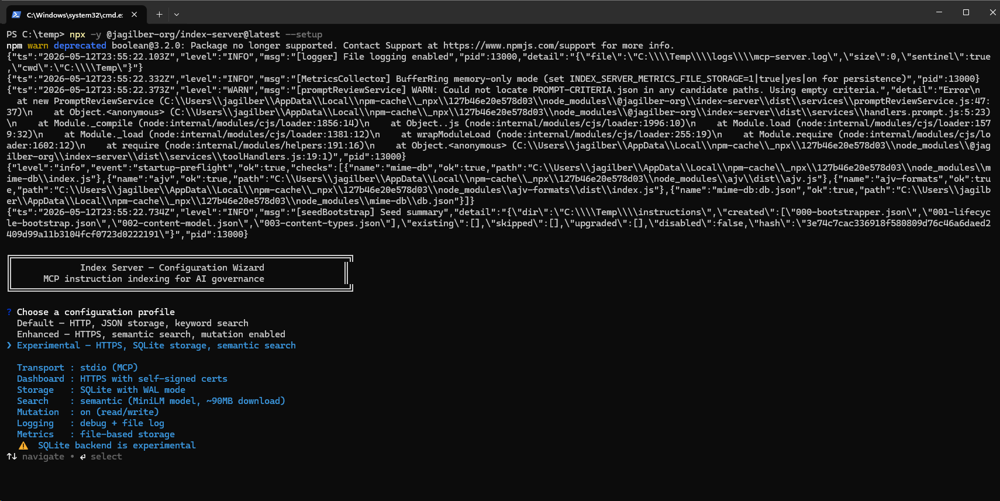

---

## 2. Choose a configuration profile

Three preset profiles bundle transport, storage, search engine, mutation policy, and dashboard defaults. The right pane shows the resolved settings for the highlighted profile.

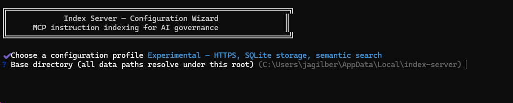

> Walkthrough selection: **Experimental** — HTTPS, SQLite storage, semantic search.

---

## 2a. Base directory

Single root under which every data path (instructions, embeddings, SQLite db, TLS certs, metrics) is resolved. Press `Enter` to accept the platform default — `%LocalAppData%\index-server` on Windows, `~/.local/share/index-server` on Linux/macOS.


> **Capture command:** `npx -y @jagilber-org/index-server@latest --setup` → select any profile → screenshot the **Base directory** prompt.

---

## 3. MCP server name

The key written into `mcp.json`''s `servers` map. Default `index-server`.

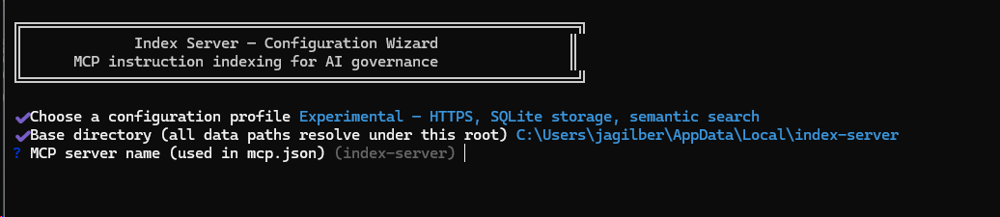

---

## 4. Dashboard port

Port for the admin/dashboard HTTP(S) listener. Default **8787**.

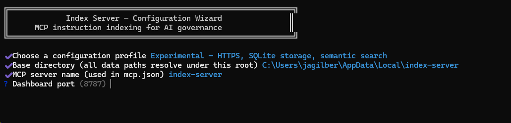

---

## 5. Dashboard host

Bind address. Localhost-only is recommended unless you intentionally want remote access.

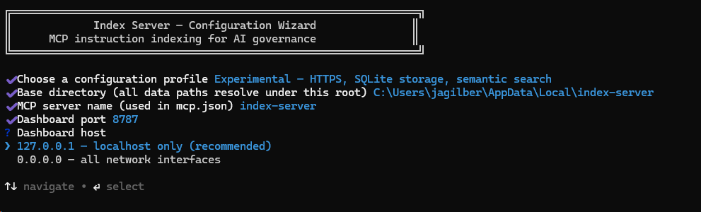

---

## 6. TLS certificates

Because the **Experimental** profile uses HTTPS, the wizard offers to generate a localhost self-signed cert chain via OpenSSL.

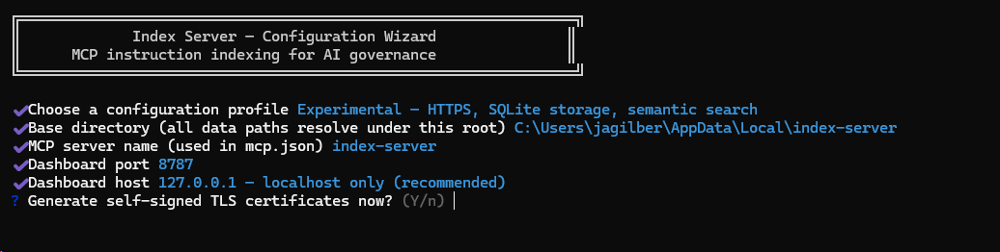

---

## 6a. Enable mutation (Default profile only)

The **Default** profile is read-only by default and asks whether to enable write operations (index_add, index_remove, archive, etc.). The Enhanced and Experimental profiles enable mutation automatically and skip this prompt.


> **Capture command:** `npx -y @jagilber-org/index-server@latest --setup` → choose **Default** profile → screenshot the **Enable mutation** prompt.

---

## 7. Log level

Five levels (`error`, `warn`, `info`, `debug`, `trace`). Default `info`.

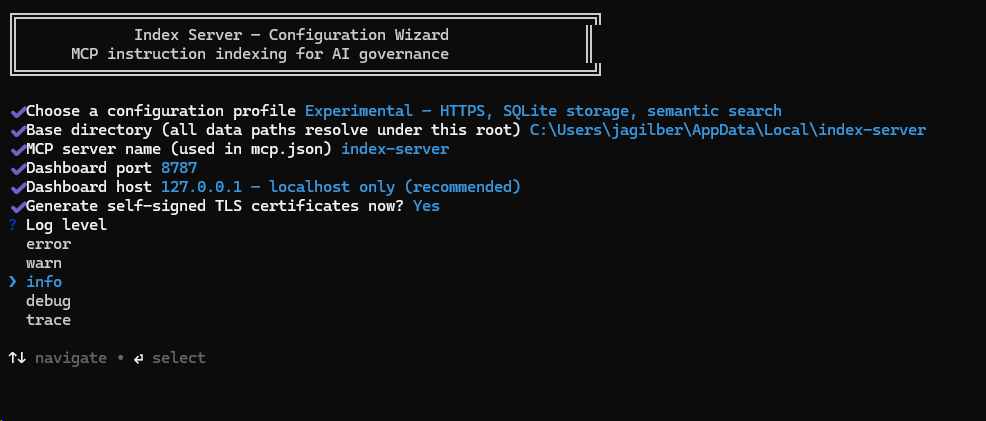

---

## 8. MCP client targets

Multi-select — pick every MCP client you want a config written for. `space` toggles, `a` selects all, `i` inverts, `↵` submits.

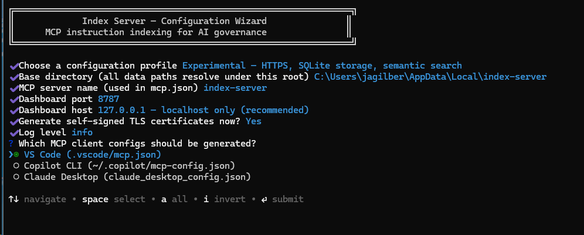

---

## 9. Configuration scope

Per-target choice: write to the **user-global** location, or to the workspace/repo (`.vscode/mcp.json`).

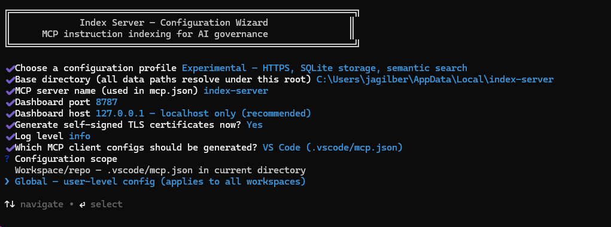

> Current build orders these as **Global** (default) → **Workspace/repo**. The screenshot reflects the previous ordering.

---

## 10. Index locations & configuration preview

The wizard prints all resolved data paths and the exact JSON it is about to write to each target, so you can review before any file is touched.

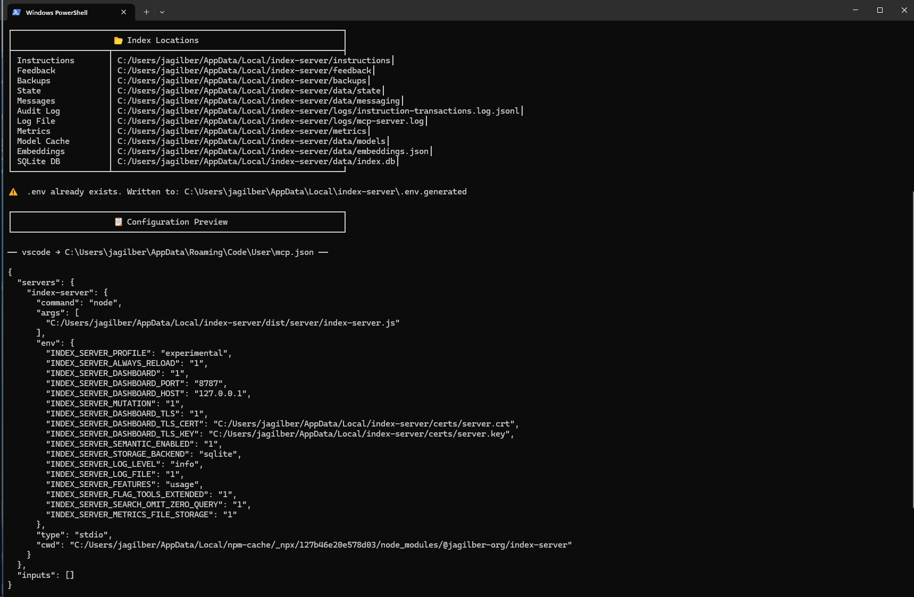

The generated `mcp.json` (user-global, VS Code) sets the standard `INDEX_SERVER_*` env vars on the `index-server` entry — profile, dashboard host/port, TLS cert paths under the chosen base directory, semantic search, SQLite storage, log level, mutation, and metrics-file storage.

---

## 11. TLS generation, config write, runtime confirmation

Final wizard output: the cert chain (CA + server pair) is generated, the MCP client config is written (existing files are timestamp-backed-up), and the deployed runtime version is confirmed. The `Next Steps` panel ends with a one-liner reminder that you can re-run the wizard at any time.

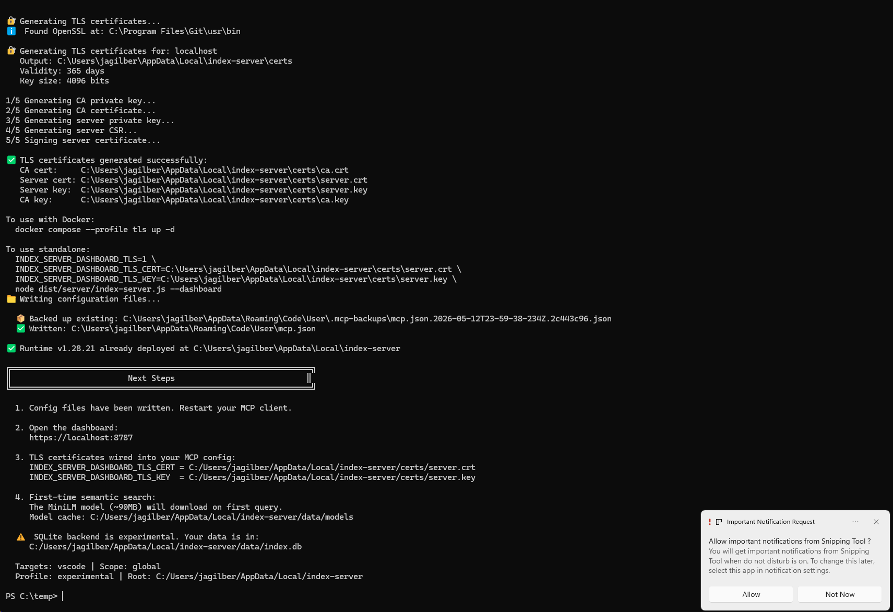

---

## 12. Enable the tools in VS Code

Open VS Code, then **Configure Tools** (chat picker). Check the `index-server` group to expose all of its tools to your AI agent.

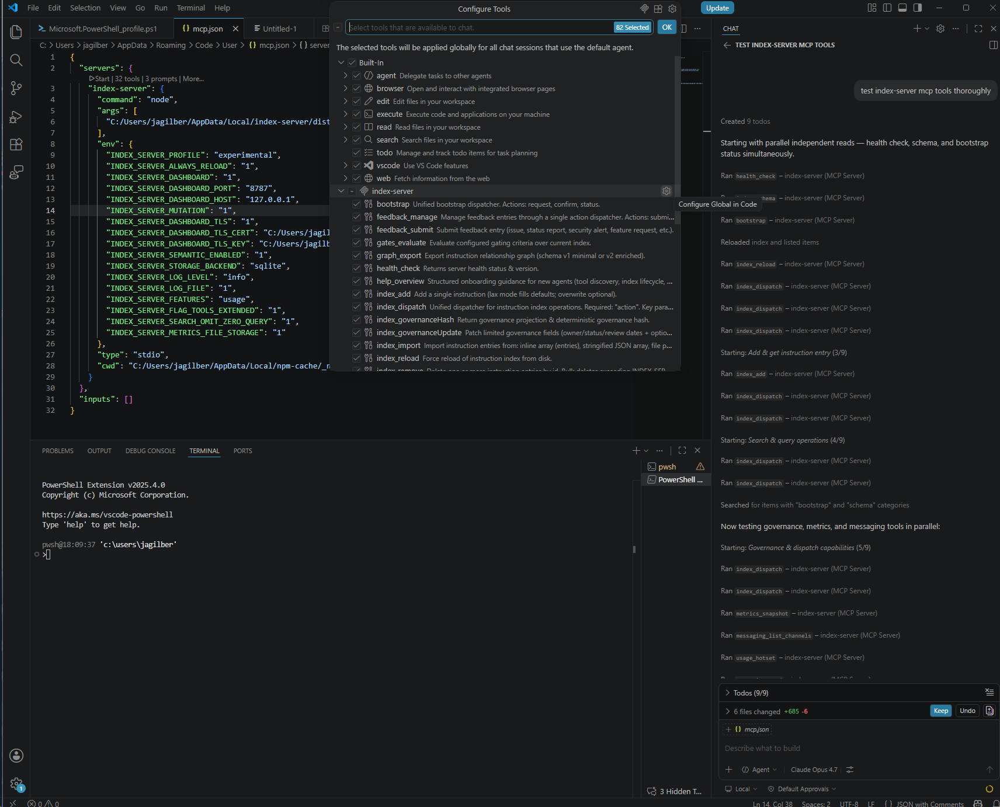

---

## 13. Open the dashboard

Browse to **https://localhost:8787/admin** and accept the self-signed certificate (Edge / Chrome will show "Not secure" — expected for the local CA generated in Step 6).

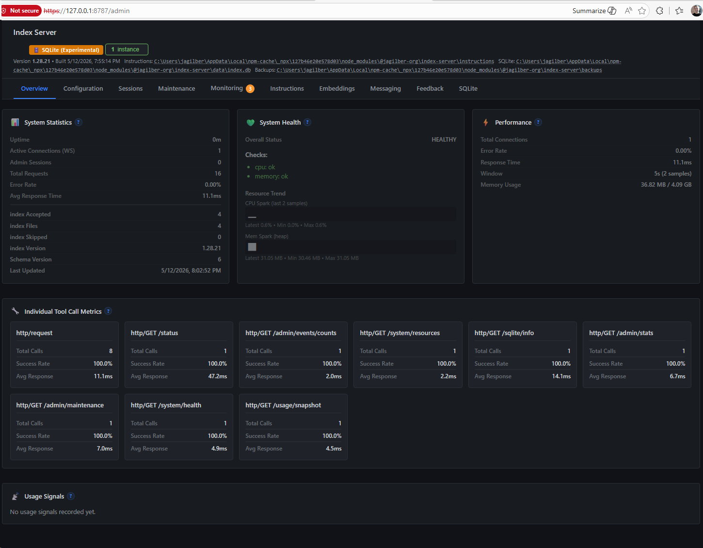

---

## Recap

| # | Step | Selection in this walkthrough |
|---|------|-------------------------------|
| 1 | Launch | `npx -y @jagilber-org/index-server@latest --setup` |
| 2 | Profile (+ base directory) | **Experimental** — HTTPS, SQLite, semantic search · default base dir accepted |
| 3 | MCP server name | `index-server` |
| 4 | Dashboard port | `8787` |
| 5 | Dashboard host | `127.0.0.1` (localhost only) |
| 6 | Generate TLS certs | **Yes** |
| 7 | Log level | `info` |
| 8 | MCP client targets | VS Code |
| 9 | Configuration scope | **Global** (user-level) |
| 10 | Paths + JSON preview | OK |
| 11 | Cert generation + write | OK (existing `mcp.json` backed up) |
| 12 | Enable tools in VS Code | `Configure Tools` → check **index-server** |
| 13 | Open dashboard | https://localhost:8787/admin |

After restarting the MCP client, the `index-server` tools become available to your AI agent. The first semantic query downloads the ~90 MB MiniLM model into the `data/models` cache.

To re-run this wizard later (idempotent):

```powershell
npx -y @jagilber-org/index-server@latest --setup    # works without a global install
index-server --setup                                # if installed globally
```
