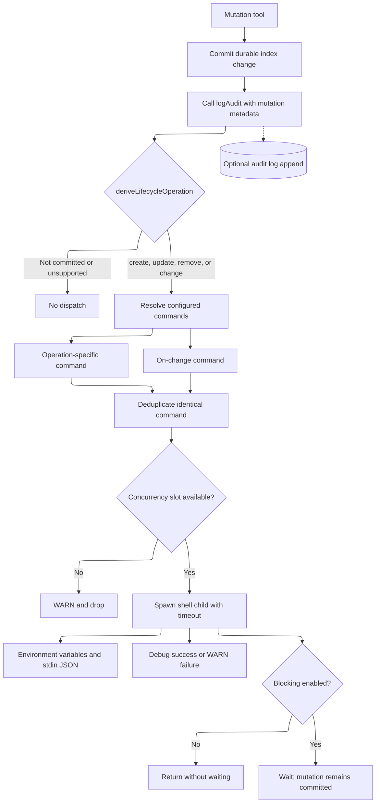

# Lifecycle Hooks

Lifecycle hooks let an operator run a trusted local command after Index Server commits an instruction mutation. The feature is optional and disabled until at least one command variable is configured.

Use hooks for external cache invalidation, repository synchronization, notifications, or other post-commit automation. Do not use them as the durable source of truth for instruction state; the index remains authoritative.

## Architecture



The dispatch point is `logAudit(..., kind: 'mutation')`, after the mutation handler has committed its durable write. Dispatch is independent of audit-file configuration: hooks still run when `INDEX_SERVER_AUDIT_LOG` is unset. The optional JSONL audit append occurs after hook dispatch begins; in blocking mode it occurs after the hook completes.

## Activation and Configuration

Configure one or more command variables, then restart Index Server:

| Variable | Default | Purpose |
| --- | --- | --- |
| `INDEX_SERVER_HOOK_ON_CREATE` | unset | Runs when `index_add` creates a new instruction. |
| `INDEX_SERVER_HOOK_ON_UPDATE` | unset | Runs when `index_add` durably overwrites an instruction. |
| `INDEX_SERVER_HOOK_ON_REMOVE` | unset | Runs when one or more instructions are removed. |
| `INDEX_SERVER_HOOK_ON_CHANGE` | unset | Fires alongside the specific hooks, and is the **only** hook for `import` and `promote_from_repo`. Not a catch-all — see the scope note below. |
| `INDEX_SERVER_HOOK_BLOCKING` | off | When enabled, synchronously waits for each selected command before the mutation call returns. |
| `INDEX_SERVER_HOOK_TIMEOUT_MS` | `10000` | Per-command wall-clock timeout in milliseconds; minimum `1`. |
| `INDEX_SERVER_HOOK_MAX_CONCURRENT` | `4` | Maximum in-flight child processes; minimum `1`. Excess non-blocking dispatches are dropped with a warning. |

An empty or whitespace-only command is treated as unconfigured. All variables are startup configuration and require a process restart.

### Scope: which mutations actually dispatch a hook

`ON_CHANGE` was previously documented as a "catch-all for every committed
mutation". It is not, and relying on that reading means silently missing events
(#591).

`deriveLifecycleOperation` (`src/services/lifecycleHooks.ts:52-73`) maps exactly
**four** audit actions to a lifecycle operation. Everything else reaches
`default: return undefined` and dispatches nothing — including `ON_CHANGE`.

| Audit action | Operation | Hooks that fire |
| --- | --- | --- |
| `add` (durable, `created: true`) | `create` | `ON_CREATE`, `ON_CHANGE` |
| `add` (durable, `created: false`) | `update` | `ON_UPDATE`, `ON_CHANGE` |
| `remove` (removed > 0) | `remove` | `ON_REMOVE`, `ON_CHANGE` |
| `import` (imported + overwritten > 0) | `change` | `ON_CHANGE` only |
| `promote_from_repo` | `change` | `ON_CHANGE` only |

**Dispatches nothing at all:** `archive`, `restore`, `archive_edit`, `purge`,
`groom`, `governanceUpdate`, `patch`, `normalize`, `enrich`, `repair`. An
`index_patch` that rewrites a body, or an archive that removes an entry from the
active set, is a committed mutation and fires no hook. If you need those, the
gap is in `deriveLifecycleOperation`, not in your configuration.

`add` also returns `undefined` — no hook — when the write was skipped, hit a
duplicate at write time, or failed to persist. That is deliberate: a hook that
fires on a write that did not happen is worse than no hook.

### MCP launcher example — Windows

Add the variables to the server's `env` object in the MCP client configuration:

```json
{
  "servers": {
    "index-server": {
      "command": "node",
      "args": ["C:\\path\\to\\index-server\\dist\\server\\index-server.js"],
      "env": {
        "INDEX_SERVER_HOOK_ON_CHANGE": "pwsh -NoProfile -File \"C:\\automation\\index-changed.ps1\"",
        "INDEX_SERVER_HOOK_TIMEOUT_MS": "15000",
        "INDEX_SERVER_HOOK_MAX_CONCURRENT": "2"
      }
    }
  }
}
```

Restart the MCP client or restart the Index Server process after saving the launcher configuration.

### Shell-session example — PowerShell

```powershell
$env:INDEX_SERVER_HOOK_ON_CHANGE = 'pwsh -NoProfile -File "C:\automation\index-changed.ps1"'
$env:INDEX_SERVER_HOOK_TIMEOUT_MS = '15000'
$env:INDEX_SERVER_HOOK_MAX_CONCURRENT = '2'
npm start
```

### Shell-session example — POSIX

```sh
export INDEX_SERVER_HOOK_ON_CHANGE='sh /opt/index-hooks/index-changed.sh'
export INDEX_SERVER_HOOK_TIMEOUT_MS='15000'
export INDEX_SERVER_HOOK_MAX_CONCURRENT='2'
npm start
```

Commands run with the platform shell because the command string is operator-authored. On Windows, quote paths containing spaces. On POSIX systems, use shell quoting appropriate for the configured command.

## Event Selection

| Audit action and metadata | Derived operation | Commands selected |
| --- | --- | --- |
| `add`, `created: true` | `create` | `ON_CREATE`, then `ON_CHANGE` |
| `add`, `created: false` | `update` | `ON_UPDATE`, then `ON_CHANGE` |
| `remove`, `removed > 0` | `remove` | `ON_REMOVE`, then `ON_CHANGE` |
| `import`, `imported + overwritten > 0` | `change` | `ON_CHANGE` |
| `promote_from_repo` | `change` | `ON_CHANGE` |
| skipped, duplicate-at-write, persistence failure, zero-result remove/import, reads, feedback, and unsupported actions | none | none |

If an operation-specific command and `ON_CHANGE` contain the same command string, Index Server runs it only once for that event.

## Hook Input Contract

Mutation data is never interpolated into the configured command. Each child receives the same JSON context through stdin and `INDEX_SERVER_HOOK_CONTEXT`, plus convenient scalar environment variables:

| Child environment variable | Value |
| --- | --- |
| `INDEX_SERVER_HOOK_OPERATION` | `create`, `update`, `remove`, or `change` |
| `INDEX_SERVER_HOOK_ACTION` | Originating audit action, such as `add`, `remove`, `import`, or `promote_from_repo` |
| `INDEX_SERVER_HOOK_IDS` | Comma-separated affected instruction identifiers |
| `INDEX_SERVER_HOOK_CORRELATION_ID` | Request correlation identifier, or an empty string |
| `INDEX_SERVER_HOOK_CONTEXT` | JSON object containing `operation`, `action`, `ids`, `correlationId`, `meta`, and `ts` |

Example PowerShell hook:

```powershell
$context = $env:INDEX_SERVER_HOOK_CONTEXT | ConvertFrom-Json
Write-Host "Index operation $($context.operation) affected $($context.ids.Count) instruction(s)."
```

Prefer the JSON context over parsing `INDEX_SERVER_HOOK_IDS`, especially when consuming multiple identifiers or metadata.

## Delivery and Failure Semantics

- Dispatch is post-commit. A hook failure never rolls back or corrupts the completed instruction mutation.
- Non-blocking mode is fire-and-forget. The mutation response does not wait for child completion.
- Blocking mode waits synchronously for selected commands, subject to the timeout, but still isolates failure from the mutation result.
- Delivery is at-most-once per selected command within the running process. There is no durable queue and no automatic retry.
- A process crash after the index commit but before child creation can lose the notification. Hook consumers should reconcile from Index Server when durable delivery is required.
- `ON_CREATE`/`ON_UPDATE`/`ON_REMOVE` and `ON_CHANGE` may both run for one mutation. Consumers should use the correlation identifier and event context for idempotency.
- Standard output is ignored. Up to a bounded amount of standard error is captured for diagnostics, and at most 500 characters are included in a non-zero-exit warning.

## Security Model

The command string is trusted operator configuration. Never derive it from instruction content, MCP parameters, or other untrusted data. Index Server passes mutation data only through child environment variables and stdin JSON.

The dashboard and `GET /api/admin/config` expose command **presence only**. Command text is never returned to the browser, logs, or dashboard render state. The Configuration tab accepts write-only replacements and persists them to the owner-readable runtime overlay; the response never echoes the submitted command. Launcher environment and external configuration management remain supported alternatives.

Review hook scripts as privileged automation. Restrict file permissions, avoid embedding credentials in command strings, and retrieve secrets from the child process environment or an external secret manager.

## Dashboard Operations

Open **Configuration** and use the **Manage lifecycle hooks** card directly below
the **Lifecycle hooks** summary:

- **Enabled/Disabled** is derived from whether at least one non-empty command is configured.
- **Commands configured** reports a count from zero to four without revealing command text.
- **Blocking**, **Timeout**, and **Max concurrent** show effective execution controls.
- Each command field starts blank. Enter text only when replacing a command.
- **Clear** stages an empty command, disabling that hook after save and restart.
- Blocking, timeout, and maximum concurrency are edited in the same card.
- The flag table continues to show only **Configured** or **Not configured**.
- Saved command and execution-control values take effect after restart.

The Configuration endpoint requires the normal dashboard admin authorization policy. Redaction is enforced server-side even for an authenticated administrator.

## Troubleshooting

1. Confirm the dashboard summary reports **Enabled** and the expected command count.
2. Restart Index Server after saving hook configuration.
3. Confirm the triggering mutation produced a committed change; skipped or zero-result operations intentionally do not dispatch.
4. Search structured logs for `[lifecycle-hooks]`:
   - `hook process error` — child creation or timeout error.
   - `hook exited non-zero` — command returned a failing exit code.
   - `skipped: max concurrency reached` — raise the concurrency limit or reduce hook duration.
5. Test the command directly in the same account and environment used by Index Server.
6. In blocking mode, verify the command finishes inside `INDEX_SERVER_HOOK_TIMEOUT_MS`.

See [configuration.md](configuration.md#lifecycle-hooks) for the full environment-variable catalog and [dashboard.md](dashboard.md#configuration-panel) for dashboard usage.
