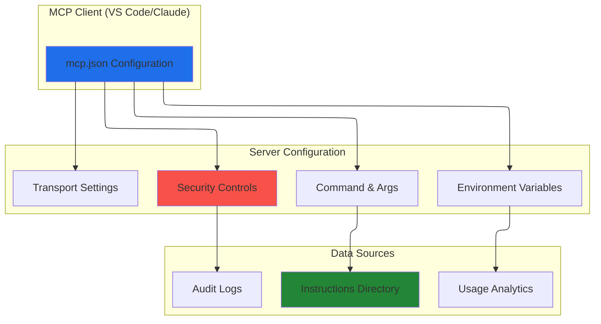

# Index Configuration Guide

**Version:** 1.0.0  
**Last Updated:** August 28, 2025  
**Compliance:** MCP Protocol v1.0+

## 📖 Overview

This guide provides comprehensive configuration patterns for the index across different deployment scenarios. All configurations follow enterprise security best practices and MCP protocol standards.

## 🏗️ Configuration Architecture

### Config File Formats

Different MCP clients use different configuration file formats. Choose the right one for your setup:

| Client | Config File | Root Key | Extra Fields | Notes |
|--------|-------------|----------|--------------|-------|
| **VS Code** | `.vscode/mcp.json` (workspace) | `servers` | — | Also: global `User/mcp.json` |
| **VS Code** (global) | `%APPDATA%/Code/User/mcp.json` | `servers` | — | Use `Code - Insiders` for Insiders |
| **Copilot CLI** | `~/.copilot/mcp-config.json` | `mcpServers` | `cwd`, `tools` | All env values are quoted strings |
| **Claude Desktop** | `claude_desktop_config.json` | `mcpServers` | `cwd` | Same root key as Copilot CLI |

> **Tip:** VS Code can auto-discover servers configured for Copilot CLI via `chat.mcp.discovery.enabled`. The `index-server --setup` flow (after `npm install -g @jagilber-org/index-server`) generates both formats without relying on the legacy extension.

#### VS Code format (`servers`)

```jsonc
{
  // VS Code: .vscode/mcp.json or global User/mcp.json
  "servers": {
    "index-server": {
      "type": "stdio",
      "command": "npx",
      "args": ["-y", "@jagilber-org/index-server@latest"],
      "env": {
        "INDEX_SERVER_PROFILE": "default"
      }
    }
  }
}
```

#### Copilot CLI / Claude Desktop format (`mcpServers`)

```json
{
  "mcpServers": {
    "index-server": {
      "type": "stdio",
      "command": "node",
      "args": ["dist/server/index-server.js"],
      "cwd": "<user-data-dir>/index-server",
      "env": {
        "INDEX_SERVER_PROFILE": "default"
      },
      "tools": ["*"]
    }
  }
}
```

> **Important:** The `mcpServers` format requires `cwd` for local server paths and supports `tools` to filter available tools. The `servers` format used by VS Code does not use these fields.

### Architecture Diagram



## � How to Invoke Tools

Once configured, how you invoke index-server tools depends on your MCP client:

### VS Code (Copilot Chat)

Type `#index-server` in the Copilot Chat input to attach the server's tools, then ask naturally:

```
#index-server search for logging best practices
```

If the server is listed in `.vscode/mcp.json`, Copilot may auto-discover tools without `#index-server`.

### Copilot CLI

Tools are auto-discovered from `~/.copilot/mcp-config.json`. Just ask:

```
copilot "search index-server for deployment patterns"
```

## Read-Only MCP Prompts And Resources

Index Server now exposes a minimal read-only MCP guidance surface in addition to tools. Use it when your client supports prompts/resources natively:

- **Prompts**: `setup_index_server`, `configure_index_server`, `verify_index_server`
- **Resources**: `index://guides/quickstart`, `index://guides/client-config`, `index://guides/verification`

Recommended usage:

1. `prompts/list` to discover available setup/config/troubleshooting prompts
2. `prompts/get` with `setup_index_server` or `configure_index_server` when you want client-specific guidance
3. `resources/list` and `resources/read` for stable markdown references

If your MCP client does not yet expose prompts/resources in the UI, keep using the normal tool flow (`tools/list`, `health_check`, bootstrap status) until the client adds that surface.

### Claude Desktop

Tools are auto-discovered from the Claude Desktop config. Use them naturally in conversation:

```
Search the index for security guidelines
```

### Setup Wizard

Generate config for any target client with the interactive setup wizard (arrow-key menus):

```bash
# Global install (recommended)
npm install -g @jagilber-org/index-server
index-server --setup

# Or one-shot via npx (no clone required)
npx -y @jagilber-org/index-server@latest --setup

# Via npm script (from repo)
npm run setup

# Direct
node scripts/setup-wizard.mjs

# Non-interactive, multiple targets
node scripts/setup-wizard.mjs --non-interactive --target vscode,copilot-cli,claude --write

# Via the server entry point
node dist/server/index-server.js --setup
```

Issue #317 adds a shared MCP configuration backend used by both `--setup` and the non-interactive CLI. The shared path structurally edits existing config files, preserves VS Code JSONC comments, validates the result, writes a manifest-backed backup before mutations, and supports restore.

Non-interactive MCP config commands:

```bash
node dist/server/index-server.js --mcp-list --target vscode --json
node dist/server/index-server.js --mcp-get --target vscode --name index-server --json
node dist/server/index-server.js --mcp-upsert --target vscode --name index-server --from-profile default --json
node dist/server/index-server.js --mcp-remove --target vscode --name index-server --json
node dist/server/index-server.js --mcp-restore --target vscode --json
node dist/server/index-server.js --mcp-validate --target vscode --json
```

Shared options:

| Option | Values |
| --- | --- |
| `--target` | `vscode`, `copilot-cli`, `claude` |
| `--scope` | `repo`, `global` for VS Code |
| `--name` | MCP server entry name, default `index-server` |
| `--from-profile` | `default`, `enhanced`, `experimental` |
| `--env` | repeatable `INDEX_SERVER_KEY=value` override |
| `--backup` | explicit backup path for `--mcp-restore` |
| `--dry-run` | validate and report without writing |
| `--json` | emit a machine-readable result to stdout |

## �🚀 Quick Start Configurations

> **Note:** The examples below use the `mcpServers` format (Copilot CLI / Claude Desktop). For VS Code's `servers` format, see the [Config File Formats](#config-file-formats) section above, or run `index-server --setup` (after `npm install -g @jagilber-org/index-server`) to generate either format.
>
> **Best practice:** keep `INDEX_SERVER_DIR` in a stable data folder outside MCP client config paths and application install folders so backups and reinstalls do not disturb your catalog.

### Recommended: High-Security Read-Only Production

**Use Case**: Enterprise environments that require an explicit read-only runtime, shared access without direct writes, or stricter separation between production readers and trusted mutation workflows

```json
{
  "mcpServers": {
    "mcp-index-production": {
      "description": "Production read-only Index",
      "command": "node",
      "args": [
        "<user-data-dir>/index-server/dist/server/index-server.js"
      ],
      "transport": "stdio",
      "cwd": "<user-data-dir>/index-server",
      "env": {
        "INDEX_SERVER_DIR": "<user-data-dir>/index-server/instructions",
        "INDEX_SERVER_MUTATION": "0",
        "INDEX_SERVER_VERBOSE_LOGGING": "0"
      },
      "restart": "onExit",
      "tags": ["production", "readonly", "audit-compliant"]
    }
  }
}
```

Use this profile when production must remain explicitly read-only. Governed production deployments that need trusted write flows can leave mutation enabled by default and rely on bootstrap gating, admin controls, and operator policy instead.

### Development: Full Mutation Access

**Use Case**: Local development, testing, content management

```json
{
  "mcpServers": {
    "mcp-index-development": {
      "description": "Development Index with full access",
      "command": "node", 
      "args": [
        "<root>/index-server/dist/server/index-server.js",
        "--dashboard"
      ],
      "transport": "stdio",
      "cwd": "<root>/index-server",
      "env": {
        "INDEX_SERVER_DIR": "<root>/index-server/instructions",
        "INDEX_SERVER_VERBOSE_LOGGING": "1",
        "INDEX_SERVER_LOG_MUTATION": "1"
      },
      "restart": "onExit",
      "tags": ["development", "mutation", "debug"]
    }
  }
}
```

### Enterprise: External Data Directory

**Use Case**: Enterprise deployment with separated data and code

```json
{
  "mcpServers": {
    "mcp-index-enterprise": {
      "description": "Enterprise Index with external data",
      "command": "node",
      "args": [
        "C:/Program Files/Server-Index/dist/server/index-server.js"
      ],
      "transport": "stdio", 
      "cwd": "C:/Program Files/Server-Index",
      "env": {
        "INDEX_SERVER_DIR": "D:/MCPData/instructions",
        "INDEX_SERVER_VERBOSE_LOGGING": "0",
        "USAGE_ANALYTICS_DIR": "D:/MCPData/analytics"
      },
      "restart": "onExit",
      "tags": ["enterprise", "external-data", "scalable"],
      "notes": [
        "Requires D:/MCPData/instructions directory with appropriate permissions",
        "Analytics data stored separately from application code",
        "Mutation enabled for authorized content management"
      ]
    }
  }
}
```

## Environment Variables Reference

### Core Configuration

| Variable | Type | Default | Description | Security Impact |
|----------|------|---------|-------------|-----------------|
| `INDEX_SERVER_DIR` | Path | `./instructions` | Directory containing instruction JSON files | **HIGH** - Controls data access |
| `INDEX_SERVER_MUTATION` | Boolean | `true` | Write operations are enabled by default; set `0` for read-only | **CRITICAL** - Enables data modification |
| `INDEX_SERVER_CACHE_MODE` | String | `normal` | Index caching mode: `normal`, `memoize`, `memoize+hash`, `reload`, `reload+memo` | Low |
| `INDEX_SERVER_WORKSPACE` | String | - | Workspace identifier for Index operations | Low |
| `INDEX_SERVER_MODE` | String | `standalone` | Server mode: `standalone`, `leader`, `follower`, `auto` | Medium |
| `INDEX_SERVER_VALIDATION_MODE` | String | `zod` | Validation engine: `zod` or `ajv` | Low |

### Dashboard

| Variable | Type | Default | Description | Security Impact |
|----------|------|---------|-------------|-----------------|
| `INDEX_SERVER_DASHBOARD` | Boolean | `false` | Enable admin dashboard | Medium |
| `INDEX_SERVER_DASHBOARD_PORT` | Number | `8787` | Dashboard HTTP port | Low |
| `INDEX_SERVER_DASHBOARD_HOST` | String | `127.0.0.1` | Dashboard bind address | **HIGH** - Network exposure |
| `INDEX_SERVER_DASHBOARD_TLS` | Boolean | `false` | Enable TLS for dashboard | **HIGH** - Transport security |
| `INDEX_SERVER_DASHBOARD_TLS_CERT` | Path | - | TLS certificate file | **HIGH** |
| `INDEX_SERVER_DASHBOARD_TLS_KEY` | Path | - | TLS private key file | **CRITICAL** |
| `INDEX_SERVER_AUTH_KEY` | String | - | Authentication API key | **CRITICAL** |
| `INDEX_SERVER_ADMIN_API_KEY` | String | - | Admin API key for dashboard | **CRITICAL** |

### Logging & Diagnostics

| Variable | Type | Default | Description | Performance Impact |
|----------|------|---------|-------------|-------------------|
| `INDEX_SERVER_LOG_LEVEL` | String | `info` | Log level: error, warn, info, debug, trace | Low |
| `INDEX_SERVER_VERBOSE_LOGGING` | Boolean | `false` | Enable detailed logging to stderr | Low |
| `INDEX_SERVER_LOG_MUTATION` | Boolean | `false` | Log only mutation operations | Low |
| `INDEX_SERVER_LOG_DIAG` | Boolean | `false` | Enable diagnostic startup logging | None |
| `INDEX_SERVER_LOG_JSON` | Boolean | `false` | Output structured JSON logs instead of text | None |
| `INDEX_SERVER_LOG_FILE` | Path | - | Enable file logging to specified path (also logs to stderr) | Low |
| `INDEX_SERVER_DEBUG` | Boolean | `false` | Enable debug mode (sets log level to debug) | Medium |

### Performance & Behavior

| Variable | Type | Default | Description | Use Case |
|----------|------|---------|-------------|----------|
| `INDEX_SERVER_ALWAYS_RELOAD` | Boolean | `false` | Disable caching, reload on every request | Development/Testing |
| `INDEX_SERVER_MEMOIZE` | Boolean | `false` | Enable memoized Index caching | Production optimization |
| `INDEX_SERVER_BODY_WARN_LENGTH` | Number | `50000` | Warn/truncate threshold for instruction body length | Content limits |
| `INDEX_SERVER_SEMANTIC_ENABLED` | Boolean | `false` | Enable semantic search with embeddings | Feature toggle |
| `INDEX_SERVER_SQLITE_VEC_ENABLED` | Boolean | `true` when `backend=sqlite`, `false` otherwise | Enable sqlite-vec vector embedding storage (requires SQLite backend, Node.js ≥ 22.13.0). Auto-enabled for sqlite backend; set `0` to opt out. Falls back to JSON if native extension fails. | Feature toggle |
| `INDEX_SERVER_SQLITE_VEC_PATH` | String | `""` | Custom path to sqlite-vec native binary (auto-detected if empty) | Deployment |
| `GOV_HASH_TRAILING_NEWLINE` | Boolean | `false` | Hash compatibility mode | Legacy Compatibility |

### Backup & Recovery

| Variable | Type | Default | Description | Use Case |
|----------|------|---------|-------------|----------|
| `INDEX_SERVER_AUTO_BACKUP` | Boolean | `true` | Enable periodic Index backups | Data protection |
| `INDEX_SERVER_AUTO_BACKUP_INTERVAL_MS` | Number | `3600000` | Backup interval (ms) | Frequency tuning |
| `INDEX_SERVER_AUTO_BACKUP_MAX_COUNT` | Number | `10` | Max backup snapshots retained | Storage management |
| `INDEX_SERVER_BACKUPS_DIR` | Path | `./backups` | Backup storage directory | Deployment |

### Analytics & Usage Tracking

| Variable | Type | Default | Description | Privacy Impact |
|----------|------|---------|-------------|----------------|
| `INDEX_SERVER_AUTO_USAGE_TRACK` | Boolean | `true` | Auto-track usage on get/search responses | Medium |
| `INDEX_SERVER_FEATURES` | String | `""` | Enable feature flags (e.g., "usage") | Medium - Usage tracking |
| `USAGE_ANALYTICS_DIR` | Path | `./data` | Directory for usage analytics storage | Medium - Analytics data |

## 🛡️ Security Configurations

### High Security (Government/Finance)

```json
{
  "mcpServers": {
    "mcp-index-secure": {
      "description": "High-security read-only configuration",
      "command": "node",
      "args": [
        "<user-data-dir>/index-server/dist/server/index-server.js"
      ],
      "transport": "stdio",
      "cwd": "<user-data-dir>/index-server",
      "env": {
        "INDEX_SERVER_DIR": "<user-data-dir>/index-server/instructions",
        "INDEX_SERVER_MUTATION": "0",
        "INDEX_SERVER_VERBOSE_LOGGING": "0",
        "INDEX_SERVER_LOG_MUTATION": "0"
      },
      "restart": "never",
      "tags": ["high-security", "immutable", "audit-compliant"],
      "notes": [
        "Read-only access only",
        "No mutation capabilities",
        "Minimal logging for security",
        "Instructions directory read-only at filesystem level"
      ]
    }
  }
}
```

### Medium Security (Corporate)

```json
{
  "mcpServers": {
    "mcp-index-corporate": {
      "description": "Corporate environment with controlled mutation",
      "command": "node",
      "args": [
        "C:/CorporateApps/MCP-Index/dist/server/index-server.js"
      ],
      "transport": "stdio",
      "cwd": "C:/CorporateApps/MCP-Index",
      "env": {
        "INDEX_SERVER_DIR": "C:/CorporateData/MCP/instructions",
        "INDEX_SERVER_VERBOSE_LOGGING": "0",
        "INDEX_SERVER_LOG_MUTATION": "1"
      },
      "restart": "onExit",
      "tags": ["corporate", "controlled-mutation", "audited"],
      "notes": [
        "Mutation enabled but logged",
        "Corporate data directory",
        "Change tracking enabled"
      ]
    }
  }
}
```

## 🚀 Performance Optimized Configurations

### High Performance (Large Datasets)

```json
{
  "mcpServers": {
    "mcp-index-performance": {
      "description": "Performance-optimized for large instruction indexs",
      "command": "node",
      "args": [
        "C:/index-server/dist/server/index-server.js",
        "--max-old-space-size=2048"
      ],
      "transport": "stdio",
      "cwd": "C:/index-server",
      "env": {
        "INDEX_SERVER_DIR": "E:/FastSSD/mcp-instructions",
        "INDEX_SERVER_VERBOSE_LOGGING": "0",
        "NODE_OPTIONS": "--max-old-space-size=2048"
      },
      "restart": "onExit",
      "tags": ["performance", "large-dataset", "optimized"],
      "notes": [
        "Increased Node.js memory limit",
        "Fast SSD storage for instructions",
        "Minimal logging for performance"
      ]
    }
  }
}
```

## 🔍 Development & Testing Configurations

> 🧩 Multi‑Process / Multi‑Worker Requirement
>
> When you run more than one instance of the index server (parallel test runners, editor + background job, clustered PM2/containers, or any sidecar mutation process), you MUST ensure every process sees the latest on‑disk instruction state immediately. The in‑process cache is intentionally lightweight and only invalidated on detected mtime/signature changes inside a single process. Cross‑process visibility is therefore guaranteed ONLY if you either:
>
> 1. Set `INDEX_SERVER_ALWAYS_RELOAD=1` (strongest consistency: disables caching, forces fresh disk read each operation), or
> 2. Constrain all writes to a single authoritative process and route reads there (harder operationally), or
> 3. Implement an external invalidation signal (e.g., file watcher broadcast) – not yet bundled here.
>
> For most multi‑process/editor scenarios, set `INDEX_SERVER_ALWAYS_RELOAD=1` in the `env` block of your `mcp.json` until a coordinated cache invalidation layer is introduced. This flag converts the server into a stateless read‑through layer and prevents phantom stale reads that can otherwise appear momentarily under concurrent mutation.


### Full Debug Mode

```json
{
  "mcpServers": {
    "mcp-index-debug": {
      "description": "Full debugging with dashboard and verbose logging",
      "command": "node",
      "args": [
        "./dist/server/index-server.js",
        "--dashboard",
        "--dashboard-port=9000"
      ],
      "transport": "stdio",
      "cwd": "./",
      "env": {
        "INDEX_SERVER_DIR": "./instructions",
        "INDEX_SERVER_VERBOSE_LOGGING": "1",
        "INDEX_SERVER_LOG_MUTATION": "1",
        "INDEX_SERVER_LOG_DIAG": "1",
        "INDEX_SERVER_LOG_FILE": "./logs/mcp-server.log",
        "INDEX_SERVER_ALWAYS_RELOAD": "1"
      },
      "restart": "onExit",
      "tags": ["debug", "development", "testing"],
      "notes": [
        "Dashboard available at http://localhost:9000",
        "All logging enabled",
        "Logs to both stderr and ./logs/mcp-server.log",
        "Cache disabled for testing",
        "Relative paths for local development",
        "To bootstrap HTTPS for the dashboard, run `index-server --init-cert --start --dashboard` separately first; see docs/cert_init.md"
      ]
    }
  }
}
```

### Testing & CI/CD

```json
{
  "mcpServers": {
    "mcp-index-testing": {
      "description": "Testing configuration for CI/CD environments",
      "command": "node",
      "args": [
        "dist/server/index-server.js"
      ],
      "transport": "stdio",
      "env": {
        "INDEX_SERVER_DIR": "./test-instructions",
        "INDEX_SERVER_VERBOSE_LOGGING": "1"
      },
      "restart": "never",
  "tags": ["testing", "ci-cd"]
    }
  }
}
```

## 🌍 Multi-Environment Setup

### Global Configuration with Multiple Servers

```json
{
  "mcpServers": {
    "mcp-index-production": {
      "description": "Production read-only server",
      "command": "node",
      "args": ["C:/mcp/production/dist/server/index-server.js"],
      "transport": "stdio",
      "cwd": "C:/mcp/production",
      "env": {
        "INDEX_SERVER_DIR": "C:/mcp/data/production/instructions"
      },
      "restart": "onExit",
      "tags": ["production", "readonly"]
    },
    
    "mcp-index-staging": {
      "description": "Staging server with mutation for testing",
      "command": "node", 
      "args": ["C:/mcp/staging/dist/server/index-server.js"],
      "transport": "stdio",
      "cwd": "C:/mcp/staging",
      "env": {
        "INDEX_SERVER_DIR": "C:/mcp/data/staging/instructions",
        "INDEX_SERVER_LOG_MUTATION": "1"
      },
      "restart": "onExit",
      "tags": ["staging", "testing"]
    },
    
    "mcp-index-development": {
      "description": "Local development server",
      "command": "node",
      "args": ["./dist/server/index-server.js", "--dashboard"],
      "transport": "stdio",
      "cwd": "./",
      "env": {
        "INDEX_SERVER_DIR": "./instructions",
        "INDEX_SERVER_VERBOSE_LOGGING": "1"
      },
      "restart": "onExit",
      "tags": ["development", "local"]
    }
  }
}
```

## 🚨 Troubleshooting Guide

### Common Issues & Solutions

| Issue | Symptom | Solution |
|-------|---------|----------|
| **Server won't start** | No response to MCP calls | Check `npm run build` completed successfully |
| **Permission denied** | File access errors | Verify `INDEX_SERVER_DIR` permissions |
| **Mutation disabled** | Add/update operations fail | Remove `INDEX_SERVER_MUTATION=0` or set it to `1` |
| **Dashboard not accessible** | Dashboard URL not working | Check `--dashboard` flag and port availability |
| **High memory usage** | Performance degradation | Set `NODE_OPTIONS=--max-old-space-size=2048` |

### Diagnostic Commands

```bash
# Check server health
echo '{"jsonrpc":"2.0","id":1,"method":"index_dispatch","params":{"action":"health"}}' | node dist/server/index-server.js

# Test with verbose logging
INDEX_SERVER_VERBOSE_LOGGING=1 node dist/server/index-server.js

# Validate configuration
node dist/server/index-server.js --help
```

### Log Analysis

**Startup Success Indicators:**

```text
[server] Ready (version=1.0.4)
[server] Instructions loaded: 42 entries
[server] Dashboard: http://localhost:3000
```

**Common Error Patterns:**

```text
Error: ENOENT: no such file or directory, scandir 'instructions'
Error: Direct mutation calls are disabled by the current runtime override. Remove INDEX_SERVER_MUTATION=0 to re-enable direct calls.
```

## 📊 Performance Monitoring

### Recommended Monitoring Configuration

```json
{
  "mcpServers": {
    "mcp-index-monitored": {
      "description": "Production server with performance monitoring",
      "command": "node",
      "args": [
        "dist/server/index-server.js",
        "--dashboard"
      ],
      "transport": "stdio",
      "env": {
        "INDEX_SERVER_DIR": "/data/instructions",
        "INDEX_SERVER_FEATURES": "usage",
        "NODE_OPTIONS": "--enable-source-maps"
      },
      "restart": "onExit",
      "tags": ["production", "monitored", "analytics"]
    }
  }
}
```

### Key Metrics to Monitor

- **Response Time**: P95 < 120ms for read operations
- **Memory Usage**: < 512MB under normal load
- **Error Rate**: < 1% of requests
- **Instruction Count**: Track Index growth
- **Usage Patterns**: Most accessed instructions

## 🔐 Security Best Practices

### 1. **Principle of Least Privilege**

- Use read-only configuration by default
- Enable mutation only when necessary
- Separate data directories from application code

### 2. **Environment Isolation**

- Use different configurations for dev/staging/prod
- Separate instruction directories by environment
- Never share mutation-enabled configs across environments

### 3. **Audit & Compliance**

- Enable mutation logging in production
- Regular backup of instruction directories
- Monitor file system permissions

### 4. **Network Security**

- Dashboard bound to localhost by default
- Use `--dashboard-host` carefully in production
- Consider firewall rules for dashboard access

## 📚 Advanced Configuration

### Custom Instruction Validation

```json
{
  "mcpServers": {
    "mcp-index-custom": {
      "description": "Custom validation and processing",
      "command": "node",
      "args": ["dist/server/index-server.js"],
      "transport": "stdio",
      "env": {
        "INDEX_SERVER_DIR": "./custom-instructions",
        "CUSTOM_SCHEMA_PATH": "./custom-schemas",
        "VALIDATION_STRICT": "1"
      },
      "restart": "onExit"
    }
  }
}
```

### Integration with CI/CD

```yaml
# GitHub Actions example
- name: Test Index
  env:
    INDEX_SERVER_DIR: "./test-data/instructions"
    INDEX_SERVER_VERBOSE_LOGGING: "1"
  run: |
    npm run build
    npm run test
    echo '{"jsonrpc":"2.0","id":1,"method":"index_dispatch","params":{"action":"capabilities"}}' | node dist/server/index-server.js
```

## 📝 Configuration Validation

### Validation Checklist

- [ ] **Path Validation**: All paths are absolute and accessible
- [ ] **Permission Check**: Write permissions for mutation-enabled configs
- [ ] **Security Review**: Mutation only enabled where necessary
- [ ] **Environment Separation**: Different configs for different environments
- [ ] **Monitoring Setup**: Logging and analytics configured appropriately
- [ ] **Backup Strategy**: Data directories included in backup plans

### Automated Validation Script

```powershell
# Validate MCP configuration
function Test-MCPConfig {
    param($ConfigPath)
    
    $config = Get-Content $ConfigPath | ConvertFrom-Json
    
    foreach ($server in $config.mcpServers.PSObject.Properties) {
        $serverConfig = $server.Value
        
        # Check required fields
        if (-not $serverConfig.command) { 
            Write-Error "Missing command for $($server.Name)" 
        }
        
        # Validate paths
        if ($serverConfig.env.INDEX_SERVER_DIR) {
            if (-not (Test-Path $serverConfig.env.INDEX_SERVER_DIR)) {
                Write-Warning "Instructions directory not found: $($serverConfig.env.INDEX_SERVER_DIR)"
            }
        }
        
        # Security check
        if ($serverConfig.env.INDEX_SERVER_MUTATION -eq "0") {
            Write-Warning "Read-only override enabled for $($server.Name)"
        }
    }
}
```

---

## 📞 Support & Resources

- **Documentation**: [PROJECT-PRD.md](./PROJECT-PRD.md)
- **API Reference**: [TOOLS.md](./TOOLS.md)
- **Architecture**: [ARCHITECTURE.md](./ARCHITECTURE.md)
- **Security**: [SECURITY.md](../SECURITY.md)

**Need Help?**

- Create GitHub issue with `[configuration]` label
- Include your mcp.json (redact sensitive paths)
- Provide error logs with timestamps

---

*This configuration guide ensures proper deployment of the index with security, performance, and maintainability considerations.*
