# Multi-Instance Design: Standalone & Leader/Follower Modes

> **Status: EXPERIMENTAL** — Leader/follower mode is under active development. Standalone mode is the production default.

## Overview

the index supports two operational modes for multi-instance environments where many VS Code windows, Copilot Chat sessions, or Squad agents each spawn their own Index process.

| Mode | Description | Maturity |
|------|-------------|----------|
| **Standalone** | Each instance is independent — full Index, full I/O, full memory. Default. | Production |
| **Leader/Follower** | One leader owns Index + disk I/O; followers proxy via HTTP. | Experimental |

## Mode Selection

```
INDEX_SERVER_MODE=standalone   →  Independent instance (default, production)
INDEX_SERVER_MODE=auto         →  Attempt leader election; fallback to follower
INDEX_SERVER_MODE=leader       →  Force leader role (error if port taken)
INDEX_SERVER_MODE=follower     →  Force follower role (requires running leader)
```

---

## Standalone Mode (Production)

### Architecture

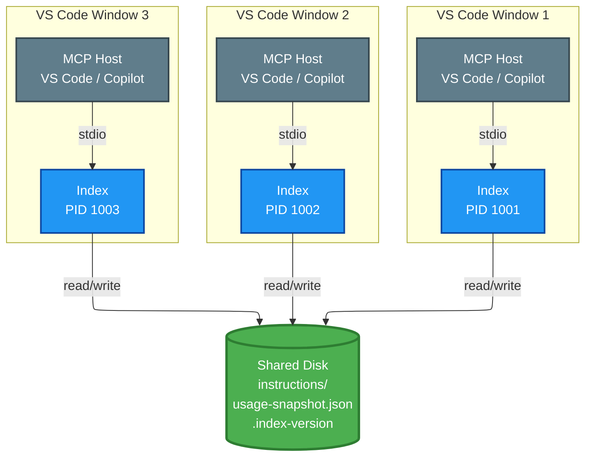

### Startup Flow

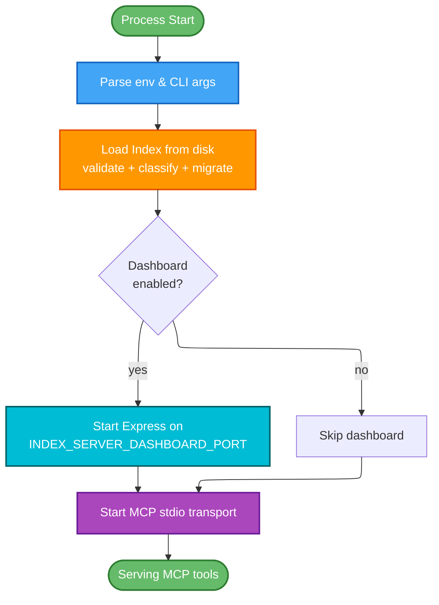

### Data Flow — Read Path

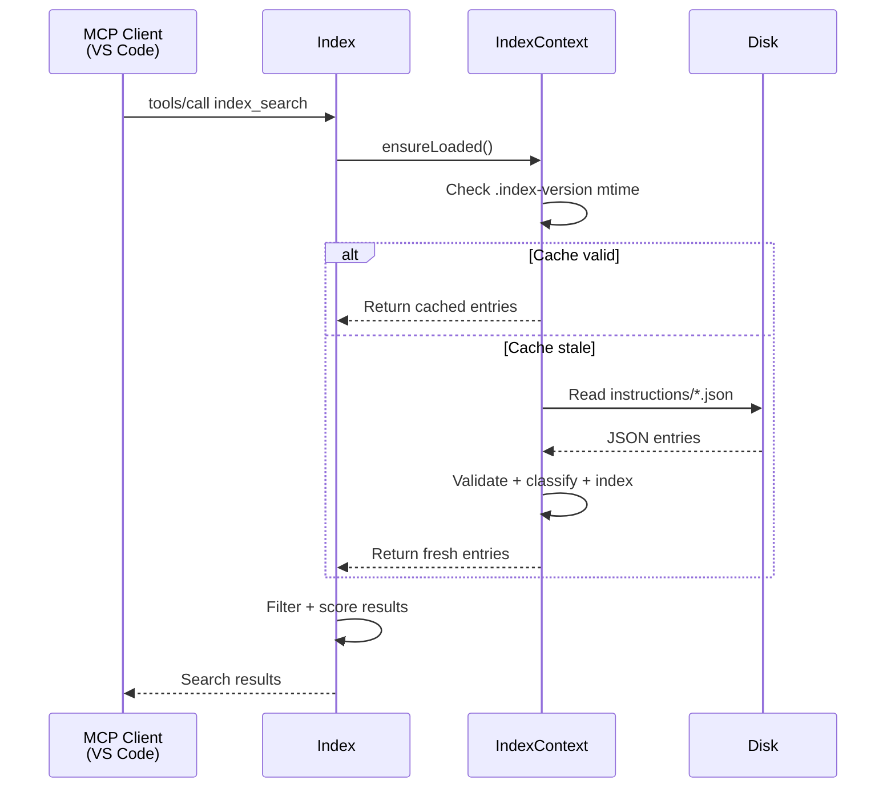

### Data Flow — Mutation Path

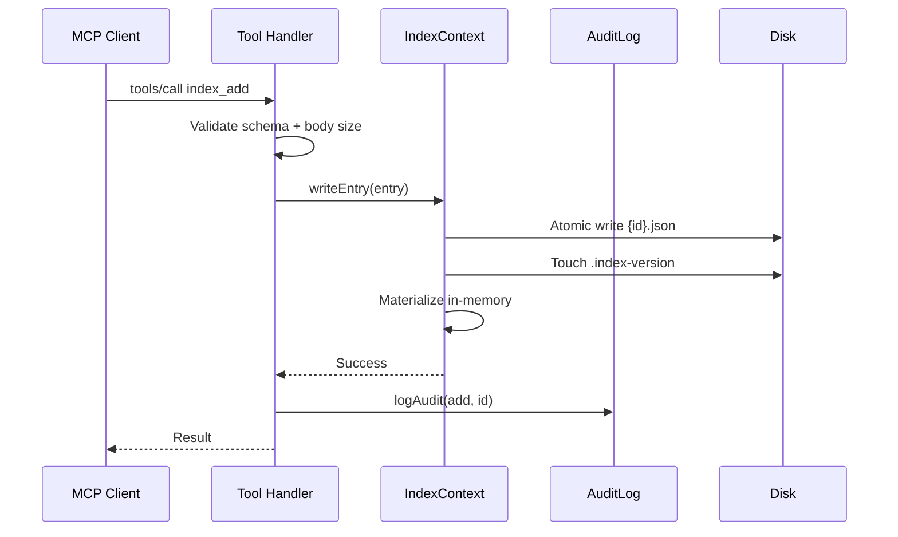

### Characteristics

| Property | Behavior |
|----------|----------|
| Memory | Full Index in every instance (~60-70 MB RSS each) |
| CPU | Full classification + indexing per instance on load |
| Disk I/O | All instances read/write concurrently |
| File locking | None — last-writer-wins on concurrent mutations |
| Consistency | `.index-version` file + mtime polling for cross-process invalidation |
| Isolation | Complete — each instance independent |
| Failure mode | One crash has no effect on others |

### When to Use

- **Default for all deployments** — proven, simple, no coordination overhead
- 1-5 concurrent instances (typical workload)
- When file locking risk is acceptable (rare concurrent mutations)
- When ~300-400 MB total RSS for 5 instances is acceptable

---

## Leader/Follower Mode (Experimental)

### Architecture

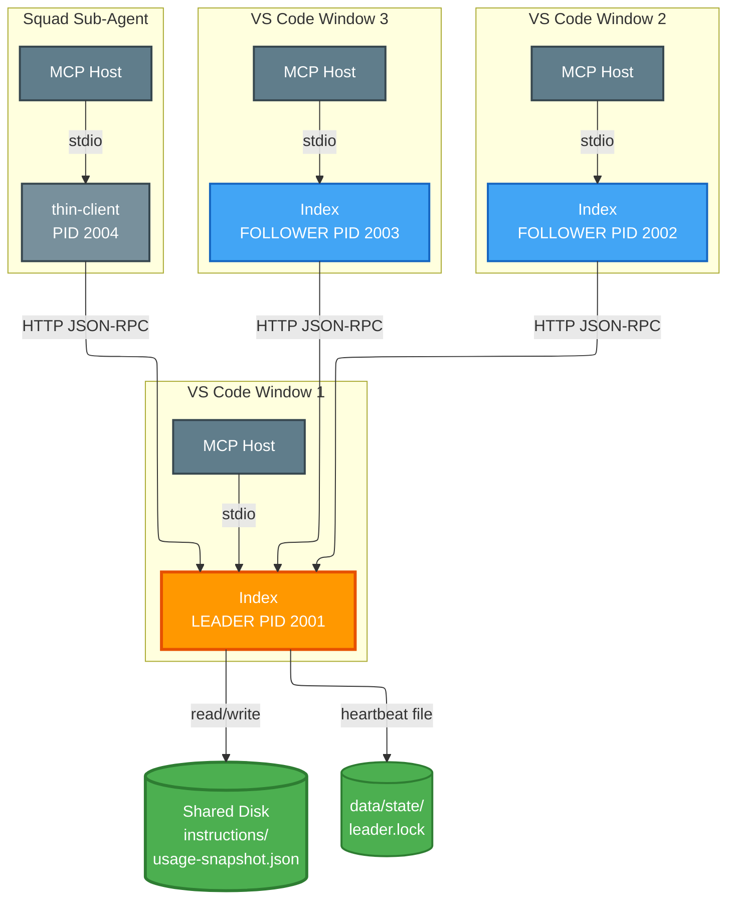

### Election Flow

```mermaid
---
config:
    layout: elk
---
flowchart TD
    Start([Process Start]) --> ParseConfig[Parse env & CLI args]
    ParseConfig --> CheckMode{INDEX_SERVER_MODE?}

    CheckMode -->|standalone| Standalone([Standalone path<br/>full startup])
    CheckMode -->|auto / leader| TryBind[Attempt bind<br/>INDEX_SERVER_LEADER_PORT]

    TryBind -->|listen() OK| BecomeLeader[LEADER ROLE<br/>Write leader.lock]
    TryBind -->|EADDRINUSE| HealthCheck[Health check<br/>existing leader]

    HealthCheck -->|healthy| BecomeFollower[FOLLOWER ROLE<br/>Proxy to leader]
    HealthCheck -->|unhealthy| RetryElection[Wait + retry<br/>election]
    RetryElection --> TryBind

    BecomeLeader --> LoadIndex[Load Index<br/>Start HTTP transport<br/>Start dashboard]
    BecomeLeader --> StartStdio1[Start stdio transport<br/>WITH real handlers]

    BecomeFollower --> StartStdio2[Start stdio transport<br/>WITH proxy handlers]
    BecomeFollower --> Heartbeat[Start heartbeat<br/>monitor]

    CheckMode -->|follower| DiscoverLeader[Read leader.lock<br/>Connect to leader]
    DiscoverLeader -->|found| BecomeFollower
    DiscoverLeader -->|not found| WaitLeader[Wait for leader<br/>with backoff]
    WaitLeader --> DiscoverLeader

    LoadIndex --> Serving([Serving])
    StartStdio1 --> Serving
    StartStdio2 --> ServingProxy([Serving via proxy])
    Heartbeat --> ServingProxy

    style Start fill:#66bb6a,stroke:#2e7d32,stroke-width:2px,color:#fff
    style Standalone fill:#78909c,stroke:#37474f,stroke-width:2px,color:#fff
    style BecomeLeader fill:#ff9800,stroke:#e65100,stroke-width:3px,color:#fff
    style BecomeFollower fill:#42a5f5,stroke:#1565c0,stroke-width:2px,color:#fff
    style LoadIndex fill:#ff9800,stroke:#e65100,stroke-width:2px,color:#fff
    style Serving fill:#66bb6a,stroke:#2e7d32,stroke-width:2px,color:#fff
    style ServingProxy fill:#66bb6a,stroke:#2e7d32,stroke-width:2px,color:#fff
    style Heartbeat fill:#ef5350,stroke:#c62828,stroke-width:2px,color:#fff
```

### Tool Call Flow — Follower Proxy

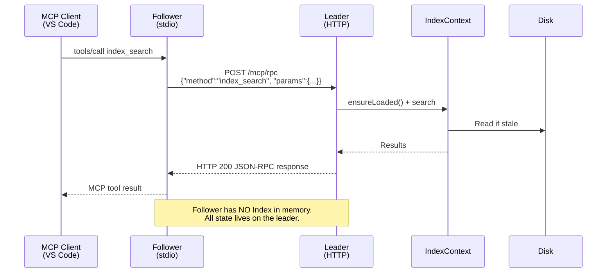

### Mutation Flow — Single Writer

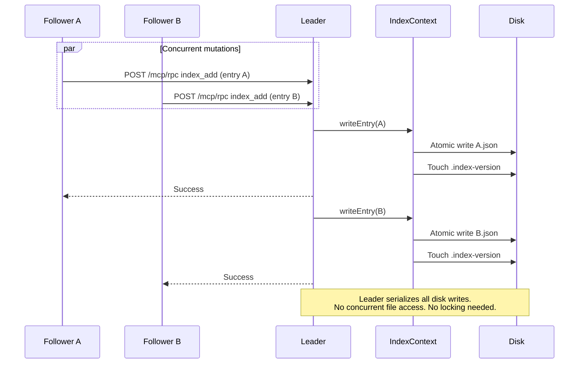

### Failover Flow

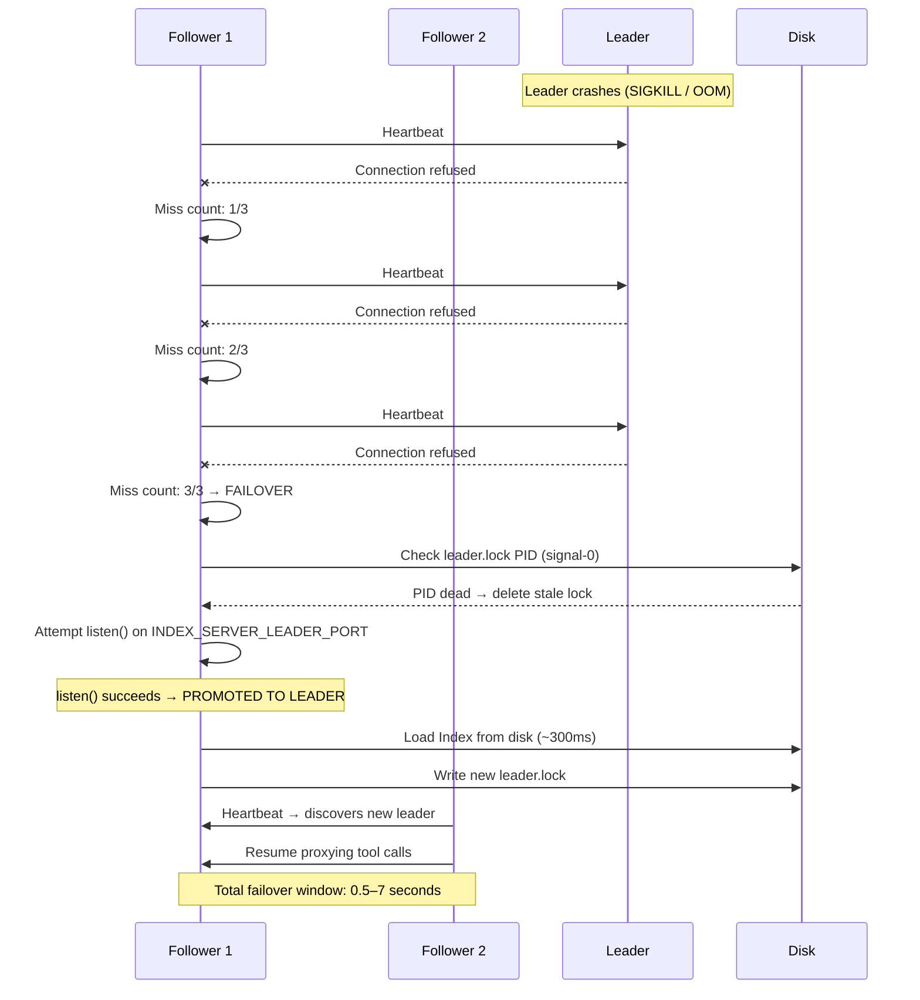

### Thin Client Architecture

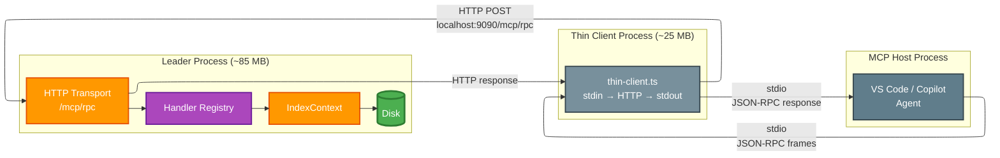

The thin client (`src/server/thin-client.ts`) is a separate entry point that skips index loading entirely. It reads JSON-RPC frames from stdin and forwards them to the leader's HTTP transport, writing responses back to stdout. This is the lightest-weight follower option.

### Configuration

| Env Var | Default | Description |
|---------|---------|-------------|
| `INDEX_SERVER_MODE` | `standalone` | `standalone`, `auto`, `leader`, `follower` |
| `INDEX_SERVER_LEADER_PORT` | `9090` | TCP port for leader HTTP transport |
| `INDEX_SERVER_HEARTBEAT_MS` | `5000` | Leader heartbeat write interval |
| `INDEX_SERVER_STALE_THRESHOLD_MS` | `15000` | Threshold before follower considers leader dead |
| `INDEX_SERVER_STATE_DIR` | `data/state` | Location for leader.lock and instance state files |
| `INDEX_SERVER_LEADER_URL` | (discovered) | Explicit leader URL for thin client (overrides discovery) |

---

## Performance Comparison

Benchmark: 10 concurrent Index instances on Windows (32 CPUs, 64 GB RAM, Node v24.3.0).

### Resource Summary

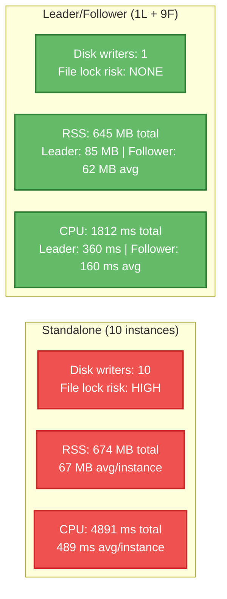

### Measured Results

| Metric | Standalone (10) | Leader/Follower (1L+9F) | Delta |
|--------|----------------|------------------------|-------|
| **Total RSS** | 674 MB | 645 MB | **-4.2% (savings: 29 MB)** |
| Avg RSS per instance | 67 MB | 65 MB | |
| Leader RSS | n/a | 85 MB | |
| Avg follower RSS | n/a | 62 MB | -8% vs standalone |
| **Total CPU time** | 4,891 ms | 1,812 ms | **-63% (moderate improvement)** |
| Avg CPU per instance | 489 ms | 181 ms | |
| **Disk writers** | 10 concurrent | 1 (leader only) | **-90%** |
| **File lock risk** | High (10 writers) | None (single writer) | **Eliminated** |

### Key Findings

1. **Memory: Small improvement (4.2%)** — Followers still load the Node.js runtime (~25-30 MB base), so per-follower savings are ~5 MB. The V8 heap and module graph dominate. Larger Indexs would show proportionally greater savings since only the leader holds entries in memory.

2. **CPU: Moderate improvement (63%)** — Followers skip index loading, classification, and indexing. The leader does this work once; followers simply proxy. This matters most during startup burst when many instances launch simultaneously.

3. **File locking: Major improvement** — The single biggest benefit. In standalone mode, 10+ processes racing on `usage-snapshot.json`, `.index-version`, and instruction files risks data loss (last-writer-wins). Leader/follower eliminates this entirely — only the leader touches disk.

4. **Leader HTTP latency** — Sub-millisecond median for proxied calls. 1,800+ req/s throughput in burst. The HTTP proxy adds negligible overhead.

### Tradeoff Analysis


---

## Module Structure

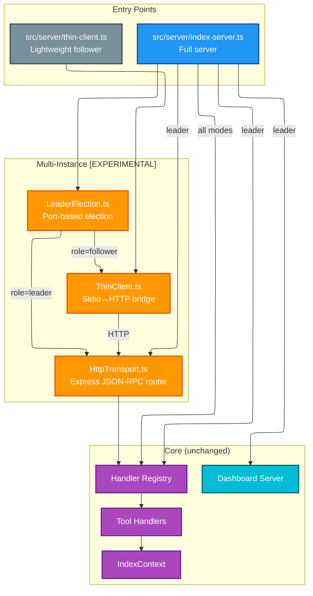

### File Summary

| File | Lines | Purpose |
|------|-------|---------|
| `src/dashboard/server/LeaderElection.ts` | ~260 | Lock file + PID election, heartbeat, stale detection |
| `src/dashboard/server/HttpTransport.ts` | ~90 | Express router: `/mcp/rpc`, `/mcp/health`, `/mcp/leader` |
| `src/dashboard/server/ThinClient.ts` | ~240 | Stdin JSON-RPC → HTTP POST → stdout bridge |
| `src/server/thin-client.ts` | ~30 | Thin client entry point (CLI) |
| `src/server/index-server.ts` | ~475 | Election integration in main startup |
| `src/config/runtimeConfig.ts` | ~4 | Config keys: `instanceMode`, `leaderPort`, `heartbeatIntervalMs`, `staleThresholdMs` |

---

## Decision Guide

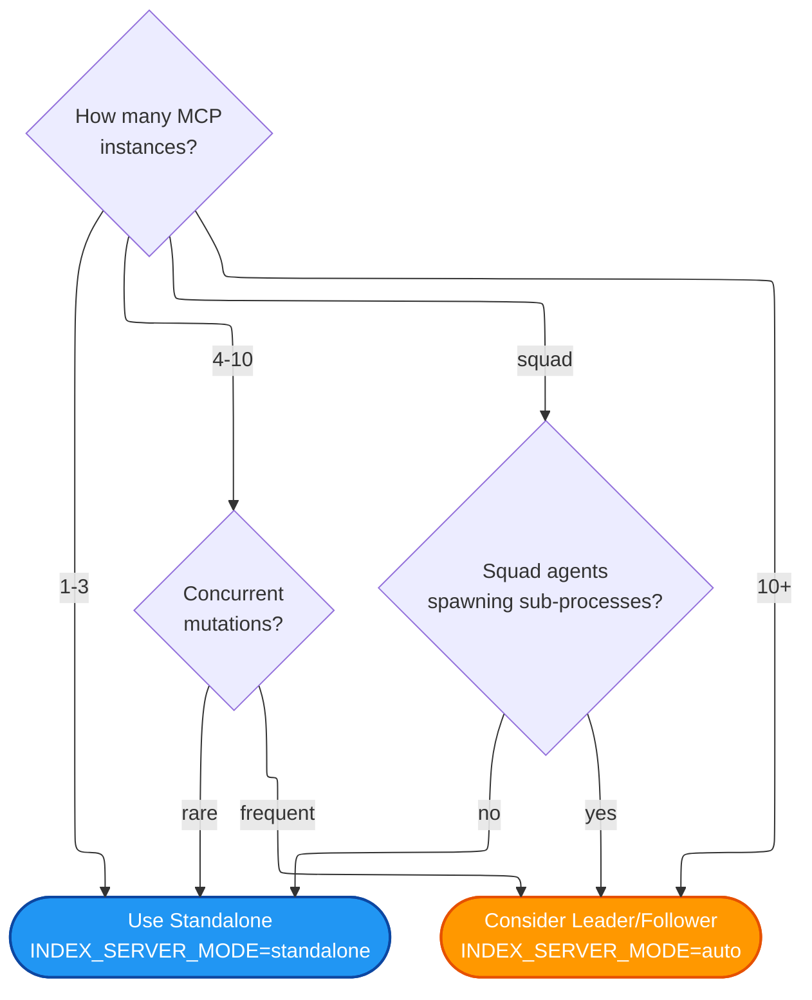

| Scenario | Recommendation |
|----------|---------------|
| Single developer, few VS Code windows | Standalone |
| Multiple windows, read-heavy workload | Standalone |
| 10+ windows with Squad agents | Leader/Follower |
| CI/CD or automated tooling | Standalone (ephemeral processes) |
| Shared team instruction index | Leader/Follower (single-writer safety) |

---

## Known Limitations (Experimental)

1. **No automatic follower-to-leader Index sync** — if a follower promotes, it cold-loads the index from disk (~300ms gap)
2. **Dashboard only on leader** — followers don't serve the admin UI
3. **No request queuing during failover** — in-flight calls to a dead leader fail and must be retried by the client
4. **Windows-specific socket behavior** — `SO_REUSEADDR` semantics differ; tested on Windows 10/11 only
5. **No TLS on the HTTP transport** — localhost-only by design, but lacks mTLS for defense-in-depth

## Related Documents

- [Architecture](architecture.md) — Overall system architecture
- [Leader/Follower Spec](mcp-index-leader-follower-spec.md) — Detailed specification
- [Performance Report](leader-follower-perf-report.txt) — Raw benchmark data
- [Configuration](configuration.md) — All environment variables
