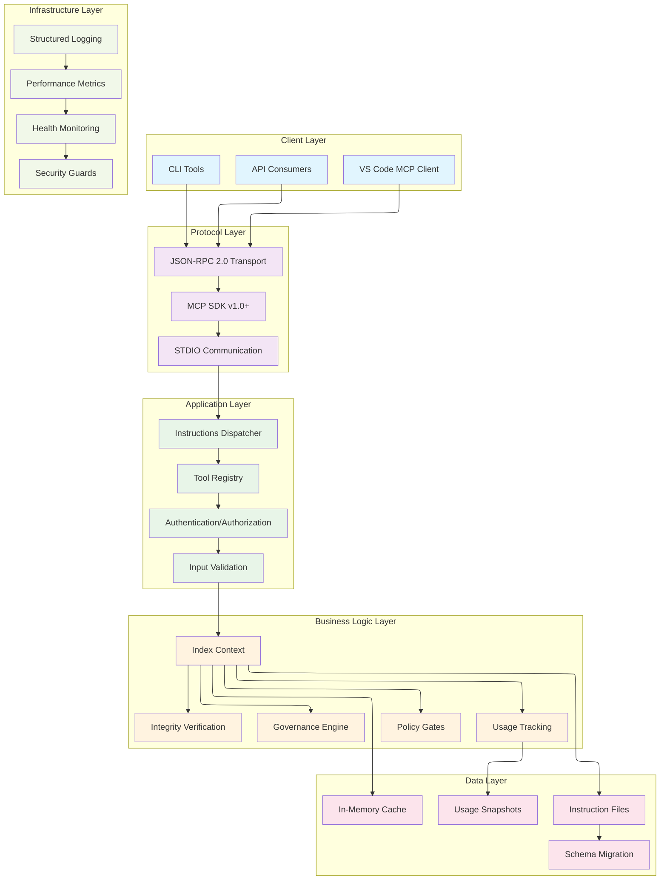
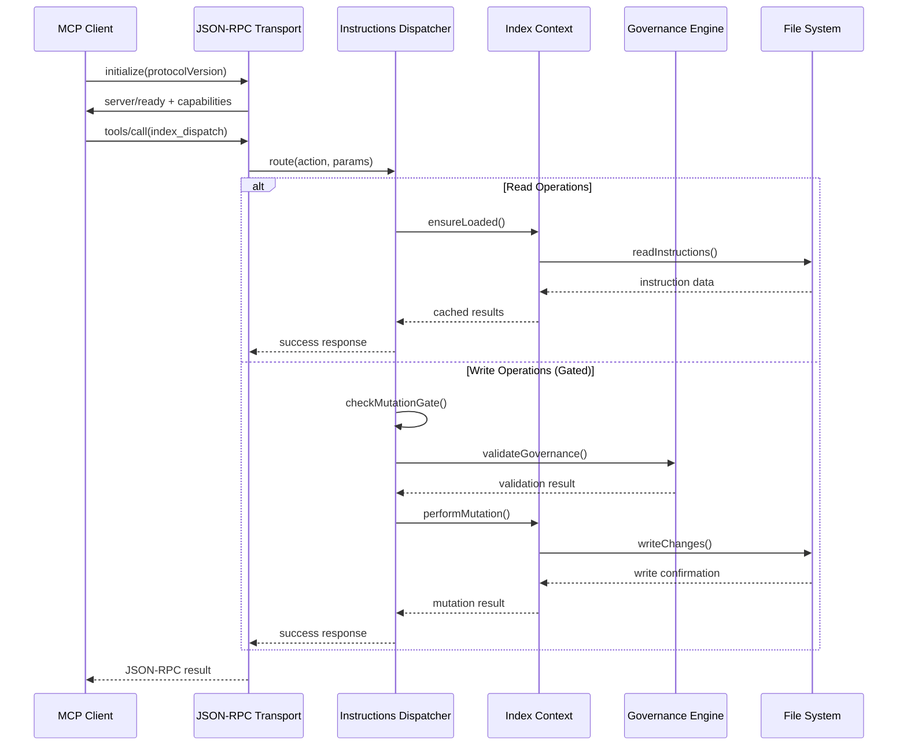
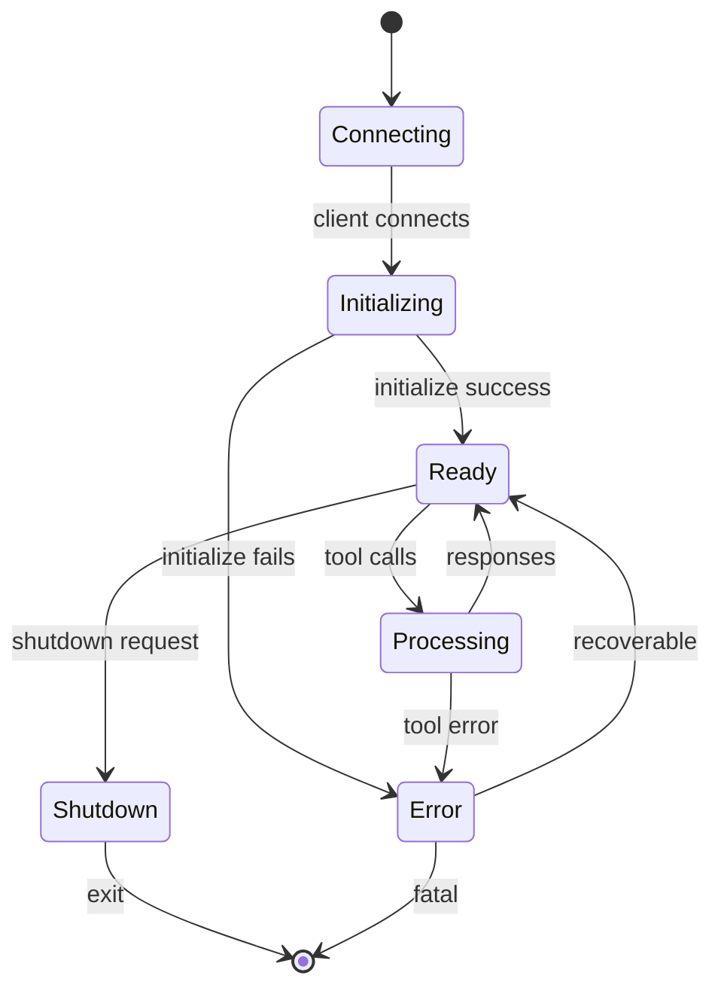
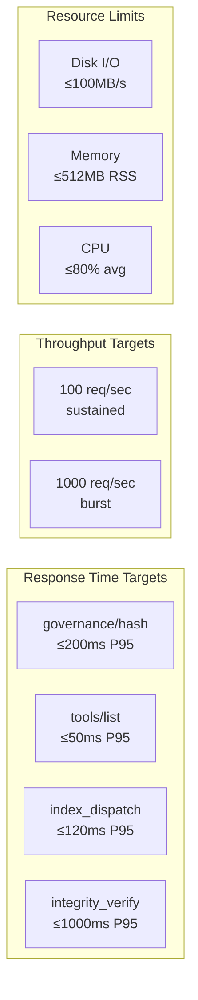
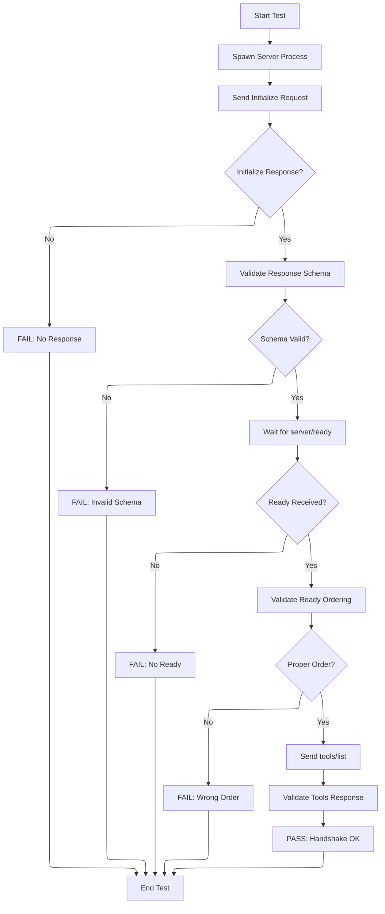
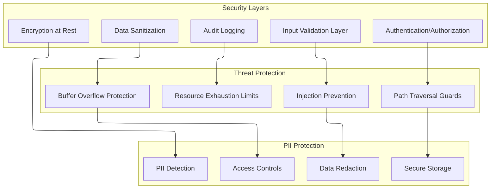
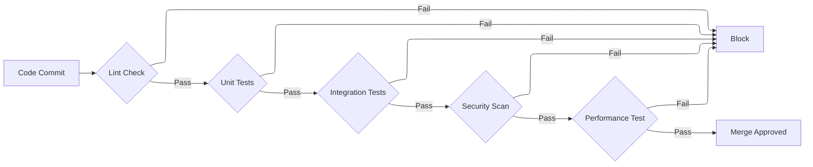
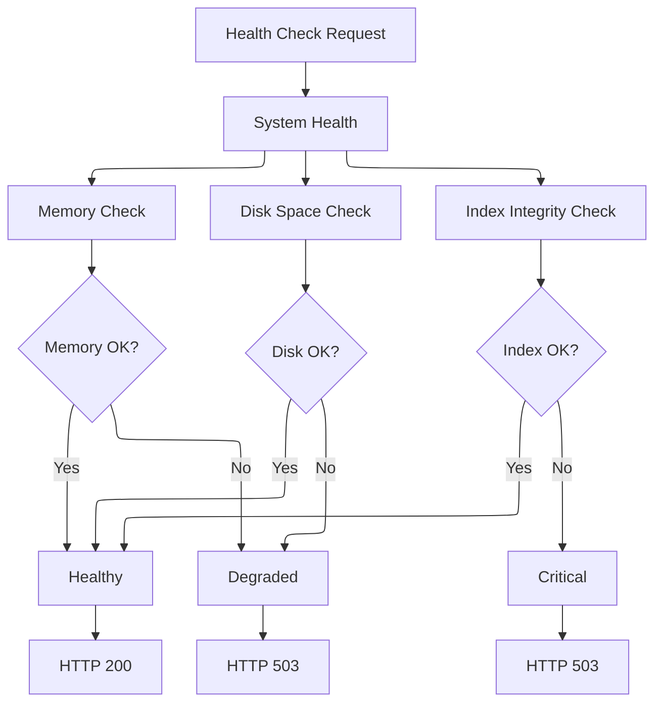

# Index Project Requirements Document (PRD)

**Version:** 1.8.1 (Supersedes 1.4.2; incorporates ToolTier system, dispatcher flat-param assembly, schema completeness, constitution Q-7/Q-8)  
**Status:** Binding - Authoritative Project Governance Document  
**Owner:** Project Maintainers & Governance Working Group  
**Last Updated:** February 24, 2026  
**Next Review:** May 24, 2026  

---

## 🎯 Executive Summary

The **Index** is a deterministic instruction indexing platform designed for AI assistant governance and developer tooling. This PRD establishes binding requirements for project structure, architectural patterns, MCP SDK compliance, JSON-RPC protocol adherence, application standards, reliability objectives, comprehensive testing mandates, and security/PII protection protocols.

**Business Value Proposition:**

- **Governance Assurance**: Deterministic instruction management with tamper detection and audit trails
- **Enterprise Compliance**: PII protection, security controls, and regulatory compliance readiness  
- **Operational Excellence**: 99.9% availability with <120ms P95 response times at enterprise scale
- **Risk Mitigation**: Comprehensive testing, security scanning, and change management controls
- **Developer Productivity**: Standards-based MCP integration with comprehensive tooling and APIs

This document serves as the **single source of truth** for all project processes, technical decisions, and quality standards. All development activities must adhere to the specifications outlined herein.

---

## 🔄 Since 1.3.1 → 1.4.2 Delta (Ratified Enhancements)

| Area | Change | Rationale | Status |
|------|--------|-----------|--------|
| Instruction Schema | Upgraded to schema v3 with `primaryCategory` invariant | Deterministic category referencing + forward compatibility | Ratified |
| Governance Versioning | Strict semver validation on create & update (`invalid_semver` rejection) | Prevent malformed version lineage | Ratified |
| Governance Mutations | Metadata-only overwrite hydration (omit body on overwrite) | Ergonomic governance edits; reduces payload redundancy | Ratified |
| ChangeLog Integrity | Silent normalization & repair on malformed changeLog arrays | Stability; avoids editor-induced failures | Ratified |
| Overwrite Telemetry | Correct `overwritten:true` for metadata-only higher-version updates | Accurate mutation metrics | Ratified |
| Feedback System | Full 6-tool feedback lifecycle (submit/list/get/update/stats/health) | Operational quality & triage | Ratified |
| Visibility Reliability | Opportunistic in‑memory materialization (no reload) + skip path self-healing | Eliminates add→get race & reduces disk churn | Ratified |
| Manifest Observability | Unified manifest write helper + counters (`manifest:write*`) | Deterministic structural drift diagnostics | Ratified |
| Manifest Disable Mode | `INDEX_SERVER_MANIFEST_WRITE=0` runtime flag | Safe read‑only diagnostics | Ratified |
| Fastload Placeholder | Reserved `INDEX_SERVER_MANIFEST_FASTLOAD` env | Forward perf optimization staging | Ratified |
| Hash Governance | Justified hash drift (schema normalization) via `governance/ALLOW_HASH_CHANGE` | Transparent integrity exceptions | Ratified |
| Baseline Protection | Guard scripts & sentinel markers enforcing minimal invariant set | Prevent uncontrolled test sprawl | Ratified |

All above changes are binding; earlier “pending ratification” addendum items have been merged into the authoritative baseline. Future provisional items will again appear under an Addendum section.

---

## ✳️ Addendum (Pending Ratification → 1.2.0) – Newly Formalized Requirements

These requirements are already implemented in code/tests but lacked explicit PRD coverage. Upon ratification the version will bump to 1.2.0. Until then they are treated as binding interim policy.

### 1. Feedback / Emit System (No Change This Cycle)

**Tools:** `feedback_submit`, `feedback_list`, `feedback_get`, `feedback_update`, `feedback_stats`, `feedback_health` (all REQUIRED; removal is a breaking change).

#### Functional Requirements

| ID | Requirement | Rationale | Verification |
|----|-------------|-----------|-------------|
| FB1 | Enumerated types: issue, bug-report, feature-request, security, documentation, performance, usability, other | Normalized taxonomy | Schema enum + submit tests |
| FB2 | Severities: low, medium, high, critical | Prioritization | Schema enum + stats aggregation |
| FB3 | Status workflow new→acknowledged→in-progress→resolved→closed | Lifecycle traceability | update tests enforce transitions |
| FB4 | Atomic durable persistence with rotation on max entries | Corruption prevention | File write uses temp + rename strategy |
| FB5 | Filterable list (type, severity, status, date range, tags, limit/offset) | Operational triage | list tests exercising filters |
| FB6 | Statistics endpoint provides byType/bySeverity/byStatus + recentActivity | Reporting & dashboard | stats test |
| FB7 | Health endpoint returns storage counts & config (maxEntries, dir) | Monitoring | health test |
| FB8 | Security & critical entries produce elevated log channel event | Audit & alerting | log assertion (future automated) |
| FB9 | Page size hard limit 200 (reject >200) | Resource safety | boundary test |
| FB10 | Length limits: title≤200, description≤2000, adminNotes≤1000 | Abuse mitigation | validation tests (schema-aligned) |

#### Non-Functional

- NFR-FB-1: Median local submit latency <50ms.
- NFR-FB-2: No data loss on mid-write crash (verified by atomic pattern review).

### 2. SDK Test Client CRUD & Governance Baseline (Updated v1.7.0+)

**Baseline Test Set (MUST stay green, no skips):**

- `createReadSmoke.spec.ts`
- `governanceHashIntegrity.spec.ts` (6 scenarios: create-stability, body-update-change, metadata-stability, multi-create consistency, overwrite-or-skip, drift lifecycle)
- `dispatcherAddFlatParams.spec.ts` (11 tests: flat-param add, nested entry compat, import, governanceUpdate, groom, remove, schema contracts)

> **Note:** The portable client was removed in v1.7.0. All integration tests now use `mcpTestClient.ts` (SDK-based). See CHANGELOG [1.7.0] for migration details.

Expanding beyond this nucleus (stress, fuzz, multi-process contention) requires formal CHANGE REQUEST with stability impact analysis.

### 3. Governance Hash Integrity Policy (Stable)

The standalone governance hash test plan file has been deprecated (single-plan consolidation). The following inline protocol is now binding for any governance hash projection change:

| Step | Requirement | Details |
|------|-------------|---------|
| 1 | Change Proposal | Pull request MUST include rationale, field diff (added/removed), and expected stability impact (hash churn %) |
| 2 | Stability Classification | Label change as: PATCH (non-breaking ordering tweak), MINOR (adds projected field — hash changes for all entries), MAJOR (removes/renames field or semantic re-derivation) |
| 3 | Test Adjustment | Update existing governance hash tests with new expected projection & add regression ensuring old hash mismatches (documented) |
| 4 | Migration Safety | If field added requires enrichment pass, note idempotency & fallback behavior |
| 5 | Rollout Note | CHANGELOG entry summarizing impact + upgrade note for downstream caches |
| 6 | Approval | At least one governance maintainer & one reviewer sign-off (recorded in PR) |

Drift Lifecycle: Acceptable transient sequence remains ≤3 states (stable → modification proposal → ratified). More than 3 successive rapid hash changes within 14 days requires formal stability review.

Status Field Scope: Current `instruction.schema.json` status enum = `draft | review | approved | deprecated`. The governanceUpdate tool previously exposed `superseded` — this state is deprecated for now; replacement relationships should use `deprecated` + `deprecatedBy` field. Future addition of `superseded` requires this section + schema update.

### 4. Declaration & Skip Guard Enforcement (Stable)

| ID | Requirement | Enforcement |
|----|-------------|-------------|
| DG1 | Single consolidated SDK test client declaration file (allowlist) | `guard-declarations.mjs` (build:verify) |
| DG2 | Zero unintentional TS7016 errors; any `@ts-expect-error` must include portability comment | Typecheck + code review |
| DG3 | No `describe.skip` / `it.skip` unless line tagged `SKIP_OK` + justification | `guard:skips` pretest stage |
| DG4 | New `.d.ts` additions require explicit guard allowlist update | Guard failure -> review |

### 5. Deployment Wipe Modes (Stable)

`scripts/deploy-local.ps1` MUST preserve these semantics:

| Flags | Behavior | Use Case | Acceptance |
|-------|----------|---------|------------|
| `-Overwrite` | Backup then preserve existing instructions | Rolling upgrade | Files unchanged except dist/version |
| `-Overwrite -EmptyIndex` | Backup then remove all instructions | Clean forensic reset | Index empty post-deploy |
| `-Overwrite -ForceSeed` | Backup then replace with seed set | Developer bootstrap | Seed set present exactly |
| `-Overwrite -EmptyIndex -ForceSeed` | Empty then seed | Reset with known corpus | Only seed entries exist |
| (default) | Install prod-only deps | Always-on for reliable deploys | node_modules excludes dev deps; dependencies always installed via lock file |

Backups stored under `backups/instructions-<timestamp>`; non-fatal count warnings allowed; persistent failure requires issue filing within 1 business day.

### 6. Documentation Canonicalization (Updated)

| ID | Rule | Action |
|----|------|--------|
| DOC1 | `project_prd.md` is canonical PRD | Version bump on each ratified addendum |
| DOC2 | Legacy `PRD.md` & `project_prd.md` remain stubs only | Do not add new technical content |
| DOC3 | README must link feedback system & governance hash plan | Verified during release checklist |
| DOC4 | `content_guidance.md` must state NOT to embed MCP tool Indexs/schemas in instructions (protocol discovery only) | Explicit bullet retained |

### 7. Schema‑Aided Add Failure Contract (Ratified)

| ID | Requirement | Rationale | Verification |
|----|-------------|-----------|-------------|
| AF1 | `index_add` MUST include `schemaRef` & `inputSchema` when returning early structural errors (`missing entry`, `missing id`, `missing required fields`) | Zero round‑trip remediation; improves client UX | Automated test asserting presence on shape errors |
| AF2 | Inline `inputSchema` MUST be authoritative subset of canonical tool schema (no divergence) | Prevent stale or conflicting schema copies | Compare hash of inline schema subset vs canonical registry schema during test |
| AF3 | Non-structural governance/semantic failures (e.g. owner/category policy) MUST NOT echo full schema | Avoid noisy payloads; clarity of failure class | Negative test verifying absence |
| AF4 | `schemaRef` value stable logical key `index_add#input` | Enables client cache keying | Test asserts constant string |
| AF5 | Feature considered additive; clients silently ignoring fields remain functional | Backward compatibility guarantee | Document review + absence of breaking changes in tests |

All AF requirements are now binding; failure to include `schemaRef` or authoritative subset on structural add failures constitutes a regression (P0 severity).

### 8. Manifest & Materialization Requirements (New 1.4.2)

| ID | Requirement | Rationale | Verification |
|----|-------------|-----------|--------------|
| MF1 | Successful mutations MUST invoke unified manifest helper once | Centralized error handling & metrics | Mutation tests assert counter increments |
| MF2 | Manifest writes MUST be atomic (temp + rename) | Crash safety | File inspection during simulated crash harness |
| MF3 | `manifest:writeFailed` increments on error; process continues | Non-fatal resilience | Induced IO error test |
| MF4 | Opportunistic writeEntry MUST surface new id immediately w/out reload | Eliminates race | IndexContext usage/materialization test |
| MF5 | Touching `.index-version` MUST sync in-memory token/mtime | Prevent spurious reload loop | Unit test asserts no immediate reload trace |
| MF6 | `INDEX_SERVER_MANIFEST_WRITE=0` MUST suppress writes silently | Diagnostic read-only mode | Disabled mode test (no file mtime change) |
| MF7 | Fastload flag reserved; enabling early MUST fallback gracefully | Forward compatibility | Env flag placeholder test |

Non-Functional:

- NFR-MF-1: Opportunistic add path P95 < 5ms at 5k entries (excludes file system write of entry itself).
- NFR-MF-2: Manifest generation P95 < 40ms at 10k entries.

---

## 🏗️ Project Architecture & Structure

### High-Level System Architecture



### Data Flow Architecture



### Enterprise Application Structure

#### Directory Structure (Mandatory)

```text
index-server/
├── src/                          # Source code (TypeScript)
│   ├── server/                   # Server bootstrap & configuration
│   │   ├── index.ts             # Main entry point
│   │   ├── sdkServer.ts         # MCP SDK integration
│   │   └── transport.ts         # JSON-RPC transport layer
│   ├── services/                # Business logic services
│   │   ├── IndexContext.ts    # Index management
│   │   ├── toolHandlers.ts      # Tool implementations
│   │   ├── governanceService.ts # Governance engine
│   │   └── validationService.ts # Input validation
│   ├── tests/                   # Comprehensive test suites
│   │   ├── integration/         # Integration tests
│   │   ├── unit/               # Unit tests
│   │   └── handshake/          # JSON-RPC handshake tests
│   └── types/                   # TypeScript type definitions
├── docs/                        # Documentation (binding)
│   ├── project_prd.md           # This document (authoritative)
│   ├── architecture.md          # Technical architecture
│   ├── tools.md                 # Complete API documentation
│   ├── mcp_configuration.md     # Configuration and setup guide
│   ├── prompt_optimization.md   # Prompt handling best practices
│   └── SECURITY.md              # Security specifications
├── schemas/                     # JSON Schema definitions
├── instructions/                # instruction index storage
├── scripts/                     # Build & deployment scripts
└── dist/                        # Compiled output (CommonJS)
```

---

## 🏢 Enterprise Standards & Compliance

### MCP SDK Schema Adherence (MANDATORY)

1. **Protocol Compliance**
   - MUST implement MCP SDK v1.0+ specifications exactly
   - MUST support JSON-RPC 2.0 without deviations
   - MUST provide proper initialize/ready handshake sequence
   - MUST implement tools/list and tools/call methods
   - MUST support proper error handling with standard codes

2. **Schema Validation**
   - ALL input parameters MUST be validated against JSON schemas
   - ALL responses MUST conform to MCP response envelope format
   - Tool schemas MUST be registered and discoverable
   - Version compatibility MUST be enforced

3. **Transport Requirements**
   - STDIO transport MUST be primary interface
   - JSON-RPC framing MUST be exact (one JSON object per line)
   - Error responses MUST include proper error codes and messages
   - Handshake ordering MUST be deterministic and tested

### JSON-RPC Protocol Requirements (BINDING)



1. **Message Format Standards**

   ```typescript
   // Request (MANDATORY format)
   interface JsonRpcRequest {
     jsonrpc: "2.0";           // MUST be exactly "2.0"
     id: string | number;      // MUST be present for requests
     method: string;           // MUST match registered tool
     params?: Record<string, unknown>; // MUST validate against schema
   }
   
   // Response (MANDATORY format)  
   interface JsonRpcResponse {
     jsonrpc: "2.0";
     id: string | number;      // MUST match request id
     result?: unknown;         // Success response
     error?: JsonRpcError;     // Error response (mutually exclusive)
   }
   ```

2. **Error Handling Requirements**
   - Parse Error (-32700): Invalid JSON
   - Invalid Request (-32600): Malformed request object
   - Method Not Found (-32601): Unknown tool/method
   - Invalid Params (-32602): Parameter validation failure
   - Internal Error (-32603): Server-side processing error
   - Custom errors (application-specific codes)

### Reliability & Performance Standards (NON-NEGOTIABLE)

#### Service Level Objectives (SLOs)

| Metric | Target | Measurement |
|--------|--------|-------------|
| Availability | 99.9% | Health check success rate |
| P95 Response Time | <120ms | Tool call latency |
| P99 Response Time | <500ms | Tool call latency |
| Memory Usage | <512MB | Peak RSS during operation |
| Error Rate | <0.1% | Failed requests / total requests |
| Handshake Success | 100% | Initialize/ready sequence |

#### Performance Requirements



---

## 🧪 Testing Requirements (BINDING)

### Comprehensive Test Coverage Mandate

**MINIMUM COVERAGE REQUIREMENTS:**

- Overall Code Coverage: **≥95%**
- Line Coverage: **≥98%**
- Branch Coverage: **≥95%**
- Function Coverage: **100%**

### JSON-RPC Handshake Testing (CRITICAL)



#### Mandatory Handshake Test Categories

1. **Protocol Compliance Tests**
   - Initialize request/response validation
   - Server ready notification timing
   - Tools list schema compliance
   - Error response format validation

2. **Ordering & Timing Tests**
   - Initialize → ready → tools sequence
   - Concurrent request handling
   - Request ID correlation
   - Timeout handling

3. **Error Condition Tests**
   - Invalid JSON handling
   - Unknown method responses  
   - Parameter validation errors
   - Server error recovery

4. **Performance Tests**
   - Handshake latency measurement
   - Concurrent client handling
   - Memory leak detection
   - Resource cleanup verification

### Index Server Schema Testing (MANDATORY)

**Schema Evolution Requirements:**

```typescript
// Schema validation test requirements
describe('Index Server Schema Compliance', () => {
  it('MUST validate instruction schema v2', () => {
    const instruction = loadTestInstruction();
    expect(validateInstructionSchema(instruction)).toBe(true);
  });
  
  it('MUST handle schema migration idempotently', () => {
    const v1Instruction = loadV1Instruction();
    const migrated = migrateToV2(v1Instruction);
    const reMigrated = migrateToV2(migrated);
    expect(migrated).toEqual(reMigrated);
  });
  
  it('MUST preserve governance hash stability', () => {
    const instruction = loadTestInstruction();
    const hash1 = computeGovernanceHash(instruction);
    // Perform schema migration
    const migrated = migrateToV2(instruction);
    const hash2 = computeGovernanceHash(migrated);
    expect(hash1).toBe(hash2);
  });

  it('MUST maintain backward compatibility', () => {
    const v1Schema = loadSchemaVersion(1);
    const v2Schema = loadSchemaVersion(2);
    expect(isBackwardCompatible(v1Schema, v2Schema)).toBe(true);
  });
});
```

### Schema Documentation & Maintenance (BINDING)

**Schema Governance Requirements:**

1. **Documentation Standards**
   - ALL schema changes MUST be documented in the active schema evolution section of the PRD (deprecated: SCHEMA-V2-PLAN.md)
   - Schema evolution MUST include migration guides
   - Breaking changes MUST have deprecation notices (minimum 1 minor version)
   - All fields MUST have comprehensive descriptions and validation rules

2. **Version Control**
   - Schema versions MUST follow semantic versioning
   - Schema files MUST be stored in `/schemas` directory
   - Migration logic MUST be tested with >95% coverage
   - Governance hash stability MUST be verified across schema changes

3. **Review Process**
   - Schema changes MUST undergo technical committee review
   - Database migration scripts MUST be peer-reviewed
   - Performance impact MUST be assessed for schema modifications
   - Rollback procedures MUST be documented and tested

4. **Compliance Verification**
   - Schema validation MUST occur on every data operation
   - Migration idempotence MUST be verified with automated tests
   - Governance hash stability MUST be maintained across schema updates
   - Legacy schema support MUST be maintained per deprecation policy

### Resiliency Testing Requirements

1. **Fault Injection Tests**
   - File system errors (permissions, disk full)
   - Memory pressure scenarios
   - CPU saturation conditions
   - Network interruption simulation

2. **Recovery Tests**
   - Graceful degradation verification
   - State consistency after errors
   - Automatic retry mechanisms
   - Circuit breaker functionality

3. **Stress Tests**
   - High-volume instruction loading
   - Concurrent access patterns
   - Memory leak detection
   - Performance under load

---

## 🛡️ Security & PII Protection (BINDING)

### Security Architecture



### Mandatory Security Requirements

1. **Input Validation (CRITICAL)**

   ```typescript
   // All inputs MUST be validated
   function validateToolInput(params: unknown): ValidationResult {
     // MANDATORY: Schema validation
     const schemaResult = validateAgainstSchema(params);
     if (!schemaResult.valid) return schemaResult;
     
     // MANDATORY: Sanitization
     const sanitized = sanitizeInput(params);
     
     // MANDATORY: Business rule validation
     return validateBusinessRules(sanitized);
   }
   ```

2. **PII Detection & Protection**
   - MUST scan all instruction content for PII patterns
   - MUST redact sensitive data before logging
   - MUST implement secure storage for any retained data
   - MUST provide PII purging capabilities

3. **Authentication & Authorization**
   - MUST implement capability-based security model
   - MUST validate all mutation operations
   - MUST audit all write operations
   - MUST support role-based access controls

4. **Audit & Compliance**
   - MUST log all security events
   - MUST maintain audit trails for compliance
   - MUST implement tamper detection
   - MUST support forensic analysis

### PII Protection Patterns (MANDATORY)

```typescript
// PII patterns that MUST be detected and protected
const PII_PATTERNS = {
  SSN: /\b\d{3}-\d{2}-\d{4}\b/g,
  EMAIL: /\b[A-Za-z0-9._%+-]+@[A-Za-z0-9.-]+\.[A-Z|a-z]{2,}\b/g,
  CREDIT_CARD: /\b\d{4}[\s-]?\d{4}[\s-]?\d{4}[\s-]?\d{4}\b/g,
  PHONE: /\b\d{3}[-.]?\d{3}[-.]?\d{4}\b/g,
  IP_ADDRESS: /\b\d{1,3}\.\d{1,3}\.\d{1,3}\.\d{1,3}\b/g
};

// MANDATORY redaction function
function redactPII(content: string): string {
  let redacted = content;
  for (const [type, pattern] of Object.entries(PII_PATTERNS)) {
    redacted = redacted.replace(pattern, `[REDACTED_${type}]`);
  }
  return redacted;
}
```

---

## 📋 Change Management & Documentation

### Architecture Documentation Requirements (BINDING)

1. **Logical Diagrams (MANDATORY)**
   - MUST include Mermaid diagrams for all major subsystems
   - MUST be GitHub dark theme compatible
   - MUST be updated with every architectural change
   - MUST include sequence diagrams for complex workflows

2. **API Documentation Standards**
   - MUST document all tools with complete schemas
   - MUST include request/response examples
   - MUST specify error conditions and codes
   - MUST maintain version compatibility matrices

3. **Decision Records (MANDATORY)**
   - MUST document all significant architectural decisions
   - MUST include rationale and alternatives considered
   - MUST specify impact and migration requirements
   - MUST maintain decision history and changes

### Change Log Requirements (BINDING)

All changes MUST be documented in CHANGELOG.md with:

```markdown
## [Version] - YYYY-MM-DD

### BREAKING CHANGES
- List all breaking changes with migration guidance

### Added
- New features and capabilities

### Changed  
- Modifications to existing functionality

### Deprecated
- Features marked for future removal

### Removed
- Features removed from the system

### Fixed
- Bug fixes and corrections

### Security
- Security-related changes and fixes
```

### Version Management (MANDATORY)


1. **Semantic Versioning (BINDING)**
   - MAJOR: Breaking changes to API or protocol
   - MINOR: New features without breaking changes
   - PATCH: Bug fixes and maintenance

2. **Release Process (MANDATORY)**
   - ALL changes require pull request review
   - ALL tests MUST pass before merge
   - ALL documentation MUST be updated
   - ALL breaking changes MUST include migration guide

---

## 🎯 Acceptance Criteria & Quality Gates

### Definition of Done (BINDING)

A feature is considered complete ONLY when:

✅ **Code Requirements**

- [ ] Code follows TypeScript strict mode
- [ ] All lint rules pass without warnings
- [ ] Code coverage meets minimum thresholds
- [ ] Performance benchmarks meet SLO targets

✅ **Testing Requirements**

- [ ] Unit tests written and passing
- [ ] Integration tests covering happy/error paths
- [ ] Handshake tests validate protocol compliance
- [ ] Performance tests verify SLO compliance

✅ **Documentation Requirements**

- [ ] API documentation updated
- [ ] Architecture diagrams updated  
- [ ] Security impact assessed
- [ ] Change log updated

✅ **Security Requirements**

- [ ] Security review completed
- [ ] PII impact assessed
- [ ] Vulnerability scan passed
- [ ] Audit trail verified

### Quality Gates (NON-NEGOTIABLE)



1. **Automated Gates**
   - Code linting (ESLint + TypeScript)
   - Unit test execution (100% pass rate)
   - Integration test execution (100% pass rate)
   - Security vulnerability scanning
   - Performance regression testing

2. **Manual Gates**
   - Code review approval (minimum 2 reviewers)
   - Architecture review (for significant changes)
   - Security review (for sensitive changes)
   - Documentation review

---

## 📊 Monitoring & Observability

### Required Metrics (BINDING)

```typescript
// Metrics that MUST be collected and exposed
interface RequiredMetrics {
  // Performance Metrics
  requestLatency: HistogramMetric;
  requestThroughput: CounterMetric;
  errorRate: RateMetric;
  
  // System Metrics
  memoryUsage: GaugeMetric;
  cpuUtilization: GaugeMetric;
  diskUsage: GaugeMetric;
  
  // Business Metrics
  instructionCount: GaugeMetric;
  IndexLoadTime: HistogramMetric;
  governanceHashStability: CounterMetric;
  
  // Security Metrics
  authenticationAttempts: CounterMetric;
  authorizationFailures: CounterMetric;
  piiDetections: CounterMetric;
}
```

### Health Check Requirements (MANDATORY)



### Alerting Thresholds (BINDING)

| Metric | Warning | Critical | Action |
|--------|---------|----------|--------|
| Response Time P95 | >100ms | >200ms | Scale/Optimize |
| Error Rate | >0.1% | >1% | Investigate |
| Memory Usage | >400MB | >500MB | Memory Leak Check |
| Disk Usage | >80% | >90% | Cleanup/Expand |
| Failed Handshakes | >0 | >5 | Protocol Issue |

---

## 🚀 Implementation Roadmap

### Phase 1: Foundation (COMPLETE)

- ✅ Basic MCP server implementation
- ✅ JSON-RPC transport layer
- ✅ instruction index management
- ✅ Schema v2 migration
- ✅ Basic testing framework

### Phase 2: Enterprise Hardening (CURRENT)

- 🔄 Comprehensive test suite completion
- 🔄 Security implementation and PII protection
- 🔄 Performance optimization
- 🔄 Documentation standardization
- 🔄 Monitoring and observability

### Phase 3: Advanced Features (PLANNED)

- 📋 Advanced search and filtering
- 📋 Real-time collaboration features
- 📋 Advanced analytics and reporting
- 📋 Multi-tenant architecture
- 📋 API versioning and backward compatibility

### Phase 4: Scale & Optimization (FUTURE)

- 📋 Distributed architecture
- 📋 Horizontal scaling capabilities
- 📋 Advanced caching strategies
- 📋 Machine learning integration
- 📋 Enterprise integration patterns

---

## ⚠️ Risk Management & Mitigation

### Technical Risks (HIGH PRIORITY)

| Risk | Probability | Impact | Mitigation Strategy |
|------|-------------|--------|-------------------|
| MCP Protocol Breaking Changes | Medium | High | Version pinning, comprehensive protocol tests, migration guides |
| Performance Degradation at Scale | Medium | High | Load testing, performance monitoring, horizontal scaling design |
| Data Corruption/Integrity Loss | Low | Critical | Multi-layer hashing, integrity verification, automated backups |
| Security Vulnerabilities | Medium | Critical | Regular security audits, automated scanning, security-first development |
| Schema Migration Failures | Low | High | Idempotent migrations, rollback procedures, extensive testing |

### Business Risks (MEDIUM PRIORITY)

| Risk | Probability | Impact | Mitigation Strategy |
|------|-------------|--------|-------------------|
| Compliance Violations | Low | High | Regular compliance audits, automated PII detection, audit trails |
| Vendor Lock-in (MCP Dependency) | Medium | Medium | Standard protocol adherence, abstraction layers, exit strategies |
| Resource Constraints | Medium | Medium | Performance budgets, resource monitoring, capacity planning |

### Mitigation Implementation (BINDING)

1. **Continuous Risk Assessment**: Monthly risk review with stakeholder committee
2. **Automated Risk Detection**: Integrate risk monitoring into CI/CD pipeline  
3. **Incident Response**: Documented procedures for each identified risk scenario
4. **Business Continuity**: Disaster recovery and data backup procedures

---

## 📞 Governance & Compliance

### Document Authority (BINDING)

This PRD serves as the **binding contract** for all project development activities. Any deviation from the requirements specified herein MUST be:

1. **Formally Requested**: Via structured change request process
2. **Technically Justified**: With detailed impact analysis
3. **Security Reviewed**: For security and compliance implications
4. **Stakeholder Approved**: By project governance committee
5. **Documented**: With updated PRD version and change log

### Compliance Verification

Regular compliance audits MUST verify:

- [ ] Code adherence to architectural standards
- [ ] Test coverage meeting minimum requirements
- [ ] Security controls implementation
- [ ] Documentation currency and accuracy
- [ ] Performance SLO compliance

### Review Cycle (MANDATORY)

- **Quarterly Reviews**: Technical implementation compliance
- **Semi-Annual Reviews**: Security and PII protection assessment  
- **Annual Reviews**: Complete PRD relevance and update

---

**Document Control:**

- **Version History**: Tracked in git with semantic versioning
- **Approval Authority**: Project Technical Committee  
- **Next Review Date**: November 28, 2025
- **Classification**: Internal Use - Technical Specification

---

*This document represents the binding technical and process requirements for the index project. All development activities must conform to these specifications to ensure quality, security, and reliability.*
