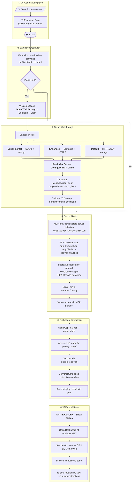

# Storyboard: VS Code Marketplace Install → Config → First Run

> End-to-end user journey for installing Index Server from the VS Code Marketplace,
> configuring the MCP client, and completing the first agent interaction.

---

## User Journey Overview


---

## Detailed Flow



---

## Scene-by-Scene Breakdown

### Scene 1 — Discovery

| Element | Detail |
|---------|--------|
| **Where** | VS Code Marketplace or Extensions sidebar (`Ctrl+Shift+X`) |
| **Search** | `index-server`, `mcp`, `ai governance` |
| **What they see** | Blue index-card icon, "Index" display name, publisher `jagilber-org` |
| **Badges** | MIT license, Node >= 22, VS Code Marketplace version, Open VSX version |
| **Categories** | Other, Machine Learning |
| **Keywords** | mcp, model-context-protocol, ai, instructions, governance |
| **Decision** | Read description → click **Install** |

### Scene 2 — Install & Activation

| Element | Detail |
|---------|--------|
| **Trigger** | `onStartupFinished` activation event |
| **Output channel** | "Index Server" created — logs `activating...` → `activated` |
| **Commands registered** | `index.configure`, `index.showStatus`, `index.openDashboard`, `index.openWalkthrough` |
| **MCP provider** | `registerMcpServerDefinitionProvider('indexProvider', ...)` — auto-registers the stdio server |
| **First-install toast** | Checks `globalState.hasShownWelcome`; shows: **Open Walkthrough** / **Configure** / **Later** |

### Scene 3 — Setup Walkthrough

The walkthrough (`index.gettingStarted`) has 7 steps:

| Step | Title | What happens |
|------|-------|--------------|
| 1 | **Choose a Profile & Configure** | User picks Default / Enhanced / Experimental; runs `index.configure` command |
| 2 | **Set Up TLS Certificates** | *(Enhanced/Experimental only)* Generate self-signed cert for HTTPS dashboard |
| 3 | **Set Up Semantic Search** | *(Enhanced/Experimental only)* Downloads ~90 MB embedding model on first search |
| 4 | **Set Up SQLite Storage** | *(Experimental only)* Switches from JSON to SQLite with FTS5 |
| 5 | **Search Instructions** | Try: *"search index-server for post installation configuration"* in agent mode |
| 6 | **Open the Dashboard** | Enable `index.dashboard.enabled`, run `index.openDashboard` |
| 7 | **Verify Your Setup** | Run `index.showStatus` — confirms server path, instructions dir, profile, features |

**Configure command output** — generates one of:

```jsonc
// .vscode/mcp.json (VS Code)
{
  "servers": {
    "index-server": {
      "type": "stdio",
      "command": "npx",
      "args": ["@jagilber-org/index-server@latest"],
      "env": {
        "INDEX_SERVER_PROFILE": "default"
      }
    }
  }
}
```

```jsonc
// ~/.copilot/mcp-config.json (Copilot CLI)
{
  "mcpServers": {
    "index-server": {
      "type": "stdio",
      "command": "npx",
      "args": ["@jagilber-org/index-server@latest"],
      "tools": ["*"]
    }
  }
}
```

### Scene 4 — Server Starts

| Event | Detail |
|-------|--------|
| **Launch** | Extension's `McpStdioServerDefinitionProvider` resolves server path: setting → workspace checkout → `npx` fallback |
| **Transport** | stdio (newline-delimited JSON-RPC 2.0) |
| **Auto-seed** | Server creates `000-bootstrapper.json` and `001-lifecycle-bootstrap.json` if absent |
| **Bootstrap gate** | Fresh workspace (seeds only) → mutations gated until `bootstrap_confirmFinalize` |
| **Ready signal** | `server/ready` notification with `{ version: "1.22.0" }` |
| **MCP panel** | Server shows as connected with green status |

### Scene 5 — First Agent Interaction

```text
User (Copilot Chat, agent mode):
  "search the instruction index for getting started"

Copilot → calls tool: index_search
  { "query": "getting started", "limit": 10 }

Server → returns:
  [
    { "id": "000-bootstrapper", "title": "Bootstrapper", "score": 0.82, ... },
    { "id": "001-lifecycle-bootstrap", "title": "Lifecycle Bootstrap", "score": 0.76, ... }
  ]

Copilot → renders results for user
```

This confirms the full pipeline: extension → MCP provider → stdio server → index search → agent response.

### Scene 6 — Verify & Explore

| Action | Expected result |
|--------|-----------------|
| `Index Server: Show Status` | ✅ Server path resolved, ✅ Instructions dir found, ✅ Profile/features listed |
| `Index Server: Open Dashboard` | Browser opens `http://localhost:8787` with Grafana-dark themed admin UI |
| Dashboard Overview tab | System stats, health checks (cpu: ok, memory: ok), performance metrics |
| Dashboard Instructions tab | Catalog browser showing seed instructions with usage counts |
| Enable mutation | Set `index.mutation.enabled: true` in settings → can now `index_add`, `index_import`, `promote_from_repo` |

---

## Profile Feature Matrix

| Feature | Default | Enhanced | Experimental |
|---------|---------|----------|--------------|
| JSON storage | ✅ | ✅ | — |
| SQLite + FTS5 | — | — | ✅ |
| HTTP dashboard | opt-in | ✅ | ✅ |
| HTTPS / TLS | — | ✅ | ✅ |
| Semantic search | — | ✅ | ✅ |
| Mutation | opt-in | ✅ | ✅ |
| File logging | — | ✅ | ✅ |
| Metrics persistence | — | ✅ | ✅ |
| Debug logging | — | — | ✅ |

---

## Key Extension Settings

| Setting | Default | Description |
|---------|---------|-------------|
| `index.profile` | `default` | Server profile: default / enhanced / experimental |
| `index.serverPath` | *(empty)* | Custom server path; empty = use `npx` |
| `index.instructionsDir` | *(empty)* | Custom instructions dir; empty = built-in default |
| `index.dashboard.enabled` | `false` | Enable admin dashboard HTTP server |
| `index.dashboard.port` | `8787` | Dashboard port |
| `index.logLevel` | `info` | Log level: debug / info / warn / error |
| `index.mutation.enabled` | `false` | Enable write operations via MCP tools |

---

## Troubleshooting Quick Reference

| Problem | Fix |
|---------|-----|
| Extension not appearing | Requires VS Code >= 1.99.0 |
| "Command not found" | Restart VS Code — extension activates on startup |
| Server not starting | Check Output → "Index Server" for errors |
| No search results | Verify instructions dir contains `.json` files |
| Dashboard won't open | Set `index.dashboard.enabled: true` |
| MCP tools not in Copilot | Confirm server shows connected in MCP panel |
| Bootstrap gate blocking mutations | Complete `bootstrap_confirmFinalize` flow |
