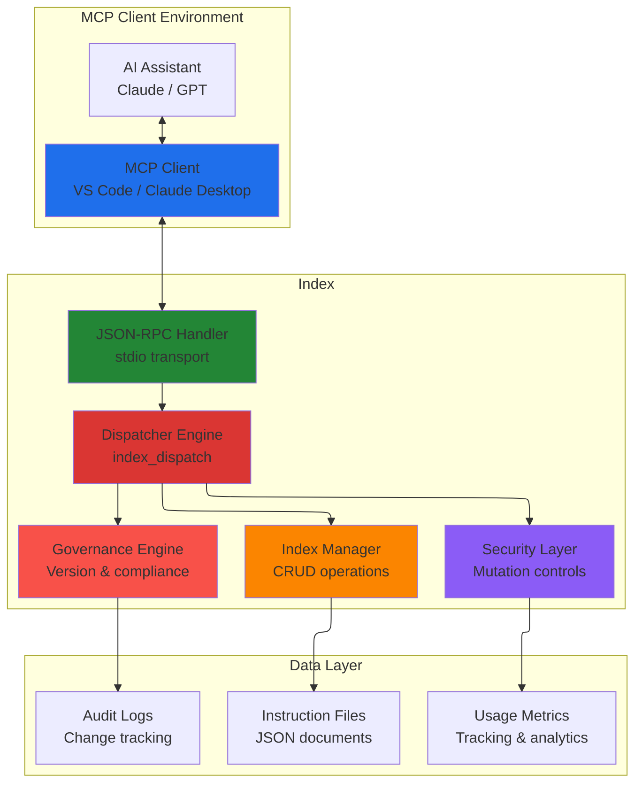
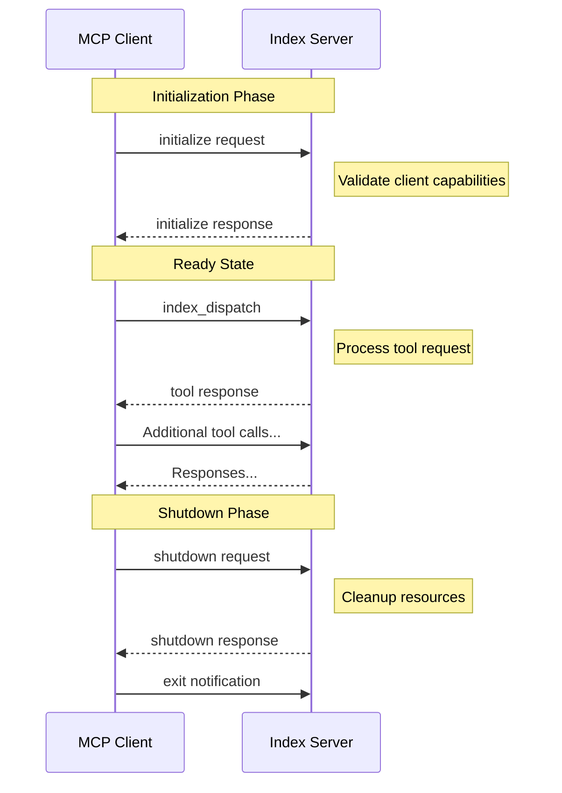
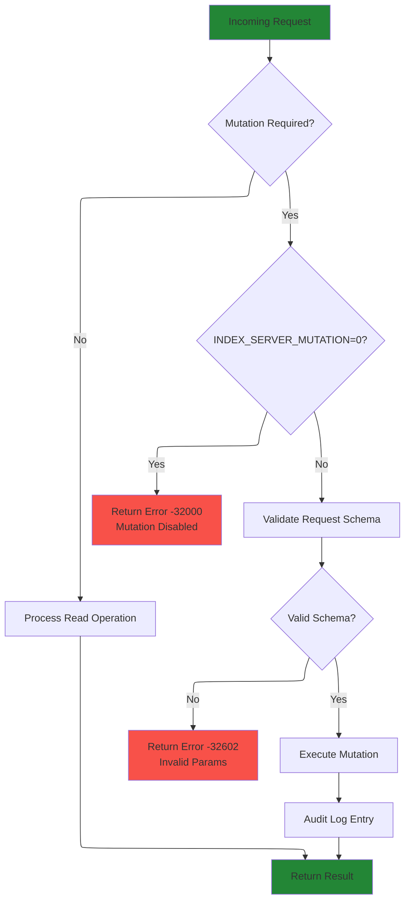
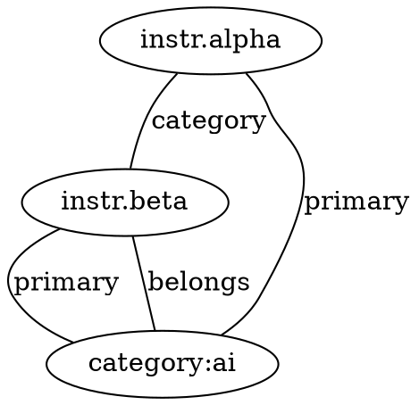
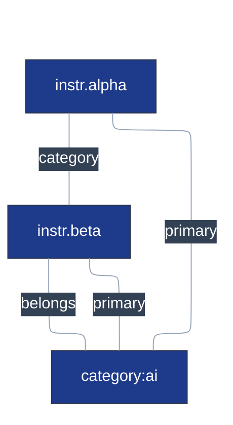

# Index - Tools API Reference

**Protocol:** Model Context Protocol (MCP) v1.0+  
**Transport:** JSON-RPC 2.0 over stdio, REST bridge via dashboard HTTP(S)  
**Server version:** see `package.json` — this document tracks the tool registry, not a release.  
**Currency:** the [Tool Inventory](#tool-inventory-authoritative-reference) below is generated from
`src/services/toolRegistry.ts` and gated by `npm run contract:tools`. The surrounding prose is
hand-written and dated by git history.

> The hand-maintained header this replaces claimed "Version 1.17.0, last updated February 24 2026"
> against a package at 1.41.2 (#587). A version number restated by hand in a document nothing
> checks is a claim that is wrong by default; it is not restated here for that reason.

## 📖 Overview

the index provides a comprehensive instruction index management system through the Model Context Protocol. This document serves as the complete API reference for all available tools, following enterprise standards for security, reliability, and ease of integration.

### 🎯 Key Features

* **Protocol Compliance**: Full MCP SDK v1.0+ compatibility
* **Enterprise Security**: Mutation controls and audit logging
* **High Performance**: Optimized for <120ms P95 response times
* **Governance Ready**: Built-in versioning and change tracking
* **Developer Friendly**: Comprehensive error handling and diagnostics
* **Feedback Subsystem**: MCP tool for structured client feedback (submit only; dashboard CRUD via operator HTTP API)
* **Structured Tracing (1.1.2+)**: Rotated JSONL trace lines `[trace:category[:sub]] { json }` for reliable test parsing
* **Schema-Aided Add Failures**: Inline JSON Schema returned on early structural `index_add` errors (1.1.0+)

### 🤖 Agent Graph Strategy Reference

For guidance on how autonomous / LLM agents should efficiently consume `graph_export` (progressive edge expansion, caching, scoring heuristics, and anomaly reporting), see `agent_graph_instructions.md`. That document defines the sparse→expand retrieval model recommended for large Indexs and should be followed instead of ad‑hoc full graph pulls.

## 🏗️ Architecture Overview



## 🔧 Transport & Protocol

### JSON-RPC 2.0 Specification

the index implements JSON-RPC 2.0 strictly following the [MCP Protocol Specification](https://spec.modelcontextprotocol.io/).

#### Request Format

```typescript
interface MCPRequest {
  jsonrpc: "2.0"
  method: string
  params?: object
  id: string | number
}
```

#### Response Format

```typescript
interface MCPResponse {
  jsonrpc: "2.0"
  id: string | number
  result?: any
  error?: {
    code: number
    message: string
    data?: any
  }
}
```

### 🚀 Connection Lifecycle



### 🔒 Security & Environment Controls

#### Environment Variables

| Variable | Type | Default | Description |
|----------|------|---------|-------------|
| `INDEX_SERVER_MUTATION` | Boolean | `true` | Write operations are enabled by default; set `0` for read-only |
| `INDEX_SERVER_MESSAGING_ENABLED` | Boolean | `true` | Inter-agent messaging subsystem. Set `0` to remove all `messaging_*` MCP tools from `tools/list`, skip the dashboard REST routes, and hide the Messaging tab. See #353. |
| `INDEX_SERVER_VERBOSE_LOGGING` | Boolean | `false` | Enable detailed logging to stderr |
| `INDEX_SERVER_LOG_MUTATION` | Boolean | `false` | Log only mutation operations |
| `INDEX_SERVER_LOG_FILE` | Path | - | Enable file logging to specified path (dual stderr/file output) |
| `GOV_HASH_TRAILING_NEWLINE` | Boolean | `false` | Governance hash compatibility mode |

#### Security Model



## 🛠️ Tools Reference

### Primary Tool: `index_dispatch`

The main entry point for all instruction index operations. This unified dispatcher replaces legacy individual methods and provides comprehensive functionality through action-based routing.

#### Base Request Structure

```typescript
interface DispatchRequest {
  method: "index_dispatch"
  params: {
    action: string
    // Action-specific parameters
    [key: string]: any
  }
}
```

### 📖 Read Operations (No Authentication Required)

#### `list` - List Instructions

**Purpose**: Retrieve all instructions with optional filtering  
**Mutation**: No  
**Performance**: O(1) with in-memory indexing

```typescript
// Request
{
  "action": "list",
  "category"?: string,
  "limit"?: number,
  "offset"?: number
}

// Response
{
  "hash": string,        // Index integrity hash
  "count": number,       // Total matching items
  "items": InstructionEntry[]
}
```

**Example:**
```json
{
  "jsonrpc": "2.0",
  "id": 1,
  "method": "index_dispatch",
  "params": {
    "action": "list",
    "category": "ai_code_nav",
    "limit": 10
  }
}
```

#### `get` - Retrieve Single Instruction

**Purpose**: Fetch a specific instruction by ID  
**Mutation**: No  
**Performance**: O(1) hash table lookup

```typescript
// Request
{
  "action": "get",
  "id": string
}

// Response
{
  "hash": string,
  "item": InstructionEntry | null
} | {
  "notFound": true,
  "id": string
}
```

#### `search` - Text and Structural Search

**Purpose**: Search instructions by keywords, phrase input, and/or structural predicates
**Mutation**: No  
**Performance**: O(n) with optimization for common patterns

```typescript
// Request
{
  "action": "search",
  "q"?: string,                 // Backward-compatible dispatcher phrase alias
  "keywords"?: string[],        // Explicit keyword tokens; mutually exclusive with searchString
  "searchString"?: string,      // Ergonomic phrase input; mutually exclusive with keywords
  "fields"?: SearchFields,      // Structural predicates; may be used without text input
  "limit"?: number,
  "includeCategories"?: boolean,
  "caseSensitive"?: boolean,
  "mode"?: "keyword" | "regex" | "semantic"  // Default follows semantic runtime config
}

// Response
{
  "results": [
    {
      "instructionId": string,
      "relevanceScore": number,
      "matchedFields": string[]
    }
  ],
  "totalMatches": number,
  "query": {
    "keywords": string[],
    "searchString"?: string,
    "fields"?: SearchFields,
    "mode": "keyword" | "regex" | "semantic",
    "limit": number,
    "includeCategories": boolean,
    "caseSensitive": boolean
  },
  "executionTimeMs": number
}
```

**Search Modes**:
- **keyword** (default): Substring matching across titles and bodies. Auto-tokenizes multi-word queries.
- **regex**: Full regex pattern matching (e.g., `"deploy|release"`, `"Type[Ss]cript"`). Patterns are capped at 200 chars and screened for catastrophic backtracking before execution.
- **semantic**: Embedding-based similarity search using cosine distance. Requires `INDEX_SERVER_SEMANTIC_ENABLED=1`. Falls back to keyword mode gracefully on model failure. Configure model via `INDEX_SERVER_SEMANTIC_MODEL` (default: `Xenova/all-MiniLM-L6-v2`).
  - `INDEX_SERVER_SEMANTIC_DEVICE`: Set to `cuda` (NVIDIA GPU) or `dml` (DirectML/Windows GPU) for hardware acceleration. Default: `cpu`. GPU backends require `onnxruntime-node-gpu` package.
  - `INDEX_SERVER_SEMANTIC_LOCAL_ONLY`: Set to `1` to block remote model downloads. Model must already be cached locally.

**Phrase input (`searchString`)**:

`searchString` is a convenience parameter for callers that have one phrase instead
of pre-tokenized `keywords`. It is mutually exclusive with `keywords`, capped at
500 characters, trimmed before search, and echoed in the response query object.

```json
{
  "action": "search",
  "searchString": "graph export content type",
  "mode": "keyword"
}
```

**Structural predicates (`fields`)**:

`fields` filters candidates before text scoring. It can also be used by itself for
structural-only queries; those results are deterministically ordered by priority,
newest `updatedAt`, then `id`.

Supported predicate forms:

| Predicate kind | Examples | Semantics |
|----------------|----------|-----------|
| Scalar exact | `{ "owner": "docs-team" }`, `{ "status": "approved" }` | Exact match on canonical instruction fields |
| OneOrMany scalar/enum | `{ "contentType": ["integration", "knowledge"] }` | Arrays mean OR for scalar and enum fields |
| Array membership | `{ "categories": "security" }` | Canonical array fields match when any expected value is present |
| Array operators | `{ "categoriesAny": ["security", "docs"] }`, `{ "categoriesAll": ["security", "hooks"] }`, `{ "categoriesNone": ["deprecated"] }` | Any/all/none membership checks; also available for `teamIdsAny`, `teamIdsAll`, `teamIdsNone` |
| ID prefix | `{ "idPrefix": "search-" }` | Fast prefix match against instruction IDs |
| Safe ID regex | `{ "idRegex": "^search-[0-9]+$" }` | Regex match against IDs after the same safety validation used by regex search |
| Numeric ranges | `{ "priorityMin": 1, "priorityMax": 20 }`, `{ "riskScoreMax": 5 }` | Inclusive range checks for numeric metadata |
| Date ranges | `{ "updatedAfter": "2026-01-01T00:00:00Z" }`, `{ "nextReviewDueBefore": "2026-06-01T00:00:00Z" }` | Inclusive ISO date range checks |

Validation is strict: unknown field names are rejected, empty arrays are rejected,
enum values must come from the canonical instruction schema, inverted ranges are
invalid, and `fields` must contain at least one predicate.

```json
{
  "action": "search",
  "fields": {
    "contentType": ["integration", "knowledge"],
    "categoriesAll": ["search", "docs"],
    "updatedAfter": "2026-01-01T00:00:00Z"
  },
  "limit": 10
}
```

```json
{
  "action": "search",
  "searchString": "release readiness",
  "fields": {
    "idPrefix": "search-",
    "categoriesAny": ["docs", "release"],
    "updatedAfter": "2026-01-01T00:00:00Z",
    "updatedBefore": "2026-06-01T00:00:00Z"
  }
}
```

#### `query` - Advanced Filtering

**Purpose**: Complex multi-field filtering with cursor-based pagination  
**Mutation**: No  
**Performance**: Optimized with indexing strategies

```typescript
// Request
{
  "action": "query",
  "filters": {
    "categories"?: string[],
    "priorityTiers"?: ("P1" | "P2" | "P3" | "P4")[],
    "status"?: ("draft" | "review" | "approved" | "deprecated")[],
    "owners"?: string[],
    "classification"?: ("public" | "internal" | "restricted")[],
    "workspaceId"?: string,
    "userId"?: string,
    "teamIds"?: string[],
    "createdAfter"?: string,  // ISO 8601
    "updatedAfter"?: string,
    "text"?: string
  },
  "sort"?: {
    "field": "createdAt" | "updatedAt" | "priority" | "title",
    "direction": "asc" | "desc"
  },
  "limit"?: number,
  "cursor"?: string
}

// Response
{
  "items": InstructionEntry[],
  "total": number,
  "returned": number,
  "nextCursor"?: string,
  "appliedFilters": object,
  "performanceMs": number
}
```

#### `categories` - Category Analytics

**Purpose**: Get category distribution statistics  
**Mutation**: No

```typescript
// Request
{
  "action": "categories"
}

// Response
{
  "categories": Array<{
    "name": string,
    "count": number,
    "lastUpdated": string
  }>,
  "totalDistinct": number,
  "IndexHash": string
}
```

#### `diff` - Incremental Synchronization

**Purpose**: Efficient Index synchronization for clients  
**Mutation**: No  
**Use Case**: Cache invalidation and incremental updates

```typescript
// Request
{
  "action": "diff",
  "clientHash"?: string,
  "known"?: Array<{
    "id": string,
    "sourceHash": string
  }>
}

// Response - Up to date
{
  "upToDate": true,
  "hash": string
} |
// Response - Changes detected
{
  "hash": string,
  "added": InstructionEntry[],
  "updated": InstructionEntry[],
  "removed": string[]  // IDs
}
```

> **Active vs archive surface** (spec 006-archive-lifecycle).
> Read actions `list`, `query`, `search`, `categories`, `get`, `export`, and
> `diff` operate on the **active** surface by default — archived entries are
> excluded. Pass `includeArchived: true` to fold archived entries into the
> result set (active ∪ archive), or `onlyArchived: true` to scope the query
> to the archive surface alone. The default is `false` for both flags so
> existing callers see no behavior change. See `listArchived` / `getArchived`
> below for archive-only reads with full archive metadata projection.

#### `listArchived` - List Archived Instructions

**Purpose**: Enumerate archived entries with archive-metadata filtering  
**Mutation**: No  
**Performance**: O(n) over the archive store; supports `limit` / `offset` paging

```typescript
// Request
{
  "action": "listArchived",
  "category"?: string,
  "contentType"?: string,
  "reason"?: "deprecated" | "superseded" | "duplicate-merge" | "manual" | "legacy-scope",
  "source"?: "groom" | "remove" | "archive" | "import-migration",
  "archivedBy"?: string,
  "restoreEligible"?: boolean,
  "includeContent"?: boolean,    // Default false: body omitted to keep payloads small
  "limit"?: number,
  "offset"?: number
}

// Response
{
  "count": number,
  "items": Array<InstructionEntry & {
    "archived": true,
    "archivedAt": string,
    "archivedBy"?: string,
    "archiveReason"?: ArchiveReason,
    "archiveSource"?: ArchiveSource,
    "restoreEligible"?: boolean
  }>
}
```

Items are sorted by `archivedAt` ascending, then `id` ascending. Set `includeContent: true` to
include each entry's `body` (default omits it).

#### `getArchived` - Fetch Single Archived Instruction

**Purpose**: Fetch one archived entry by id with full archive metadata  
**Mutation**: No  
**Performance**: O(1) keyed lookup against the archive store

```typescript
// Request
{
  "action": "getArchived",
  "id": string
}

// Response
{
  "item": InstructionEntry & { "archived": true, "archivedAt": string, ... }
} | {
  "notFound": true,
  "id": string
}
```

`getArchived` does **not** fall back to the active surface — use `get` for
active entries.


#### `graph_export` - Instruction Relationship Graph

Exports a structural or enriched graph representation of the instruction index. Backward-compatible dual-schema design:

* Schema v1 (default): Minimal nodes `{ id }`, edge types `primary`, `category`.
* Schema v2 (opt-in via `enrich:true`): Enriched instruction nodes with metadata + optional category nodes and `belongs` edges.

**Stability**: Stable (read-only).  
**Caching**: Small per-env signature cache map for default (schema v1) invocation with no params. Explicit env overrides disable caching for determinism. Enriched or formatted (dot/mermaid) invocations uncached.  
**Determinism**: Node list and edges are lexicographically ordered; filters and truncation applied post-deterministic ordering.

**Parameters (all optional):**

| Param | Type | Default | Description |
|-------|------|---------|-------------|
| `includeEdgeTypes` | string[] (subset of `primary`,`category`,`belongs`,`link`) | all | Edge type allowlist (filter applied before truncation) |
| `maxEdges` | number >=0 | unlimited | Truncate edge list (stable slice) |
| `format` | `json` \| `dot` \| `mermaid` | `json` | Output format (DOT & Mermaid visualizations). Mermaid now emits a `flowchart TB` block (top-bottom); edges use `---` (no arrows) so the layout appears undirected. |
| `enrich` | boolean | false | Enable schema v2 enrichment (metadata + optional new edge type) |
| `includeCategoryNodes` | boolean | false | Materialize explicit category nodes `category:<name>` (enriched only) |
| `includeUsage` | boolean | false | Attach real `usageCount` (falls back to 0 if absent) |

**Environment Knobs:**

| Env | Effect |
|-----|--------|
| `GRAPH_INCLUDE_PRIMARY_EDGES=0` | Suppress `primary` edges entirely |
| `GRAPH_LARGE_CATEGORY_CAP=<N>` | Skip generating pairwise category edges when member size > N (note added to `meta.notes`) |

**JSON Schema (Input):** (excerpt – note `mermaid` now included)

```json
{
  "type": "object",
  "additionalProperties": false,
  "properties": {
    "includeEdgeTypes": {"type": "array", "items": {"type": "string", "enum": ["primary","category","belongs","link"]}, "maxItems": 4},
    "maxEdges": {"type": "number", "minimum": 0},
  "format": {"type": "string", "enum": ["json","dot","mermaid"]},
    "enrich": {"type": "boolean"},
    "includeCategoryNodes": {"type": "boolean"},
    "includeUsage": {"type": "boolean"}
  }
}
```

**Zod Schema (Internal Validation):** (excerpt – `mermaid` added)

```ts
const GraphExportParams = z.object({
  includeEdgeTypes: z.array(z.enum(['primary','category','belongs','link'])).max(4).optional(),
  maxEdges: z.number().int().min(0).optional(),
  format: z.enum(['json','dot','mermaid']).optional(),
  enrich: z.boolean().optional(),
  includeCategoryNodes: z.boolean().optional(),
  includeUsage: z.boolean().optional()
}).strict();
```

**Response (Schema v1 minimal):**

```json
{
  "meta": {"graphSchemaVersion":1,"nodeCount":number,"edgeCount":number,"truncated"?:boolean,"notes"?:string[]},
  "nodes": [{"id":"string"}],
  "edges": [{"from":"id","to":"categoryOrCatId","type":"primary|category"}]
}
```

**Response (Schema v2 enriched example)** (see full JSON Schema: `schemas/graph-export-v2.schema.json`):

```json
{
  "meta": {"graphSchemaVersion":2,"nodeCount":3,"edgeCount":4},
  "nodes": [
    {"id":"instr.alpha","nodeType":"instruction","categories":["ai"],"primaryCategory":"ai","priority":10,"owner":"team-x","status":"approved","contentType":"integration","createdAt":"2025-09-01T12:00:00Z"},
    {"id":"instr.beta","nodeType":"instruction","categories":["ai","code"],"primaryCategory":"ai","contentType":"instruction"},
    {"id":"category:ai","nodeType":"category"}
  ],
  "edges": [
    {"from":"instr.alpha","to":"category:ai","type":"primary","weight":1},
    {"from":"instr.alpha","to":"instr.beta","type":"category","weight":1},
    {"from":"instr.beta","to":"category:ai","type":"primary","weight":1},
    {"from":"instr.beta","to":"category:ai","type":"belongs","weight":1}
  ]
}
```

**DOT Output Example:**


**Mermaid Output Example (with YAML frontmatter & themeVariables)**  
The server now emits a YAML frontmatter block as the first segment of Mermaid output. This block is authoritative for theming (including `themeVariables`) and high‑level metadata. The actual `flowchart TB` line appears *after* the terminating `---` marker. Tests and downstream tooling should not assume the first line starts with `flowchart` anymore—always scan for the `flowchart` directive after frontmatter.



Frontmatter / Theming Notes:

* Exactly one frontmatter block is emitted—clients should preserve it when copying or re‑rendering.
* `config.themeVariables` is the canonical place to customize colors; server may evolve defaults without breaking consumer parsing.
* Additional keys (e.g., `meta`) may appear; consumers should ignore unknown keys for forward compatibility.
* If you need to modify only visuals client‑side, prefer appending a second (non‑YAML) comment section rather than rewriting frontmatter to avoid drift.
* The graph body (nodes & edges) intentionally has no leading indentation beyond two spaces for readability and regex stability.

**Client Usage Examples:**

```ts
// Minimal (schema v1)
await client.callTool('graph_export', {});

// Enriched schema v2 with category nodes and only belongs edges
await client.callTool('graph_export', { enrich: true, includeCategoryNodes: true, includeEdgeTypes: ['belongs'] });

// Limit edges and request DOT format
await client.callTool('graph_export', { maxEdges: 25, format: 'dot' });

// Mermaid output (schema v2 enriched)
await client.callTool('graph_export', { enrich: true, includeCategoryNodes: true, format: 'mermaid' });

// Minimal mermaid (schema v1) – omit enrichment & category nodes
await client.callTool('graph_export', { format: 'mermaid' });

// Filter to only primary edges in mermaid
await client.callTool('graph_export', { format: 'mermaid', includeEdgeTypes: ['primary'] });
```

**Admin Dashboard Integration:**

When the dashboard is enabled (`INDEX_SERVER_DASHBOARD=1`), a live visualization panel uses the endpoint:

`GET /api/graph/mermaid`

Query parameters mirror tool params (subset):

| Param | Type | Notes |
|-------|------|-------|
| `enrich` | boolean | Enables schema v2 enrichment |
| `includeCategoryNodes` | boolean | Adds explicit `category:<name>` nodes |
| `includeEdgeTypes` | csv string | e.g. `primary,belongs` |
| `maxEdges` | number | Optional truncation |
| `includeUsage` | boolean | Adds usageCount (when present) |

Response shape:

```jsonc
{
  "success": true,
  "meta": { "graphSchemaVersion": 1|2, "nodeCount": n, "edgeCount": m, "truncated"?: true },
  "mermaid": "flowchart TB\n  ..."
}
```

The dashboard provides:

* Raw / rendered toggle (inline mermaid -> SVG)
* Copy source button
* Enrichment & category node toggles
* Edge type multi-select + usage overlay toggle


**Evolution & Compatibility:**

* Schema v1 behavior unchanged when `enrich` absent/false.
* Schema v2 enriched instruction nodes include `contentType` from instruction metadata; category nodes and schema v1 nodes omit it.
* Additional edge type `belongs` only appears when `enrich:true` & `includeCategoryNodes:true` or when filtered explicitly.
* Future planned additions: weighted edges from real usage metrics (`includeUsage` will switch placeholder to actual counts).
* Enriched & formatted responses intentionally excluded from current cache to prevent stale metadata propagation while schema evolves.
* `usageCount` now reflects live Index usage counters (monotonic) when `includeUsage:true`; enriched nodes also expose `retrievedCount`/`appliedCount` (issue #418).
* **Link edges** (schema v8, issue #511): a new `link` edge type is emitted from each instruction's `links` array. Edge metadata includes `rel` and `label`. In enriched mode, inverse edges are materialized per relationship semantics (`prerequisite`/`sequel`/`part-of` produce directional inverses, `related` produces bidirectional edges, `see-also` is directed only). Inverse edges carry `inverse: true` metadata. Category-based edges (`primary`, `category`, `belongs`) are unchanged.

### 🔐 Administrative Operations

#### `capabilities` - Server Discovery

**Purpose**: Client feature detection and compatibility checking  
**Mutation**: No

```typescript
// Request
{
  "action": "capabilities"
}

// Response
{
  "version": string,
  "protocolVersion": string,
  "supportedActions": string[],
  "mutationEnabled": boolean,
  "features": {
    "advancedQuery": boolean,
    "bulkOperations": boolean,
    "governanceTracking": boolean,
    "usageAnalytics": boolean
  },
  "limits": {
    "maxBatchSize": number,
    "maxQueryResults": number,
    "maxFileSize": number
  }
}
```

#### `health` - System Health Check

**Purpose**: Monitor system status and performance metrics  
**Mutation**: No

```typescript
// Request
{
  "action": "health"
}

// Response
{
  "status": "healthy" | "degraded" | "unhealthy",
  "version": string,
  "uptime": number,        // seconds
  "IndexStats": {
    "totalInstructions": number,
    "totalCategories": number,
    "lastModified": string,
    "integrityHash": string
  },
  "performance": {
    "avgResponseTime": number,  // ms
    "requestCount": number,
    "errorRate": number
  },
  "diskUsage": {
    "totalSize": number,    // bytes
    "availableSpace": number
  }
}
```

### ✏️ Mutation Operations (Enabled by default; set `INDEX_SERVER_MUTATION=0` for read-only)

#### `add` - Create New Instruction

**Purpose**: Add a single instruction to the index  
**Mutation**: Yes  
**Validation**: Full schema validation with optional lax mode

```typescript
// Request (via index_dispatch) — flat params (v1.8.1+)
{
  "action": "add",
  "id": string,                    // Instruction ID
  "body": string,                  // Instruction content
  "title"?: string,                // Optional title
  "overwrite"?: boolean,           // Allow ID conflicts
  "lax"?: boolean                  // Auto-fill missing fields
}

// Request (via index_dispatch) — nested entry wrapper (also supported)
{
  "action": "add",
  "entry": InstructionEntryInput,  // Instruction wrapped in entry field
  "overwrite"?: boolean,           // Allow ID conflicts
  "lax"?: boolean                  // Auto-fill missing fields
}

// Direct tool call (index_add)
{
  "entry": InstructionEntryInput,  // REQUIRED: must wrap instruction object
  "overwrite"?: boolean,
  "lax"?: boolean
}

// Response
{
  "id": string,
  "hash": string,
  "created": boolean,     // Only true if successfully persisted and readable
  "overwritten": boolean,
  "skipped": boolean,
  "verified": boolean,    // Read-back validation passed
  "sourceHash": string,
  "governanceHash": string
}

// Common Error Response
{
  "success": false,
  "created": false,
  "error": "missing entry" | "invalid_instruction",
  "message": "Instruction not added.",
  "validationErrors": string[],       // Exact schema / field failures
  "hints": string[],                  // Repair guidance
  "schemaRef": "index_add#input",
  "inputSchema": object,
  "feedbackHint": string,
  "reproEntry": object
}
```

##### Governance Notes (since 1.3.1)

The `index_add` pathway now enforces additional server-side governance:

* Strict SemVer validation on create: `entry.version` MUST match `/^\d+\.\d+\.\d+$/` (no pre-release/build metadata). Non‑conforming versions are rejected with `error: "invalid_semver"`.
* Auto Patch Bump (implicit): If the body text changes for an existing ID (detected via content hash comparison) and `overwrite` is true, the server will internally bump patch when caller supplies the previous version unchanged. Client may still proactively increment; duplicate increments are normalized by repair logic.
* Metadata-Only Overwrite Hydration: When `overwrite: true` and the caller intentionally omits `entry.body` (or `title`), the server hydrates the persisted values prior to validation so that minor metadata adjustments (e.g., tags) do not require resending full content. Omit ONLY when you intend no body/title change.
* Overwritten Flag Accuracy: `overwritten: true` only when an existing persisted instruction was actually replaced (metadata-only hydrations without a semantic version change still set `overwritten: true` because the on-disk record is rewritten after governance normalization).
* ChangeLog Repair: A malformed or missing ChangeLog entry for the ID is silently synthesized/normalized to keep governance hashes stable.
* Content Type Taxonomy: write inputs must use one of the schema v6 canonical values: `agent`, `skill`, `instruction`, `prompt`, `workflow`, `knowledge`, `template`, or `integration`.

Developer Tips:

```text
DO  supply a full SemVer (e.g., 2.4.7) on first creation.
DO  omit body ONLY with overwrite for metadata-only edits; server reuses stored body.
DO  increment patch when body changes if you want explicit client control.
DON'T send non-standard versions like 1.0, v1.0.0, 1.0.0-beta, or 2024.09.01.
DON'T rely on side effects of hydration to alter content; body changes require explicit body field.
```

Error Codes Added:

| code            | Condition                                    | Guidance                                          |
|-----------------|-----------------------------------------------|---------------------------------------------------|
| invalid_semver  | Version not MAJOR.MINOR.PATCH                 | Supply strict SemVer or let server assign default |
| hydration_mismatch | Body omitted but internal read failed     | Retry or resubmit with explicit body              |

These behaviors are fully described in `VERSIONING.md` (Governance Enhancements 1.3.1) and surfaced here for quick implementer reference.

##### Structured Links (schema v8, issue #511)

`index_add` accepts an optional `links` array on the entry:

```json
{
  "action": "add",
  "entry": {
    "id": "my-instruction",
    "body": "Content...",
    "links": [
      { "target": "prerequisite-id", "rel": "prerequisite" },
      { "target": "related-id", "rel": "related", "label": "See this for context" },
      { "target": "parent-id", "rel": "part-of" }
    ]
  },
  "lax": true
}
```

**Validation behavior:**

| Check | Outcome |
|-------|---------|
| Max 25 links | Schema-enforced rejection |
| `rel` not in enum | Schema-enforced rejection |
| `target` does not match ID pattern | Schema-enforced rejection |
| Self-referencing link (`target` = own `id`) | Rejected |
| Duplicate link (same `target` + same `rel`) | Silently deduplicated |
| Dead link (`target` ID not in current index) | **Warning** in response (not rejected) |
| Cycle in `prerequisite`/`sequel`/`part-of` edges | Rejected with cycle path in error |

`related` and `see-also` links are exempt from cycle detection (symmetric/informational).

**Relationship types:**

| `rel` | Semantics |
|-------|-----------|
| `related` | General association (default) |
| `prerequisite` | This entry requires the target |
| `sequel` | This entry precedes the target |
| `part-of` | This entry is part of the target |
| `see-also` | Informational reference |

#### `patch` - Partial Body Update

**Purpose**: Edit an instruction body **in place** without resending the whole body
**Mutation**: Yes
**Tool**: `index_patch` (tier: extended) — also available as `index_dispatch` action `patch`

Prefer `patch` over `add` + `overwrite:true` whenever you are changing part of an
existing body. `add` requires the complete body on every edit, which costs tokens
twice (a full `get` plus a full write), risks silent truncation when a model
regenerates a large body, and has no lost-update protection.

```typescript
// Request
{
  "action": "patch",
  "id": string,                                              // REQUIRED
  "op": "splice" | "append" | "prepend" | "replace" | "metadata",  // REQUIRED

  // op=append | prepend
  "text"?: string,

  // op=splice — a character window, mirroring get's bodyOffset/bodyLimit
  "bodyOffset"?: number,        // window start (UTF-16 code units)
  "bodyLength"?: number,        // units to remove; default 0 => pure insertion
  "text"?: string,              // replacement text; default "" => deletion

  // op=replace — LITERAL substring, never a regex
  "find"?: string,
  "replaceWith"?: string,       // default "" => deletion
  "replaceAll"?: boolean,       // default false => first occurrence only

  "expectedSourceHash"?: string,               // optimistic concurrency
  "bump"?: "patch"|"minor"|"major"|"none",     // optional semver bump
  "summary"?: string,                          // changelog summary when bumping
  "dryRun"?: boolean                           // compute without writing
}

// Success response
{
  "id": string,
  "changed": true,
  "op": string,
  "sourceHash": string,
  "previousSourceHash": string,
  "bodyLength": number,
  "previousBodyLength": number,
  "version": string,
  "updatedAt": string
}
```

**Lost-update protection.** Pass the `sourceHash` you read as `expectedSourceHash`.
If the entry changed in the meantime the patch is refused and **nothing is written**:

```jsonc
{
  "id": "my-instruction",
  "error": "precondition_failed",
  "expectedSourceHash": "<yours>",
  "actualSourceHash": "<current>",
  "hint": "The instruction changed since it was read. Re-read the entry and retry the patch against the current sourceHash."
}
```

**Round-tripping a window.** `bodyOffset` uses the same units and the same
surrogate-safe boundary snapping as the `get` action, so a window you read can be
written straight back. A pair is never split: an offset landing on the low half of
a surrogate pair snaps back to the pair boundary.

Error codes:

| code                  | Condition                                            | Guidance                                                        |
|-----------------------|------------------------------------------------------|-----------------------------------------------------------------|
| `invalid_params`      | Missing `id`/`op`, unknown op, or missing operand    | Response includes `reason`; unknown ops also return `validOps`  |
| `notFound`            | No instruction with that id                           | Verify the id via `search` or `list`                            |
| `precondition_failed` | `expectedSourceHash` did not match                    | Re-read the entry and retry against `actualSourceHash`          |
| `find_not_found`      | `op:"replace"` and `find` is absent from the body     | Never silently succeeds — re-read and adjust the search text    |
| `body_limit_exceeded` | Result would exceed `INDEX_SERVER_BODY_WARN_LENGTH`   | Split into cross-linked instructions (same rule as `add`)       |
| `empty_body`          | Patch would leave the body empty                      | Use `remove`/`archive` to retire an instruction instead         |

Notes:

- A patch that produces an identical body returns `{ "changed": false }` and does not write.
- Unlike `add`, the patched body is **not** trimmed — trimming would shift character
  offsets and break round-trip symmetry with the windowed `get` read.
- `find` is always literal. There is deliberately no regex mode, to avoid a ReDoS surface.

#### `import` - Bulk Import

**Purpose**: Import multiple instructions efficiently  
**Mutation**: Yes  
**Performance**: Optimized for large datasets

```typescript
// Request
{
  "action": "import",
  "entries": InstructionEntryInput[],
  "mode": "skip" | "overwrite" | "merge",
  "validate"?: boolean,   // Skip validation for trusted sources
  "batchSize"?: number   // Control memory usage
}

// Response
{
  "hash": string,
  "imported": number,
  "skipped": number,
  "overwritten": number,
  "total": number,
  "errors": Array<{
    "index": number,
    "id"?: string,
    "error": string,
    "code": string
  }>,
  "processingTimeMs": number
}
```

#### `remove` - Delete Instructions

**Purpose**: Retire or permanently delete instructions by ID  
**Mutation**: Yes  
**Safety**: Requires explicit confirmation for bulk operations

> ⚠️ **Default behavior change ahead** (spec 006-archive-lifecycle). The
> current default for `index_remove` is destructive purge. A future major
> release will flip the default to **archive** so retirement is non-destructive
> and reversible via `restore`. Pass `mode` explicitly today to insulate your
> caller from the flip:
>
> - `mode: "archive"` — move entry to the archive surface; reversible via
>   `index_restore`; payload, provenance, and audit context are preserved.
> - `mode: "purge"` (alias: `purge: true`) — permanent deletion; matches
>   current default behavior.
>
> Calls that omit `mode` continue to purge in this release and additionally
> emit a `remove_default_change_warning` audit entry plus a
> `defaultBehaviorChangeWarning` field on the response.

```typescript
// Request
{
  "action": "remove",
  "ids": string[],
  "mode"?: "archive" | "purge",
  "purge"?: boolean,        // Alias for mode:"purge"
  "archivedBy"?: string,    // Optional operator id (mode:"archive" only)
  "force"?: boolean,        // Required for bulk operations beyond INDEX_SERVER_MAX_BULK_DELETE
  "dryRun"?: boolean,
  "missingOk"?: boolean
}

// Response (mode: "archive")
{
  "mode": "archive",
  "archived": number,
  "archivedIds": string[],
  "missing": string[],
  "archiveErrors": Array<{ "id": string, "error": string }>
}

// Response (mode: "purge" — destructive; default this release)
{
  "mode": "purge",
  "removed": number,
  "removedIds": string[],
  "missing": string[],
  "errorCount": number,
  "errors": Array<{ "id": string, "error": string }>,
  "backupDir"?: string,
  "defaultBehaviorChangeWarning"?: string  // Present iff mode omitted
}
```

#### `groom` - Index Maintenance

**Purpose**: Automated Index cleanup and optimization  
**Mutation**: Yes (conditional)  
**Safety**: Supports dry-run mode

> **Retirement now archives** (spec 006-archive-lifecycle). When
> `mode.removeDeprecated`, `mode.mergeDuplicates`, or `mode.purgeLegacyScopes`
> retire an entry, the entry is moved to the archive surface (audit action
> `archive`) instead of being unlinked. A separate `mode.purgeArchive` flag
> permanently deletes archived entries; it cannot be combined with the
> retirement flags above. Bulk `purgeArchive` invocations are gated by
> `INDEX_SERVER_MAX_BULK_DELETE` and auto-create a zip backup
> (`purge_backup` audit) before deletion.

```typescript
// Request
{
  "action": "groom",
  "ids"?: string[],                  // Required only for purgeArchive when targeting specific ids
  "force"?: boolean,                 // Required to exceed INDEX_SERVER_MAX_BULK_DELETE for purgeArchive
  "mode": {
    "dryRun"?: boolean,
    "mergeDuplicates"?: boolean,
    "removeDeprecated"?: boolean,    // Retirement → archive (was: physical delete)
    "purgeLegacyScopes"?: boolean,   // Retirement → archive (was: physical delete)
    "remapCategories"?: boolean,
    "purgeArchive"?: boolean         // NEW — permanently delete archived entries
  }
}

// Response
{
  "previousHash": string,
  "hash": string,
  "scanned": number,
  "repairedHashes": number,
  "normalizedCategories": number,
  "deprecatedRemoved": number,       // count of entries moved to archive
  "duplicatesMerged": number,
  "signalApplied": number,
  "filesRewritten": number,
  "migrated": number,
  "remappedCategories": number,
  "purgedScopes": number,
  "archived"?: number,               // count of entries archived this run
  "archivedIds"?: string[],
  "archiveErrors"?: Array<{ "id": string, "error": string }>,
  "archiveLocation"?: string,        // "json:<path>/.archive" | "sqlite:instructions_archive"
  "dryRun": boolean,
  "notes": string[],
  "performanceMs": number
}
```

For `mode.purgeArchive` the response shape switches to
`{ purged, purgedIds, purgeErrors?, backupZip?, mode: "purgeArchive" }`.

#### `archive` - Archive Active Instructions

**Purpose**: Move active entries to the archive surface (non-destructive retirement)  
**Mutation**: Yes  
**Safety**: Bulk operations gated by `INDEX_SERVER_MAX_BULK_DELETE`

Archived entries are retained with full payload + provenance, suppressed from
default reads (see `includeArchived` / `onlyArchived` filters above), and are
reversible via `restore`.

```typescript
// Request
{
  "action": "archive",
  "ids": string[],
  "reason"?: "deprecated" | "superseded" | "duplicate-merge" | "manual" | "legacy-scope",
  "archivedBy"?: string,             // Optional operator identity
  "dryRun"?: boolean
}

// Response
{
  "archived": number,
  "archivedIds": string[],
  "archiveErrors": Array<{ "id": string, "error": string }>,
  "dryRun": boolean
}
```

Audit action: `archive`. Embedding vectors for archived ids are evicted (the
archived entry cannot surface in semantic search).

#### `restore` - Restore Archived Instructions

**Purpose**: Return one or more archived entries to the active surface  
**Mutation**: Yes  
**Eligibility**: Entries with `restoreEligible: false` are rejected

```typescript
// Request
{
  "action": "restore",
  "ids": string[],
  "restoreMode"?: "reject" | "overwrite",   // Default "reject" — collision with active id fails
  "dryRun"?: boolean
}

// Response
{
  "restored": number,
  "restoredIds": string[],
  "restoreErrors": Array<{ "id": string, "error": string }>,
  "restoreMode": "reject" | "overwrite",
  "dryRun": boolean
}
```

Audit action: `restore`. The restored entry's embedding vector is marked
stale so the next refresh recomputes it.

#### `purgeArchive` - Permanently Delete Archived Instructions

**Purpose**: Terminal destructive deletion of archived entries  
**Mutation**: Yes  
**Safety**: Bootstrap mutation-gated; bulk operations require `force: true`
above `INDEX_SERVER_MAX_BULK_DELETE` and auto-create a zip backup
(`purge_backup` audit) before deletion. Audit `purge_blocked` on gate denial.

```typescript
// Request
{
  "action": "purgeArchive",
  "ids": string[],
  "force"?: boolean,
  "dryRun"?: boolean
}

// Response
{
  "purged": number,
  "purgedIds": string[],
  "missing": string[],
  "purgeErrors": Array<{ "id": string, "error": string }>,
  "backupDir"?: string,
  "bulkBlocked"?: true,
  "maxBulkDelete"?: number,
  "requestedCount"?: number
}
```

Audit actions: `purge` (per id), `purge_backup` / `purge_backup_failed`
(pre-mutation backup), `purge_blocked` (gate denial). **Purge is terminal —
there is no restore path.**

### 🛠️ **Common Troubleshooting**

#### Parameter Format Issues

#### Incorrect: Sending instruction object directly

```typescript
// This FAILS with "missing entry" error
{
  "method": "tools/call",
  "params": {
    "name": "index_add",
    "arguments": {
      "id": "my-instruction",
      "body": "Content..."
    }
  }
}
```

#### Correct: Wrap in entry field (index_add)

```typescript
{
  "method": "tools/call",
  "params": {
    "name": "index_add",
    "arguments": {
      "entry": {                 // ← Required wrapper for direct index_add
        "id": "my-instruction",
        "body": "Content..."
      },
      "lax": true
    }
  }
}
```

#### Also correct: Flat params via index_dispatch (v1.8.1+)

```typescript
{
  "method": "tools/call",
  "params": {
    "name": "index_dispatch",
    "arguments": {
      "action": "add",
      "id": "my-instruction",     // ← Flat params accepted by dispatcher
      "body": "Content...",
      "lax": true
    }
  }
}
```

#### Backup Restoration

#### Incorrect: Sending backup file directly

```typescript
// Backup files often contain arrays or metadata
{
  "entries": [
    {"id": "...", "body": "..."},
    {"id": "...", "body": "..."}
  ],
  "timestamp": "...",
  "version": "..."
}
```

#### Correct: Extract individual objects

```typescript
// Use index_import for multiple entries
{
  "action": "import", 
  "entries": [
    {"id": "...", "body": "..."},  // Individual instruction objects
    {"id": "...", "body": "..."}
  ],
  "mode": "skip"
}
```

#### Error Response Handling

### 🛠️ Index Visibility / Index Recovery Guide

Use this when an instruction file exists on disk but one or more MCP operations (typically `index_dispatch` with action `list`) fail to show it, or when index hash/count drift is suspected. The server now self‑heals many cases automatically; these steps document observability and manual recovery levers.

#### 1. Quick Triage Decision Tree

| Symptom | Fast Check | Expected Auto‑Repair? | Next Step |
|---------|------------|-----------------------|-----------|
| `get` works, `list` missing id | Call `index_dispatch` with action `list` and `expectId` | Yes (targeted reload + late materialize) | If still absent, step 2 |
| Both `get` and `list` miss id but file present on disk | Call `index_dispatch` with action `getEnhanced` | Yes (invalidate + late materialize) | If not repaired, step 3 |
| Hash/count mismatch after bulk adds | Re‑invoke `list` with `expectId` for a missing representative id | Yes | If mismatch persists, step 4 |
| Many files absent / widespread drift | Check trace flags (`repairedVisibility`, `lateMaterialized`) | Partial (may be iterative) | Step 4 (full reload) |
| Corrupt JSON (parse error) | Manual open file; validate JSON | No (rejected) | Fix file or remove |
| Need clean forensic baseline | Confirm backups/ | n/a | Step 5 (reset modes) |

#### 2. Verify Auto‑Repair Flags

Enable trace (set env `INDEX_SERVER_DIAG=1` or use existing verbose harness). Invoke:

```json
{ "name": "index_dispatch", "arguments": { "action": "list", "expectId": "your-id" } }
```

Trace line `[trace:list]` includes:

* `repairedVisibility: true` → entry surfaced via reload or late materialization
* `lateMaterialized: true` → file parsed & injected without full reload
* `attemptedReload/attemptedLate` → repair paths tried (even if final repair failed)

If `expectOnDisk:true` and `expectInIndex:false` AND no repair flags turned true, proceed to step 3.

#### 3. Target a Single ID Repair

Call enhanced getter (exposes repair):

```json
{ "name": "index_dispatch", "arguments": { "action": "getEnhanced", "id": "your-id" } }
```

Outcomes:

* Returns `{ item }` → repaired
* Returns `{ notFound:true }` but file exists → likely validation failure (check file JSON + required fields)

If repaired, re‑run `list` (no restart needed). If not, inspect file integrity:

1. Confirm `.json` extension & UTF‑8 encoding
2. Ensure `id` inside file matches filename
3. Validate mandatory fields: `id`, `body`

#### 4. Full Index Reload / Sanity Sweep

If multiple items missing:

1. Force reload via dispatch (if exposed) or temporarily rename `.index-version` then invoke any list/get (will repopulate)
2. Optionally trigger a groom (if enabled) for hash recomputation & normalization.
3. Re‑run a hash integrity test (`governanceHashIntegrity.spec.ts` pattern) in a diagnostic environment.

#### 5. Reset / Seed Strategies

Use deployment script flags (PowerShell examples):

* Preserve & upgrade only:  
  `pwsh scripts/deploy-local.ps1 -Overwrite -TargetDir <prod>`
* Empty index (keep templates) for forensic isolation:  
  `pwsh scripts/deploy-local.ps1 -Overwrite -EmptyIndex -TargetDir <prod>`
* Force known seed set (replace current):  
  `pwsh scripts/deploy-local.ps1 -Overwrite -ForceSeed -TargetDir <prod>`
* Full wipe then seed:  
  `pwsh scripts/deploy-local.ps1 -Overwrite -EmptyIndex -ForceSeed -TargetDir <prod>`

Always capture backup first (script does this automatically into `backups/`). For manual emergency: copy `instructions/` elsewhere before resetting.

#### 6. Bulk Validation After Recovery

After any repair/reset:

1. `index_dispatch` with action `list` → record `count` & `hash`
2. Spot check 2–3 representative IDs with `get`
3. Run quick MCP test client smoke (`createReadSmoke.spec.ts` or `mcpTestClient.spec.ts`) against same directory (set `INDEX_SERVER_DIR`)
4. Check traces for unexpected high frequency of `lateMaterializeRejected` (indicates malformed files)

#### 7. When to Escalate

Open an issue if ANY occurs:

* Repeated absence requiring >1 repair per same id per hour
* `lateMaterializeRejected` increments for properly formatted files
* index hash oscillates between >3 distinct values without mutations

Include in report: recent `[trace:list]` payload, file stat (mtime/size), and whether `invalidate` was manually triggered.

#### 8. Preventive Practices

* Avoid out‑of‑band writes that keep file open (write atomically: temp file + rename)
* Keep filenames stable; changing internal `id` without renaming breaks validation
* Run periodic groom in maintenance windows for normalization & hash check
* Use overwrite flag for planned corrections instead of editing large batches manually

---

> This section documents the new self‑healing visibility feature (expectId‑driven targeted reload + late materialization) added in version 1.1.2.


All mutation operations now return enhanced error information:

```typescript
{
  "created": false,
  "error": "mandatory/critical require owner",  // Machine-readable
  "feedbackHint": "Submit feedback_submit with reproEntry",
  "reproEntry": {                               // Debugging context
    "id": "problem-id",
    "bodyPreview": "First 200 chars..."
  }
}
```

### �📊 Analytics & Governance

#### `governanceHash` - Integrity Verification

**Purpose**: Generate stable governance hash for compliance  
**Mutation**: No  
**Use Case**: Change detection and compliance auditing

```typescript
// Request
{
  "action": "governanceHash",
  "includeItems"?: boolean
}

// Response
{
  "count": number,
  "governanceHash": string,
  "algorithm": string,
  "items"?: Array<{
    "id": string,
    "governance": object,
    "hash": string
  }>
}
```

#### `usage_track` - Usage Analytics

**Purpose**: Record instruction usage for analytics  
**Mutation**: Yes (tracking data)

```typescript
// Request
{
  "method": "usage_track",
  "params": {
    "instructionId": string,
    "context": {
      "userId"?: string,
      "workspaceId"?: string,
      "sessionId"?: string,
      "timestamp": string
    },
    "metrics": {
      "executionTime"?: number,
      "success": boolean,
      "errorCode"?: string
    }
  }
}

// Response
{
  "tracked": boolean,
  "sessionId": string,
  "aggregatedCount": number
}
```

**Split counters (issue #418):** usage is tracked as two monotonic sub-counters:

| Field | Meaning |
| ----- | ------- |
| `retrievedCount` | Times the entry was surfaced/retrieved (search, get, query, export). |
| `appliedCount` | Times the entry was actually applied/cited (`action:'applied'` or `signal:'applied'`). |
| `usageCount` | **Deprecated** derived total = `retrievedCount + appliedCount`. Retained one minor version for backward compatibility. |

`lastRetrievedAt` / `lastAppliedAt` timestamp each sub-counter independently.

**BREAKING (issue #418):** a *signal-only* call (e.g. `signal:'helpful'` with no `action`) now records the signal/comment **without** incrementing either counter. Previously it bumped `usageCount`. Pass `action:'applied'` (or `signal:'applied'`) to count an application.

**Auto-track scope (issue #418):** when `INDEX_SERVER_AUTO_USAGE_TRACK` is on, `index_search` auto-records at most the **top-3** results (was top-10) as retrievals; `index_dispatch` auto-tracks the top-3 `query` results and each explicit-id `export`; `get` auto-tracks the returned entry. `list`/`listScoped` are **not** auto-tracked (browse, not retrieval).

### 🔍 Diagnostic Operations


#### `inspect` - Deep Inspection

**Purpose**: Detailed diagnostic information for debugging  
**Mutation**: No  
**Use Case**: Development and troubleshooting

```typescript
// Request
{
  "action": "inspect",
  "id"?: string,          // Specific instruction
  "scope": "Index" | "instruction" | "governance" | "usage"
}

// Response
{
  "timestamp": string,
  "scope": string,
  "data": {
    // Scope-specific detailed information
    "raw": object,
    "normalized": object,
    "validation": object,
    "metadata": object,
    "filesystem": object
  }
}
```

### 📬 Inter-Agent Messaging

Eleven `messaging_*` tools (extended tier) provide short-lived inter-agent messaging. They are
**not** part of the instruction index: messages persist to JSONL on disk and expire, and nothing
about them enters the governed catalog.

`messaging_manage` is the recommended entry point — a single dispatcher whose `action` mirrors the
ten standalone `messaging_<action>` tools 1:1 (#373). The standalone tools remain registered.

All eleven are gated at registration on `INDEX_SERVER_MESSAGING_ENABLED` (default on). With it set
to `0` they vanish from `tools/list`, the dashboard REST routes are skipped, and the Messaging tab
is hidden — see the environment table above and #353.

Full semantics, channel model, TTL and acknowledgement rules, and the REST surface:
**[messaging.md](messaging.md)**. Until #587 this 82 KB API reference mentioned messaging exactly
once, in an environment-variable row, and documented none of the tools.

## Tool Inventory (Authoritative Reference)

<!-- BEGIN GENERATED: tool inventory (npm run docs:tools) -->

> **65 registered tools** — core 8, extended 26, admin 31.
>
> Generated from `src/services/toolRegistry.ts` at the **admin** tier, which is the
> full declared surface. `npm run contract:tools` fails when this table drifts from
> the registry. Use `meta_tools` for the runtime view of a specific server.
>
> `stable` and `mutation` are the registry visibility/gating contract, not a claim
> about persistence side effects. `feedback_submit` is `stable` and `core` so agents
> can always report issues even though it writes. The three `diagnostics_*` tools are
> `mutation` *and* gated at registration on `INDEX_SERVER_STRESS_DIAG=1` or
> `INDEX_SERVER_DEBUG=1`; without one of those they are not registered at all. The
> eleven `messaging_*` tools are likewise gated on `INDEX_SERVER_MESSAGING_ENABLED=1`
> and documented in [messaging.md](messaging.md).

| Tool Name | Classification | Tier | Description |
|-----------|---------------|------|-------------|
| `bootstrap` | stable | core | Unified bootstrap dispatcher. Actions: request, confirm, status. |
| `bootstrap_confirmFinalize` | mutation | admin | Finalize bootstrap by submitting issued token; enables guarded mutations. |
| `bootstrap_request` | mutation | admin | Request a human confirmation bootstrap token (hash persisted, raw returned once). |
| `bootstrap_status` | stable | admin | Return bootstrap gating status (referenceMode, confirmed, requireConfirmation). |
| `dashboard_config` | stable | admin | Deterministic snapshot of every recognized environment / feature flag with metadata (category, stability, default, reload behavior). Flags marked sensitive return only a present boolean, never the value. |
| `diagnostics_block` | mutation | admin | Intentionally CPU blocks the event loop for N ms (diagnostic stress). |
| `diagnostics_handshake` | stable | admin | Return recent handshake events (ordering/ready/list_changed trace). |
| `diagnostics_memoryPressure` | mutation | admin | Allocate &amp; release transient memory to induce GC / memory pressure. |
| `diagnostics_microtaskFlood` | mutation | admin | Flood the microtask queue with many Promise resolutions to probe event loop starvation. |
| `feature_status` | stable | admin | Report active index feature flags and counters. |
| `feedback_manage` | mutation | extended | Manage feedback entries through a single action dispatcher. Actions: submit, list, get, update, delete, stats. |
| `feedback_submit` | stable | core | Submit feedback entry (issue, status report, security alert, feature request, etc.). |
| `gates_evaluate` | stable | extended | Evaluate configured gating criteria over current index. |
| `graph_export` | stable | extended | Export instruction relationship graph (schema v1 minimal or v2 enriched). |
| `health_check` | stable | core | Returns server health status &amp; version. |
| `help_overview` | stable | core | Structured onboarding guidance for new agents (tool discovery, index lifecycle, promotion workflow). |
| `index_add` | mutation | extended | Add a single instruction (lax mode fills defaults; overwrite optional). |
| `index_archive` | mutation | admin | Archive one or more active instructions (move to archive store, atomically). Closed-enum reason taxonomy (deprecated\|superseded\|duplicate-merge\|manual\|legacy-scope). Restorable unless restoreEligible:false. Surfaced via index_dispatch action:"archive". |
| `index_debug` | stable | admin | Dump raw index state for debugging (entry count, keys, load status). |
| `index_diagnostics` | stable | admin | Summarize loader diagnostics: scanned vs accepted, skipped reasons, missing IDs, optional trace sample. |
| `index_dispatch` | stable | core | Unified dispatcher for instruction index operations. Required: "action". Key params by action: get/getEnhanced(id, bodyOffset?, bodyLimit?), search(q/searchString/keywords/fields, includeCategories, caseSensitive, limit, mode, includeBody?), query(text,categoriesAny,limit,offset), list(category, limit?, offset?, includeBody?), diff(clientHash), export(ids,metaOnly), patch(id, op:"splice"\|"append"\|"prepend"\|"replace", text?/find?/replaceWith?, bodyOffset?, bodyLength?, expectedSourceHash?, dryRun?), remove(id or ids, mode:"archive"\|"purge"), archive(ids, reason), restore(ids, restoreMode), listArchived/getArchived/purgeArchive. Use patch to edit an instruction body in place instead of resending the whole body via add+overwrite. list/search return body-light items by default (bodyPreview+bodyLength); pass includeBody:true for full bodies or use get (supports bodyOffset/bodyLimit pagination). list/search default to INDEX_SERVER_DEFAULT_PAGE_SIZE results (default 50) when limit is omitted; pass limit:0 on list to return all. Read actions accept includeArchived/onlyArchived flags (mutually exclusive). Use action="capabilities" to discover all supported actions. |
| `index_enrich` | mutation | admin | Persist normalization of placeholder governance fields to disk. |
| `index_getArchived` | stable | admin | Read a single archived entry by id. Surfaced via index_dispatch action:"getArchived". Returns null when not present. |
| `index_governanceHash` | stable | extended | Return governance projection &amp; deterministic governance hash. |
| `index_governanceUpdate` | mutation | extended | Patch governance fields (owner/status/review dates/riskScore/priority/priorityTier/requirement + optional version bump). |
| `index_groom` | mutation | admin | Groom index: normalize, repair hashes, merge duplicates, ARCHIVE deprecated (was: remove), remap categories, apply usage signal feedback (outdated/not-relevant/helpful/applied) to instruction priority and requirement. Spec 006 Phase D: retirement paths now archive instead of permanently delete; pass mode.purgeArchive=true (mutually exclusive with retirement flags) to permanently purge archived entries. |
| `index_health` | stable | admin | Compare live index to canonical snapshot for drift. |
| `index_import` | mutation | extended | Import instruction entries from: inline array (entries), stringified JSON array, file path to JSON array (entries as string), or directory of .json files (source). |
| `index_inspect` | stable | admin | Return raw instruction entry by ID for debugging (full JSON). |
| `index_listArchived` | stable | admin | List archived entries with optional filters (category, contentType, reason, source, archivedBy, restoreEligible). Set includeContent:true to include bodies. Surfaced via index_dispatch action:"listArchived". |
| `index_normalize` | mutation | admin | Normalize instruction JSON files (hash repair, version hydrate, timestamps) with optional dryRun. |
| `index_patch` | mutation | extended | Patch an instruction body in place (splice/append/prepend/replace) or update metadata fields (title/semanticSummary/categories/primaryCategory/contentType) via op:metadata without touching the body; supports an expectedSourceHash precondition for lost-update protection. |
| `index_purgeArchive` | mutation | admin | Permanently delete archived entries. IRREVERSIBLE. Subject to bootstrap mutation gating, INDEX_SERVER_MAX_BULK_DELETE bulk limit, and auto-backup. Surfaced via index_dispatch action:"purgeArchive". |
| `index_reload` | mutation | extended | Force reload of instruction index from disk. |
| `index_remove` | mutation | extended | Delete one or more instruction entries by id. Bulk deletes exceeding INDEX_SERVER_MAX_BULK_DELETE (default 5) require force=true and auto-create a backup first. Use dryRun=true to preview. NOTE: spec 006-archive-lifecycle introduces a new mode parameter ("archive" \| "purge"). Today the omitted-mode default remains destructive ("purge") for backwards compatibility, but the response includes defaultBehaviorChangeWarning — pass mode:"archive" to opt into the upcoming default (move to archive store, restorable) or mode:"purge" (or purge:true alias) to keep destructive behavior. The default WILL change to "archive" in a future release. |
| `index_repair` | mutation | admin | Repair out-of-sync sourceHash fields (noop if none drifted). |
| `index_restore` | mutation | admin | Restore archived entries back to the active store. restoreMode:"reject" (default) fails on id collision; restoreMode:"overwrite" replaces the active entry. Entries marked restoreEligible:false cannot be restored. Surfaced via index_dispatch action:"restore". |
| `index_schema` | stable | extended | Return instruction JSON schema, examples, validation rules, and promotion workflow guidance for self-documentation. |
| `index_search` | stable | core | 🔍 PRIMARY: Search instructions by keywords, searchString phrase input, and/or structural fields — returns instruction IDs for targeted retrieval. Supports mode: "keyword" (substring match), "regex" (patterns like "deploy\|release"), or "semantic" (embedding similarity). Default mode is semantic when INDEX_SERVER_SEMANTIC_ENABLED=1, otherwise keyword. Omit the mode parameter to let the server choose the best default. Use this FIRST to discover relevant instructions, then use index_dispatch get for details. |
| `integrity_manifest` | stable | admin | Verify integrity of index manifest entries against stored sourceHash values. |
| `integrity_verify` | stable | extended | Verify each instruction body hash against stored sourceHash. |
| `manifest_refresh` | mutation | admin | Rewrite manifest from current index state. |
| `manifest_repair` | mutation | admin | Repair manifest by reconciling drift with index. |
| `manifest_status` | stable | admin | Report index manifest presence and drift summary. |
| `messaging_ack` | mutation | extended | Acknowledge (mark as read) one or more messages by ID. |
| `messaging_get` | stable | extended | Get a single message by ID with full details. |
| `messaging_list_channels` | stable | extended | List all active messaging channels with message counts and latest timestamps. |
| `messaging_manage` | mutation | extended | Dispatcher consolidating all 10 messaging_&lt;action&gt; tools into a single MCP surface. Pick the underlying operation with action= (send/read/list_channels/ack/stats/get/update/purge/reply/thread). Mirrors the individual tools 1:1; the standalone messaging_&lt;action&gt; tools remain available but messaging_manage is the recommended entry-point (#373). |
| `messaging_purge` | mutation | extended | Delete messages: all, by channel, or by specific IDs. |
| `messaging_read` | stable | extended | Read messages from a channel with visibility filtering. Supports unread-only, limit, mark-as-read, tag filtering, and sender filtering. |
| `messaging_reply` | mutation | extended | Reply to a message with auto-populated channel and parentId. Supports reply-all (all original recipients) or reply-to-sender. |
| `messaging_send` | mutation | extended | Send a message to a channel with recipient targeting. Supports broadcast (*), directed, priority, TTL, threading, and structured payloads. |
| `messaging_stats` | stable | extended | Get messaging statistics for a reader: total, unread, channel count. |
| `messaging_thread` | stable | extended | Retrieve a full message thread by root parentId. Returns parent + all nested replies sorted chronologically. |
| `messaging_update` | mutation | extended | Update mutable fields of a message (body, recipients, payload, persistent flag). |
| `meta_activation_guide` | stable | admin | Comprehensive guide for activating Index Server tools in VSCode. Explains why settings.json alone is insufficient and provides activation function reference for all tool categories. |
| `meta_check_activation` | stable | admin | Check activation requirements for a specific tool. Returns the VSCode activation function needed and step-by-step instructions. |
| `meta_tools` | stable | admin | Enumerate available tools &amp; their metadata. |
| `metrics_snapshot` | stable | extended | Performance metrics summary for handled methods. |
| `promote_from_repo` | mutation | extended | Scan a local Git repository and promote its knowledge content (constitutions, docs, instructions, specs) into the instruction index. Reads .specify/config/promotion-map.json and instructions/*.json from the target repo. |
| `prompt_review` | stable | core | Static analysis of a prompt returning issues &amp; summary. |
| `trace_dump` | stable | admin | Write the in-memory trace ring buffer to a file and return a summary (records count, bytes, env). Requires tracing to be enabled. |
| `usage_flush` | mutation | admin | Reset usage counters for a specific instruction (by id) or for entries with lastUsedAt before a given date. |
| `usage_hotset` | stable | extended | Return the most-used instruction entries (hot set). |
| `usage_track` | stable | core | Track instruction usage with optional qualitative signal. Params: id (required), action (retrieved\|applied\|cited), signal (helpful\|not-relevant\|outdated\|applied), comment (short text, max 256 chars). |

<!-- END GENERATED: tool inventory -->

### Tier Visibility

- **Core**: Always visible. Essential daily-use tools.
- **Extended**: Opt-in via `INDEX_SERVER_FLAG_TOOLS_EXTENDED=1`
- **Admin**: Opt-in via `INDEX_SERVER_FLAG_TOOLS_ADMIN=1`. Operations/debug tools.

**Tiers control what `tools/list` advertises, not what may be called.** A tool
hidden by tier stays callable by a client that already knows its name — that is
the intended contract (`specs/002-tool-consolidation.md`: "reduces visible count
without removing anything"). Enforcement is a separate concern, handled by the
mutation gate (`INDEX_SERVER_MUTATION`), bootstrap confirmation, and the
registration-time gates for dangerous diagnostics and messaging.

What `tools/call` *does* enforce, since #592, is that the name is **declared in
the tool registry at all**. A handler registered without a registry entry is
refused with `-32601`, identically to an unknown tool, so the callable surface
always equals the declared surface (constitution A-2). Do not "upgrade" that
check to the flag-resolved tier: it would make `index_add`, `index_patch`,
`index_remove` and every other extended/admin tool uncallable by default.

## 📈 Performance Characteristics

### Response Time SLOs

| Operation Type | P50 Target | P95 Target | P99 Target |
|----------------|------------|------------|------------|
| Read Operations | <50ms | <120ms | <300ms |
| Simple Mutations | <100ms | <250ms | <500ms |
| Bulk Operations | <500ms | <2s | <5s |
| Analytics | <200ms | <500ms | <1s |

### Throughput Targets

* **Read Operations**: >1000 RPS sustained
* **Write Operations**: >100 RPS sustained
* **Concurrent Connections**: 50+ simultaneous clients
* **Memory Usage**: <512MB under normal load

## 🚨 Error Handling

### Standard JSON-RPC Error Codes

| Code | Name | Description | Resolution |
|------|------|-------------|------------|
| -32700 | Parse Error | Invalid JSON received | Check request format |
| -32600 | Invalid Request | Invalid JSON-RPC format | Verify protocol compliance |
| -32601 | Method Not Found | Unknown method/action | Check available actions |
| -32602 | Invalid Params | Parameter validation failed | Review parameter schema |
| -32603 | Internal Error | Server-side error | Check logs and report |

### Custom Error Codes

| Code | Name | Description |
|------|------|-------------|
| -32000 | Mutation Disabled | Write operation attempted while direct mutations were disabled via `INDEX_SERVER_MUTATION=0` |
| -32001 | Resource Limit | Operation exceeds configured limits |
| -32002 | Validation Error | Schema validation failed with details |
| -32003 | Integrity Error | Index integrity check failed |
| -32004 | Permission Denied | Insufficient permissions for operation |

### Error Response Format

```typescript
interface ErrorResponse {
  jsonrpc: "2.0"
  id: string | number
  error: {
    code: number
    message: string
    data?: {
      action?: string
      validation?: object
      suggestion?: string
      documentation?: string
    }
  }
}
```

## 🔧 Integration Examples

### PowerShell Client

```powershell
# Start server with verbose logging
$env:INDEX_SERVER_VERBOSE_LOGGING = "1"

# Launch server process
$serverProcess = Start-Process -FilePath "node" -ArgumentList "dist/server/index-server.js" -PassThru -NoNewWindow

# Example request via stdin/stdout
$request = @{
    jsonrpc = "2.0"
    id = 1
    method = "index_dispatch"
    params = @{
        action = "list"
        limit = 10
    }
} | ConvertTo-Json -Depth 4

# Send to server (implementation-specific transport)
```

### Node.js Client

```typescript
import { spawn } from 'child_process'

class MCPIndexClient {
  private server: ChildProcess
  private requestId = 0

  async start() {
    this.server = spawn('node', ['dist/server/index-server.js'], {
      stdio: ['pipe', 'pipe', 'pipe'],
      env: { ...process.env }
    })
    
    // Handle server initialization
    await this.initialize()
  }

  async dispatch(action: string, params: object = {}) {
    const request = {
      jsonrpc: '2.0',
      id: ++this.requestId,
      method: 'index_dispatch',
      params: { action, ...params }
    }

    return this.sendRequest(request)
  }

  async listInstructions(category?: string) {
    return this.dispatch('list', { category })
  }

  async addInstruction(entry: InstructionEntry, lax = true) {
    return this.dispatch('add', { entry, lax })
  }
}
```

### VS Code Extension Integration

```typescript
// MCP client for VS Code extension
import { MCPClient } from '@modelcontextprotocol/client'

export class IndexServerClient extends MCPClient {
  async initializeIndexServer() {
    await this.initialize({
      protocolVersion: '1.0.0',
      capabilities: {
        tools: true,
        logging: true
      }
    })
  }

  async searchInstructions(query: string): Promise<InstructionEntry[]> {
    const response = await this.callTool('index_dispatch', {
      action: 'search',
      q: query,
      includeCategories: true,
      limit: 50
    })
    
    return response.items || []
  }
}
```

## 📚 Schema Reference

### Environment Variables (Runtime Behavior)

| Variable | Purpose | Default |
|----------|---------|---------|
| `INDEX_SERVER_MUTATION` | Optional read-only override for mutation tools (set `0` to disable direct writes). | `1` |
| `INDEX_SERVER_DIR` | Override instruction storage directory. | `instructions/` |
| `INDEX_SERVER_STRICT_CREATE` | Enforce strict create (no implicit upsert). | `0` |
| `INDEX_SERVER_STRICT_REMOVE` | Enforce strict remove (must exist). | `0` |
| `INDEX_SERVER_CANONICAL_DISABLE` | Disable source hash canonicalization on write. | `0` |
| `INDEX_SERVER_READ_RETRIES` | Read retry attempts for IO transient errors. | `3` |
| `INDEX_SERVER_READ_BACKOFF_MS` | Base backoff ms for read retries. | `8` |
| `INDEX_SERVER_ATOMIC_WRITE_RETRIES` | Atomic write retry attempts. | `3` |
| `INDEX_SERVER_ATOMIC_WRITE_BACKOFF_MS` | Base backoff ms for atomic writes. | `8` |
| `INDEX_SERVER_MEMOIZE` | Cache Index in-memory to reduce file IO. | disabled |
| `INDEX_SERVER_DIAG` | Verbose Index diagnostics to stderr. | `0` |
| `INDEX_SERVER_FILE_TRACE` | Trace file load sequence. | `0` |
| `INDEX_SERVER_RATE_LIMIT` | Dashboard HTTP API and usage-tracking rate limit, in requests per minute. `0` (default) disables rate limiting; positive integer N enforces N req/min (fixed 60s window). Bulk import/export/backup/restore routes are unconditionally exempt. | `0` |
| `INDEX_SERVER_DISABLE_USAGE_CLAMP` | Disable clamp of usage increments. | `0` |
| `INDEX_SERVER_USAGE_FLUSH_MS` | Delay (ms) for batching usage snapshot writes. | `75` |
| `INDEX_SERVER_FEATURES` | Feature flags (comma list): `usage,window,hotness,drift,risk`. Required for `usage_track`/`usage_hotset`. | none |
| `INDEX_SERVER_VERBOSE_LOGGING` | Verbose RPC / transport logging. | `0` |
| `INDEX_SERVER_LOG_DIAG` | Diagnostic handshake / buffer logging. | `0` |
| `INDEX_SERVER_LOG_FILE` | File to append structured logs. | unset |
| `INDEX_SERVER_DISABLE_EARLY_STDIN_BUFFER` | Disable early stdin buffer before handshake. | `0` |
| `INDEX_SERVER_IDLE_KEEPALIVE_MS` | Keepalive echo interval for idle transports. | `30000` |
| `INDEX_SERVER_SHARED_SERVER_SENTINEL` | Multi-client shared server sentinel. | unset |
| `INDEX_SERVER_TRACE=handshake` | Detailed handshake stage tracing. | `0` |
| `INDEX_SERVER_INIT_FEATURES=handshakeFallbacks` | Enable handshake fallback logic. | `0` |
| `INDEX_SERVER_INIT_FEATURES=initFallback` | Allow init fallback override path. | `0` |
| `INDEX_SERVER_TRACE=initFrame` | Output handshake frame diagnostics. | `0` |
| `INDEX_SERVER_TRACE=healthMixed` | Mixed transport health diagnostics. | `0` |
| `INDEX_SERVER_INIT_FEATURES=disableSniff` | Disable initial stdout sniff logic. | `0` |
| `INDEX_SERVER_LOG_ROTATE_BYTES` | Max logger file size before rotation. | `524288` |
| `INDEX_SERVER_TRACE_DIR` | Directory for trace JSONL emissions. | `traces/` |
| `INDEX_SERVER_TRACE_MAX_BYTES` | Max bytes per trace file before rotate. | `65536` |
| `INDEX_SERVER_TRACE_SESSION` | Force trace session id. | random |
| `INDEX_SERVER_TRACE_FILTER` | Category allowlist (comma list). | all |
| `INDEX_SERVER_TRACE_FILTER_DENY` | Category denylist (comma list). | none |
| `INDEX_SERVER_AGENT_ID` | Identifier of agent performing mutations. | unset |
| `INDEX_SERVER_DASHBOARD` | Enable admin dashboard (0=disable, 1=enable). | `0` |
| `INDEX_SERVER_DASHBOARD_PORT` | Dashboard HTTP port. | `8787` |
| `INDEX_SERVER_DASHBOARD_HOST` | Dashboard bind address. | `127.0.0.1` |
| `INDEX_SERVER_DASHBOARD_TRIES` | Max port retry attempts for dashboard. | `10` |
| `WORKSPACE_ID` / `INDEX_SERVER_WORKSPACE` | Source workspace for new instruction. | unset |
| `DIST_WAIT_MS` | Override dist readiness wait in tests. | dynamic |
| `EXTEND_DIST_WAIT` | Extend default dist wait budget. | `0` |
| `DIST_WAIT_DEBUG` | Verbose dist wait debug logging. | `0` |
| `SKIP_PROD_DEPLOY` | Skip prod deploy in test harness. | dynamic |
| `INDEX_SERVER_INIT_FEATURES=handshakeFallbacks` | Enable handshake fallback stages. | `0` |
| `INDEX_SERVER_TRACE=initFrame` | Frame-level init diagnostics. | `0` |
| `MULTICLIENT_TRACE` | Multi-client orchestration trace. | `0` |
| `INDEX_SERVER_FORCE_REBUILD` | Force rebuild on startup (tests). | `0` |
| `INDEX_SERVER_TRACE=healthMixed` | Mixed health diagnostics. | `0` |
| `INDEX_SERVER_SHARED_SERVER_SENTINEL` | Shared server id (test harness). | unset |
| `INDEX_SERVER_ATOMIC_WRITE_RETRIES` | Override atomic write retries. | `3` |
| `INDEX_SERVER_ATOMIC_WRITE_BACKOFF_MS` | Override atomic write backoff. | `8` |

Additional specialized env vars may appear in test-only contexts; production runtime should rely on documented set above.


### Core Data Types

#### InstructionEntry

```typescript
interface InstructionEntry {
  // Identity
  id: string                    // Unique identifier
  title?: string                // Human-readable title
  body: string                  // Instruction content
  
  // Classification
  categories: string[]          // Topical tags
  priority: number              // integer 1-100, LOWER = more important; defaults to 50
  requirement: 'mandatory' | 'critical' | 'recommended' | 'optional' | 'deprecated'
  
  // Governance
  version: string               // Semantic version
  status: 'draft' | 'review' | 'approved' | 'deprecated'
  owner: string                 // Responsible party
  classification: 'public' | 'internal' | 'restricted'
  
  // Lifecycle
  createdAt: string            // ISO 8601 timestamp
  updatedAt: string            // ISO 8601 timestamp
  reviewIntervalDays?: number  // Review frequency
  
  // Scoping
  workspaceId?: string         // Workspace association
  userId?: string              // User association  
  teamIds?: string[]           // Team associations
  
  // Computed
  sourceHash: string           // Content integrity hash
  governanceHash: string       // Governance metadata hash
  priorityTier: 'P1' | 'P2' | 'P3' | 'P4'  // Derived priority tier
  
  // Optional
  description?: string         // Detailed description
  examples?: string[]          // Usage examples
  tags?: string[]             // Additional tags
  dependencies?: string[]      // Instruction dependencies
  deprecatedBy?: string       // Replacement instruction ID

  // Cross-references (schema v8)
  links?: Array<{
    target: string             // Target instruction ID
    rel?: 'related' | 'prerequisite' | 'sequel' | 'part-of' | 'see-also'  // Default: 'related'
    label?: string             // Human-readable annotation (max 120 chars)
  }>                           // Max 25 links per entry
}
```

## 🏷️ Version History

| Version | Date | Changes |
|---------|------|---------|
| 1.0.0 | 2024-12-28 | Complete MCP protocol compliance, unified dispatcher |
| 0.9.0 | 2024-11-15 | Schema v2 migration, dispatcher consolidation |
| 0.8.0 | 2024-10-01 | Governance features, security hardening |
| 0.7.0 | 2024-09-15 | Usage analytics, performance optimization |

---

## 📞 Support & Resources

* **Documentation**: [project_prd.md](./project_prd.md)
* **Architecture**: [architecture.md](./architecture.md)
* **Security**: [SECURITY.md](../SECURITY.md)
* **Contributing**: [CONTRIBUTING.md](../CONTRIBUTING.md)

**Contact Information:**

* Technical Issues: Create GitHub issue with `[tools-api]` label
* Security Concerns: Follow responsible disclosure in SECURITY.md
* Feature Requests: Use RFC process documented in CONTRIBUTING.md

---

*This document represents the complete API specification for the index tools interface. All integrations must conform to these specifications to ensure compatibility and reliability.*

| batch | { operations:[ { action,... }, ... ] } | { results:[ ... ] } | Per-op isolation; continues after failures |

Mutation actions (enabled by default unless `INDEX_SERVER_MUTATION=0`):

| Action | Params | Result (primary fields) | Notes |
|--------|--------|------------------------|-------|
| add | { id, body, title?, overwrite?, lax? } or { entry, overwrite?, lax? } | { id, hash, created, overwritten, skipped } | Flat params or entry wrapper; lax fills defaults |
| import | { entries, mode:"skip"\|"overwrite" } | { hash, imported, skipped, overwritten, total, errors } | Bulk add/update |
| remove | { ids } | { removed, removedIds, missing, errorCount, errors } | Permanent delete |
| reload | none | { reloaded:true, hash, count } | Clears and reloads |
| groom | { mode? } | { previousHash, hash, scanned, repairedHashes, normalizedCategories, deprecatedRemoved, duplicatesMerged, signalApplied, filesRewritten, purgedScopes, migrated, remappedCategories, dryRun, notes } | Normalization, duplicate merge, signal feedback |
| repair | { clientHash?, known? } | diff-like OR { repaired, updated:[id] } | Fix stored sourceHash mismatches |
| enrich | none | { enriched, updated } | Persist missing governance fields |
| governanceUpdate | { id, patch?, bump?, owner?, status?, lastReviewedAt?, nextReviewDue?, riskScore?, priority?, priorityTier?, requirement? } | { id, changed, previousVersion?, newVersion? } | Controlled governance metadata edit. Unsupported values are rejected with an explicit error rather than ignored. |

Batch example:

```json
{
  "jsonrpc":"2.0","id":9,
  "method":"index_dispatch",
  "params":{
    "action":"batch",
    "operations":[
      { "action":"get", "id":"alpha" },
      { "action":"list" },
      { "action":"add", "entry": { "id":"temp", "body":"x" }, "lax": true }
    ]
  }
}
```

Capabilities example:

```json
{ "jsonrpc":"2.0","id":5,"method":"index_dispatch","params": { "action":"capabilities" } }
```

Error semantics: Unknown `action` returns -32601 with `data.action` provided for diagnostics. Schema validation errors return -32602 with Ajv detail.

Legacy per-method names were removed; clients must call the dispatcher and supply `action`.


Params: { entries: InstructionEntryInput[], mode: "skip" | "overwrite" }
Result: { hash, imported, skipped, overwritten, total, errors: [] }
Notes: Automatically computes sourceHash; timestamps set to now. Entries may include an optional `links` array (same shape and validation as `index_add`: self-ref rejection, dedup, dead-link warnings, cycle detection for ordered rels).

### index_repair (mutation when rewriting)

Params: { clientHash?: string, known?: [{ id, sourceHash }] }
Result: Either incremental sync object (same as diff) OR { repaired, updated: [id] } when performing on-disk hash repairs.

### index_reload (mutation)

Params: none
Result: { reloaded: true, hash, count }
Effect: Clears in-memory cache and reloads from disk.

### index_remove (mutation)

Params: { ids: string[], mode?: "archive" | "purge", purge?: boolean, archivedBy?: string, force?: boolean, dryRun?: boolean, missingOk?: boolean }
Result (mode:"archive"): { mode: "archive", archived, archivedIds: string[], missing: string[], archiveErrors: [{ id, error }] }
Result (mode:"purge", default this release): { mode: "purge", removed, removedIds: string[], missing: string[], errorCount, errors: [{ id, error }], backupDir?, defaultBehaviorChangeWarning? }
Notes:

* **Default behavior change ahead** (spec 006-archive-lifecycle): omitting `mode` continues to purge in this release but emits a `remove_default_change_warning` audit entry and surfaces `defaultBehaviorChangeWarning` on the response. A future major release flips the default to `archive`. Pass `mode` explicitly to insulate callers.
* `mode:"archive"` moves entries to the archive surface (reversible via `index_restore` / dispatcher action `restore`).
* `mode:"purge"` (alias `purge: true`) permanently deletes; matches pre-006 behavior. Bulk operations beyond `INDEX_SERVER_MAX_BULK_DELETE` require `force: true` and auto-create a zip backup first.
* Missing ids are reported; operation still succeeds unless all fail. Set `INDEX_SERVER_MUTATION=0` to disable mutations.

### index_groom (mutation)

Params: { ids?: string[], force?: boolean, mode?: { dryRun?: boolean, mergeDuplicates?: boolean, removeDeprecated?: boolean, purgeLegacyScopes?: boolean, remapCategories?: boolean, purgeArchive?: boolean } }
Result: { previousHash, hash, scanned, repairedHashes, normalizedCategories, deprecatedRemoved, duplicatesMerged, signalApplied, filesRewritten, purgedScopes, migrated, remappedCategories, archived?, archivedIds?, archiveErrors?, archiveLocation?, danglingLinksRemoved?, danglingLinkDetails?, dryRun, notes: string[] }
Notes:

* dryRun reports planned changes without modifying files (hash remains the same).
* **Retirement paths archive instead of delete** (spec 006-archive-lifecycle): `removeDeprecated`, `mergeDuplicates`, and `purgeLegacyScopes` move targeted entries to the archive surface (audit action `archive`) rather than unlinking them. `archivedIds` / `archiveErrors` / `archiveLocation` report the moves; `deprecatedRemoved` continues to count entries retired this run.
* `mode.purgeArchive` permanently deletes archived entries. Cannot be combined with the retirement flags above. Bulk invocations require `force: true` above `INDEX_SERVER_MAX_BULK_DELETE`; an auto-zip backup is created (`purge_backup` audit) before deletion. Response shape switches to `{ mode: "purgeArchive", purged, purgedIds, purgeErrors?, backupZip? }`.
* repairedHashes: number of entries whose stored sourceHash was corrected.
* normalizedCategories: entries whose categories were lowercased/deduped/sorted.
* duplicatesMerged: number of duplicate entry merges (non-primary members processed).
* purgedScopes: legacy scope:* category tokens removed from disk when purgeLegacyScopes enabled.
* mergeDuplicates selects a primary per identical body hash (prefers earliest createdAt then lexicographically smallest id) and merges categories, priority (min), riskScore (max).
* filesRewritten counts actual JSON files updated on disk (0 in dryRun).
* signalApplied counts instructions mutated by usage signal feedback (outdated -> deprecated requirement, not-relevant -> priority -10, helpful -> priority +5, applied -> priority +2).
* migrated counts entries with missing required fields auto-filled (e.g., contentType).
* remappedCategories counts entries whose primaryCategory was derived from CATEGORY_RULES.
* danglingLinksRemoved counts links removed because their target no longer exists in the active index (schema v8, issue #511). `danglingLinkDetails` lists each removed link as `{ id, target, rel }`.
* notes array contains lightweight action hints (e.g., would-rewrite:N, would-archive:N in dryRun).

### promote_from_repo (mutation)

Params: { repoPath: string, scope?: 'all'|'governance'|'specs'|'docs'|'instructions', force?: boolean, dryRun?: boolean, repoId?: string }
Result: { repoPath, repoId, promoted: string[], skipped: string[], failed: [{ id, error }], dryRunEntries?: [{ id, title, action }], total, promotedAt }
Notes:

* Scans a local Git repository for promotable knowledge content and upserts into the instruction index.
* **Content discovery order:** 1) `.specify/config/promotion-map.json` (explicit source→instruction mappings), 2) `instructions/*.json` (valid instruction JSON files, skips `_` prefixed).
* **scope** filters which categories to process: governance (governance/constitution/coding-standards), docs (architecture/onboarding), specs (spec), instructions (bootstrap/speckit/runbook/instruction), all (no filter).
* **Content hash dedup:** SHA-256 hash of source file content compared against existing `sourceHash` in Index. Unchanged entries are skipped unless `force: true`.
* **dryRun:** Returns preview of what would be promoted/updated/skipped without writing to disk.
* **repoId:** Override the repository identifier used in category tags and `sourceWorkspace`. Defaults to directory name of `repoPath`.
* Entries are validated via `ClassificationService.normalize()` before writing. Invalid entries are reported in `failed[]`.
* Audit log entries emitted for each promoted/updated instruction.
* Enabled by default; set `INDEX_SERVER_MUTATION=0` to disable direct writes.

---

## REST Client Scripts (Agent Access Without MCP)

For subagents or environments that cannot load MCP tools, two REST client scripts are provided in `scripts/`. They invoke the same tool handlers via the dashboard HTTP REST bridge (`POST /api/tools/:name`).

**Prerequisite:** Dashboard must be enabled (`INDEX_SERVER_DASHBOARD=1` or `--dashboard` flag).

### PowerShell (`scripts/client/index-server-client.ps1`)

```powershell
# Health check
.\scripts\index-server-client.ps1 -BaseUrl http://localhost:8787 -Action health

# Search instructions
.\scripts\index-server-client.ps1 -Action search -Keywords deploy,release -Mode semantic -Limit 10

# Get a specific instruction
.\scripts\index-server-client.ps1 -Action get -Id my-instruction-id

# List instructions
.\scripts\index-server-client.ps1 -Action list -Limit 20
.\scripts\index-server-client.ps1 -Action list -Limit 20 -ExpectId my-instruction-id

# Add an instruction
.\scripts\index-server-client.ps1 -Action add -Id new-inst -Title "My Instruction" -Body "Content here" -Priority 50

# Remove an instruction
.\scripts\index-server-client.ps1 -Action remove -Id old-inst

# Track usage with signal
.\scripts\index-server-client.ps1 -Action track -Id some-inst -Signal helpful

# View hotset (most-used instructions)
.\scripts\index-server-client.ps1 -Action hotset -Limit 10

# Run groom (dry run)
.\scripts\index-server-client.ps1 -Action groom -DryRun

# HTTPS with self-signed cert (generate one via `index-server --init-cert`; see docs/cert_init.md)
.\scripts\index-server-client.ps1 -BaseUrl https://localhost:8787 -Action health -SkipCertCheck
```

**Environment:** Set `INDEX_SERVER_URL` to avoid passing `-BaseUrl` every time.

### Bash (`scripts/client/index-server-client.sh`)

```bash
# Health check
./scripts/index-server-client.sh health

# Search (space-separated keywords)
./scripts/index-server-client.sh search "deploy release" semantic 10

# Get / List / Add / Remove
./scripts/index-server-client.sh get my-instruction-id
./scripts/index-server-client.sh list 20
./scripts/index-server-client.sh add my-id "My Title" "Body content" 50
./scripts/index-server-client.sh remove my-id

# Track usage signal
./scripts/index-server-client.sh track some-inst helpful

# Hotset
./scripts/index-server-client.sh hotset 10

# Groom (dry run)
./scripts/index-server-client.sh groom --dry-run

# HTTPS with self-signed cert
INDEX_SERVER_SKIP_CERT=1 ./scripts/index-server-client.sh health
```

**Environment:** Set `INDEX_SERVER_URL` (default: `http://localhost:8787`), `INDEX_SERVER_SKIP_CERT=1` for self-signed TLS.

### Output Format

Both scripts return structured JSON:

```json
{ "success": true, "result": { ... } }
{ "success": false, "error": "message", "status": 404 }
```

### Supported Actions

| Action | Tool | Required Params | Description |
|--------|------|-----------------|-------------|
| `health` | `health_check` | none | Server health status |
| `search` | `index_search` | keywords | Keyword/regex/semantic search |
| `get` | `index_dispatch` | id | Get instruction by ID |
| `list` | `index_dispatch` | none | List all instructions |
| `add` | `index_add` | id, body | Add/overwrite instruction |
| `remove` | `index_remove` | id | Delete instruction |
| `track` | `usage_track` | id | Track usage with optional signal |
| `hotset` | `usage_hotset` | none | Top-N most-used instructions |
| `groom` | `index_groom` | none | Run Index groom (signal feedback, normalize, repair) |
